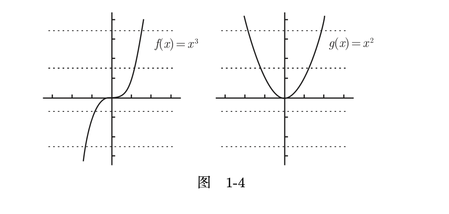
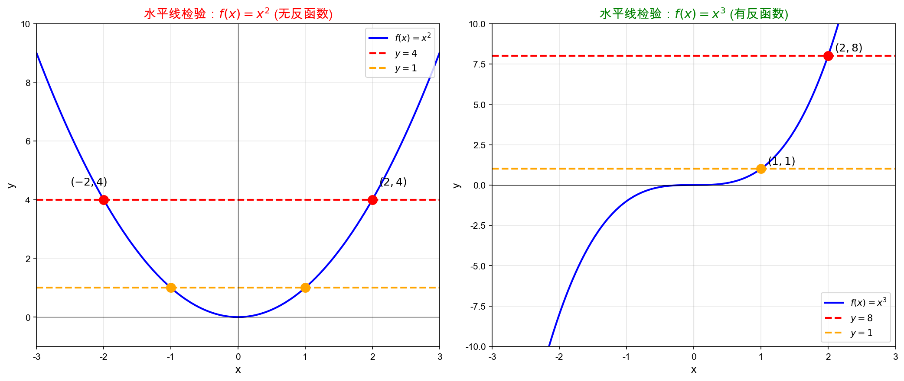
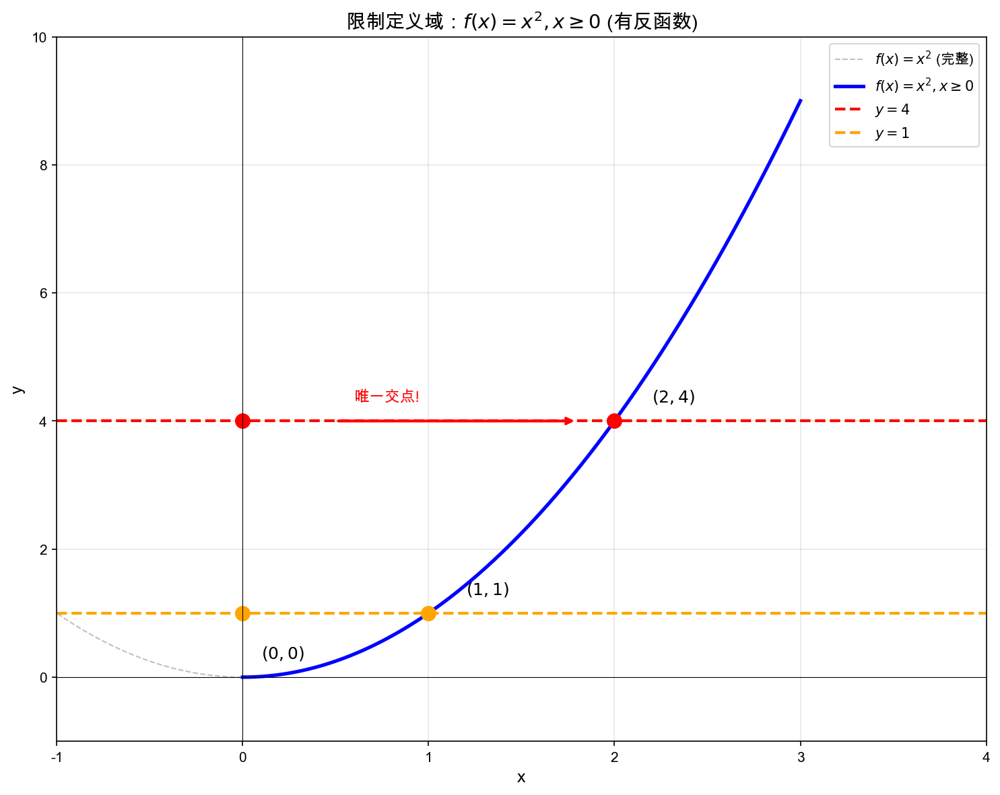
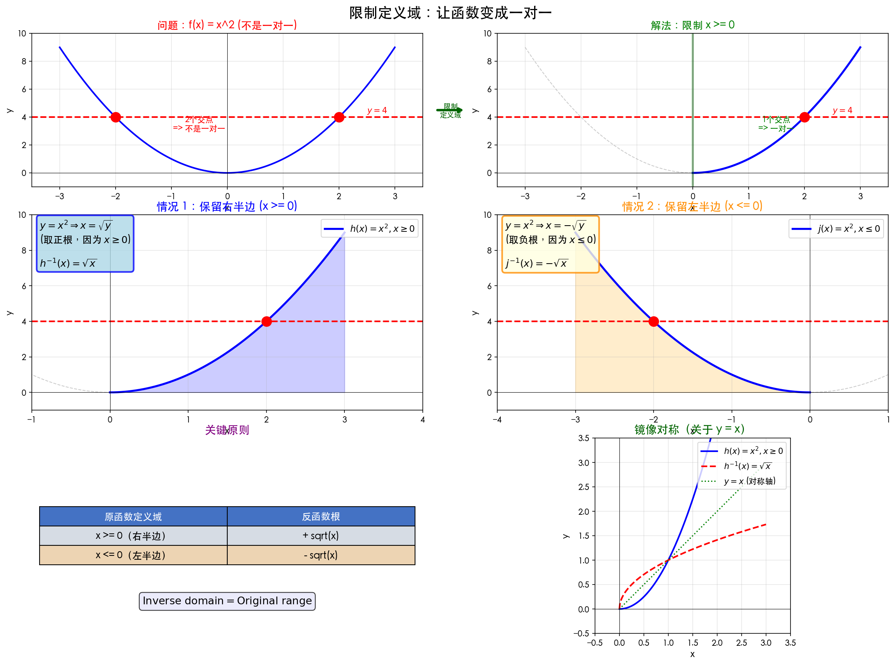
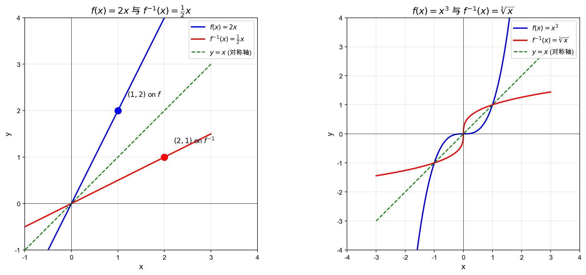

# 1.2 反函数

## 一、问题出发：反函数在解决什么

> **本质问题**：从"结果"能否找回"原因"？

- 原函数：$x \rightarrow f(x) \rightarrow y$
- 反函数：已知 $y$，能否反推出 $x$？

---

## 二、第一层限制：值域

若 $y$ **不在值域中** $\Rightarrow$ 方程 $f(x) = y$ 无解

> **结论**：只有值域中的值才有"反推意义"

---

## 三、第二层关键：解的个数

### 情况 1：多个解（不可逆）

- 例：$f(x) = x^2$，同一个 $y$ 对应多个 $x$
- 问题：无法唯一确定原来的输入

### 情况 2：唯一解（可逆）

- 例：$g(x) = x^3$，每个 $y$ 只有一个 $x$
- 满足：可以"精确还原"

---

## 四、核心条件（最重要）

> **要定义反函数，必须：每个 $y$ 只对应一个 $x$**

等价理解：
- 不同输入 $\rightarrow$ 不同输出
- 函数是"一对一"（单射）

---

## 五、反函数的定义

在满足唯一性条件下，定义 $f^{-1}$：

> **作用**：从输出 $y$ 找回输入 $x$

---

## 六、核心关系（必须记住）

$$
f(x) = y \quad \Longleftrightarrow \quad f^{-1}(y) = x
$$

---

## 七、定义域与值域的交换

| 原函数 $f$ | 反函数 $f^{-1}$ |
| ---------- | --------------- |
| 定义域      | 值域             |
| 值域       | 定义域            |

> **本质**：输入输出完全对调

---

## 八、本质理解

> **反函数 = "撤销函数" / Undo 操作**

- $f$：输入 $\rightarrow$ 输出
- $f^{-1}$：输出 $\rightarrow$ 输入

---

## 九、本节逻辑主线

1. 从"反向求输入"出发
2. 发现必须满足值域条件
3. 发现可能有多个解（问题出现）
4. 提出"唯一性"作为关键条件
5. 在此基础上定义反函数
6. 给出反函数的性质
7. 为后续学习提出问题

---

## 十、一句话总结（考试级）

> **反函数存在的前提是函数必须是一对一函数，它的作用是把输出重新还原为输入**

---

## 🚩 重点提醒：为什么必须唯一？

- 不唯一 $\rightarrow$ 无法确定原来的 $x$
- 反函数就无法定义

---

## 十一、水平线检验

### 1. 要解决的核心问题

判断：**对于每个 $y$，是否只有一个 $x$ 满足 $f(x) = y$？**

> **本质**：函数是否"一对一" $\rightarrow$ 是否存在反函数

---

### 2. 图像化思路（关键突破）

用函数图像来判断：
- 固定一个 $y$
- 画一条水平线：$y = 常数$
- 看这条线与函数图像的交点个数

---

### 3. 三种情况分析

#### 情况 1️⃣：只有一个交点 ✅（理想情况）

- 水平线与图像**只交一次**

> 每个 $y$ 只有一个 $x$ ✔ 函数是"一对一" ✔ **存在反函数**

#### 情况 2️⃣：多个交点 ❌（最关键问题）

- 水平线与图像交两次或以上

> 一个 $y$ 对应多个 $x$ ❌ 无法唯一确定输入 ❌ **不存在反函数**

#### 情况 3️⃣：没有交点（正常情况）

- 水平线不与图像相交

> 这个 $y$ 不在值域中 ✔ 不影响反函数定义

---

### 4. 水平线检验（正式定义）

> **如果任意一条水平线与函数图像至多相交一次 $\rightarrow$ 函数有反函数**

> **只要存在一条水平线与图像相交超过一次 $\rightarrow$ 函数没有反函数**

---

### 5. 典型例子

#### ✅ 有反函数：$f(x) = x^3$

- 任意水平线只交一次
- 每个 $y$ 唯一对应一个 $x$

#### ❌ 无反函数：$g(x) = x^2$

- 一条水平线会交两次
- 例如：$y = 4 \rightarrow x = 2$ 或 $-2$
- 无法确定唯一输入

---

### 6. 如何"挽救"没有反函数的函数（重要铺垫）

> **方法：限制定义域**

例如：$x^2$ 限制为 $x \geq 0 \Rightarrow$ 每个 $y$ 只有一个 $x$ $\Rightarrow$ 可以定义反函数

---

### 6.1 问题背景

- 有些函数**无法通过水平线检验**
- 一个 $y$ 对应多个 $x$

👉 **核心问题**：如果函数不是一对一，怎么办？

---

### 6.2 核心思想

**唯一解法：限制定义域**

本质操作：只保留一个 $x$，**删掉另一半图像**，让函数变成"一对一"

---

### 6.3 两种常见限制方式

#### ✅ 情况 1：保留右半边（$x \geq 0$）

- 原函数：$h(x) = x^2, x \geq 0$
- 求反函数：$y = x^2 \Rightarrow x = \sqrt{y}$（取正根，因为 $x \geq 0$）
- 得：$h^{-1}(x) = \sqrt{x}$

#### ✅ 情况 2：保留左半边（$x \leq 0$）

- 原函数：$j(x) = x^2, x \leq 0$
- 求反函数：$y = x^2 \Rightarrow x = -\sqrt{y}$（取负根，因为 $x \leq 0$）
- 得：$j^{-1}(x) = -\sqrt{x}$

---

### 6.4 关键原则

| 原函数定义域 | 反函数根的选择 |
| ------------ | -------------- |
| $x \geq 0$（右半边） | 取正根 $+\sqrt{x}$ |
| $x \leq 0$（左半边） | 取负根 $-\sqrt{x}$ |

👉 **原因**：反函数的值域 = 原函数的定义域

---

### 6.5 限制定义域的本质理解

- **不是"随便删一半"**
- 而是：**让函数通过水平线检验**
- 删掉哪一半取决于想让反函数的定义域（值域）对调后是什么

---

### 6.6 镜像对称（加深理解）

> 反函数仍然满足：关于 $y = x$ 对称

👉 如果不限制定义域直接求反函数：
- 水平线问题（原函数）
- 镜像后变成：**垂线问题**（可能不满足函数定义）

---

### 6.7 完整逻辑链

1. 有些函数不是一对一 $\Rightarrow$ 没有反函数
2. 必须人为处理 $\Rightarrow$ 限制定义域
3. 让函数变成一对一 $\Rightarrow$ 才能定义反函数

---

### 6.8 易错提醒

| ❌ 错误 | ✅ 正确 |
|---------|--------|
| 直接写 $f^{-1}(x) = \pm\sqrt{x}$ | 必须选一个（根据定义域） |
| 忽略定义域限制 | 必须写清楚 $x \geq 0$ 或 $x \leq 0$ |

---

### 6.9 一句话总结

> **当函数不是一对一时，通过限制定义域，使其变成一对一，从而得到反函数**

---

### 7. 核心逻辑

1. 反函数需要"唯一性"
2. 用图像判断唯一性
3. 用"水平线"检测
4. 得出判定规则

---

### 8. 一句话总结

> **水平线检验：判断函数是否有反函数，本质是看每个输出是否只对应一个输入**

---

### 🚩 必须真正理解的一点：为什么是"水平线"？

因为水平线代表：**固定一个 $y$**，正好对应问题 $f(x) = y$ 有几个解？

---

## 十二、求反函数方法

对于 $y = x^3$，求反函数：
1. 用 $x$ 表示 $y$ 改为用 $y$ 表示 $x$
2. 得到 $x = \sqrt[3]{y}$
3. 习惯写成 $y = \sqrt[3]{x}$

---

## 十三、图像对称原理

### 问题

原函数与反函数图像关于 $y = x$ 对称，根本原理是什么？

### 原理分析

以 $y = 2x$ 及其反函数为例：
- $x = \frac{1}{2}y$ 与 $y = 2x$ 图像**相同**
- 将 $x = \frac{1}{2}y$ 写成 $y = \frac{1}{2}x$ 是**互换 $x$、$y$**
- 相当于对坐标系进行**旋转**，从而关于 $y = x$ 对称

---

## 十四、反函数的反函数

### 无定义域限制

$y = 2x$ → 反函数 $y = \frac{1}{2}x$ → 再求反函数又回到 $y = 2x$

### 有定义域限制

此时反函数的反函数**不一定**能回到原函数

---

## 十五、重要结论

### 结论一

对于 $f$ 值域中的 $y$，都有：

$$
f(f^{-1}(y)) = y
$$

**原因**：一定有 $x$ 对应 $y$，$f^{-1}(y)$ 相当于 $x$，所以 $f(x) = y$

### 结论二

$$
f(f^{-1}(x)) \neq x \quad \text{（可能不等于）}
$$

**原因**：$x$ 必须在限定的定义域内才能使 $f^{-1}(y) = x$ 成立

---

## 十六、反函数全章总结

### 核心逻辑链

1. **什么是反函数**：从"结果"找回"原因"（撤销操作）
2. **为什么需要唯一性**：不是一对一 $\Rightarrow$ 无法反推
3. **如何判断存在**：水平线检验
4. **如何求反函数**：解方程 + 交换 $x,y$
5. **如何修复**：限制定义域 $\Rightarrow$ 变一对一

### 核心公式

| 公式 | 说明 |
|------|------|
| $f(x) = y \Leftrightarrow f^{-1}(y) = x$ | 反函数本质关系 |
| $f(f^{-1}(y)) = y$ | 复合运算（值域中） |
| 反函数定义域 = 原函数值域 | 定义域值域对调 |

### 易错点

- ❌ 直接写 $f^{-1}(x) = \pm\sqrt{x}$
- ✅ 必须根据定义域选一个：$+\sqrt{x}$（$x \geq 0$）或 $-\sqrt{x}$（$x \leq 0$）

---

## 下一步学习建议

- **反函数全章题型总结 + 解题模板**
- **水平线检验 vs 垂直线检验对比**（易混淆考点）
- **如何判断函数是否一对一（单调性）**
- **练习题：从简单到难的练习路径**
