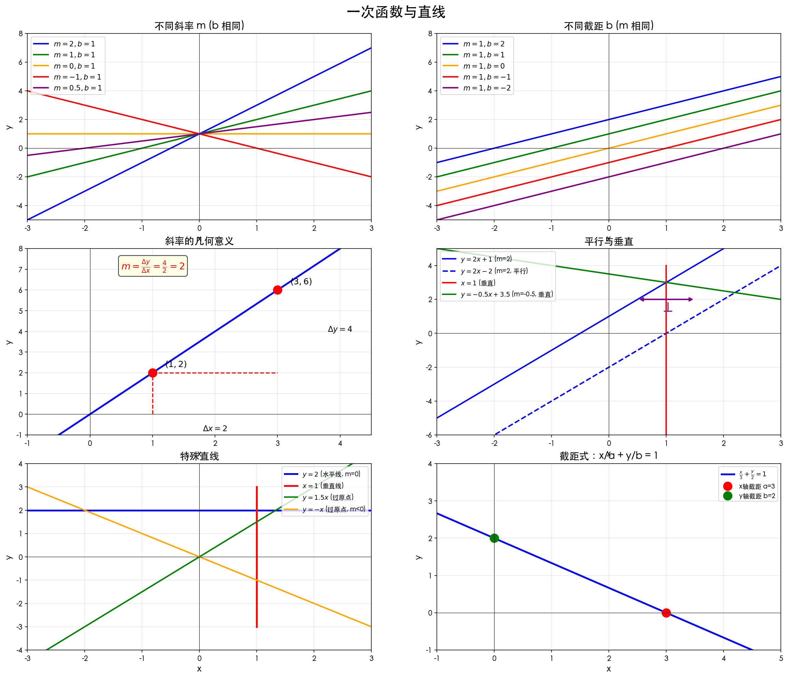
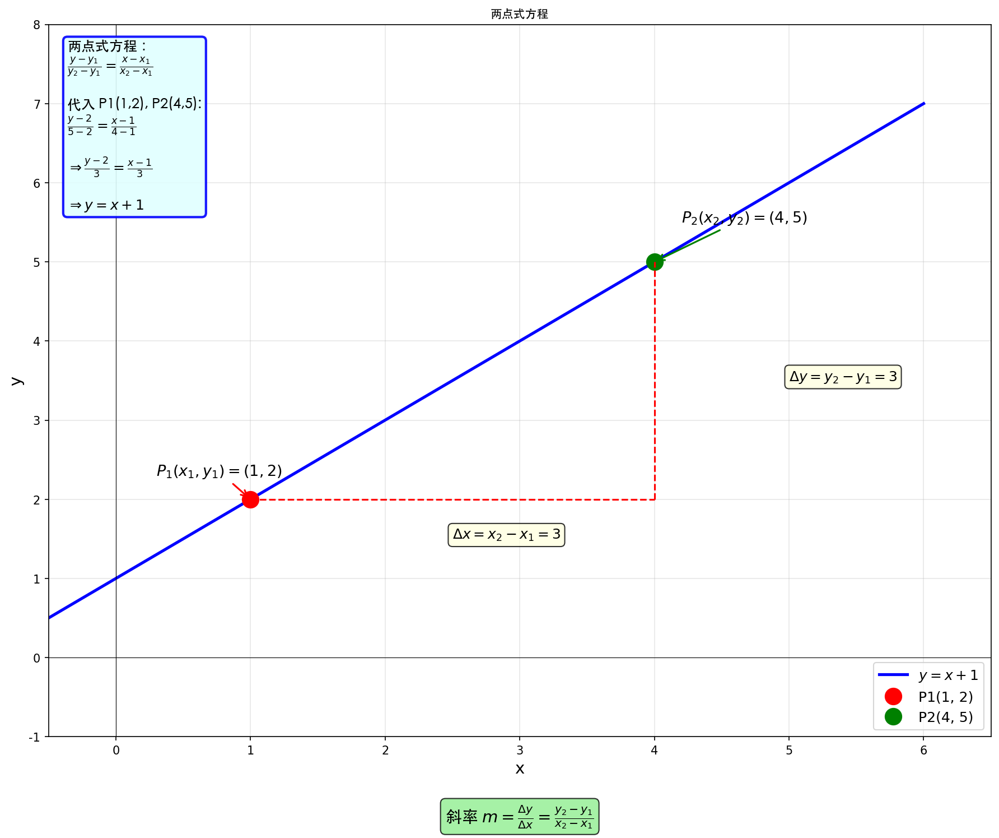

# 1.3 直线与一次函数

## 一、问题出发

> **核心问题**：如何用函数描述一条直线？

---

## 二、一次函数的定义

### 标准形式

$$
y = mx + b
$$

其中：
- $m$：**斜率**（slope）
- $b$：**截距**（y-intercept）

---

### 本质理解

> **一次函数 = 直线 = Linear Function**

- $m$ 决定**倾斜方向和程度**
- $b$ 决定**与 y 轴的交点位置**

---

## 三、斜率详解

### 定义

$$
m = \frac{\Delta y}{\Delta x} = \frac{y_2 - y_1}{x_2 - x_1}
$$

几何意义：**x 增加 1 个单位，y 变化多少**

---

### 斜率的几种情况

| 斜率 $m$ | 直线形态 | 例子 |
| --------- | -------- | ---- |
| $m > 0$ | 向右上方倾斜 | 递增 |
| $m < 0$ | 向右下方倾斜 | 递减 |
| $m = 0$ | 水平线 | 常数函数 |
| $m$ 不存在 | 垂直线 | $x = c$ |

---

### 斜率的几何意义

- $m = 2$：x 每增加 1，y 增加 2
- $m = -1$：x 每增加 1，y 减少 1
- $m = \frac{1}{2}$：x 每增加 2，y 增加 1
- $m = 0$：水平线，y 不变

---

## 四、截距

### y 轴截距

- 直线与 y 轴的交点 (0, b)
- **b > 0**：交点在 x 轴上方
- **b < 0**：交点在 x 轴下方
- **b = 0**：直线过原点

---

### x 轴截距

- 直线与 x 轴的交点 $(a, 0)$
- 解方程 $mx + b = 0 \Rightarrow x = -\frac{b}{m}$

---

## 五、直线方程的几种形式

### 1. 斜截式（最常用）

$$
y = mx + b
$$

优点：直接看出斜率 m 和截距 b

---

### 2. 点斜式

已知斜率 m 和一点 $(x_1, y_1)$：

$$
y - y_1 = m(x - x_1)
$$

---

### 3. 两点式

已知两点 $(x_1, y_1)$ 和 $(x_2, y_2)$：

$$
\frac{y - y_1}{y_2 - y_1} = \frac{x - x_1}{x_2 - x_1}
$$

**推导**：
- 斜率 $m = \frac{y_2 - y_1}{x_2 - x_1}$
- 代入点斜式 $y - y_1 = m(x - x_1)$
- 得 $\frac{y - y_1}{x - x_1} = \frac{y_2 - y_1}{x_2 - x_1}$

**适用条件**：$x_1 \neq x_2$（直线不垂直于 x 轴）

**特殊情况**：当 $x_1 = x_2$ 时，直线为垂直线 $x = x_1$

**例子**：已知 $P_1(1, 2)$ 和 $P_2(4, 5)$

$$
\frac{y - 2}{5 - 2} = \frac{x - 1}{4 - 1} \Rightarrow \frac{y - 2}{3} = \frac{x - 1}{3} \Rightarrow y = x + 1
$$

---

### 4. 截距式

已知 x 轴截距 a 和 y 轴截距 b：

$$
\frac{x}{a} + \frac{y}{b} = 1
$$

---

### 5. 一般式

$$
Ax + By + C = 0
$$

---

## 六、特殊直线

### 水平线

$$
y = c \quad (m = 0)
$$

- 斜率为 0
- 与 y 轴交于 (0, c)

---

### 垂直线

$$
x = c
$$

- 斜率**不存在**（无穷大）
- 与 x 轴交于 (c, 0)

---

### 过原点的直线

$$
y = mx
$$

- b = 0
- 必过 (0, 0)

---

## 七、两直线的关系

### 平行

$$
m_1 = m_2 \quad (\text{且 } b_1 \neq b_2)
$$

---

### 垂直

$$
m_1 \cdot m_2 = -1
$$

或：

$$
m_1 = -\frac{1}{m_2}
$$

---

### 重合（同一函数）

$$
m_1 = m_2 \quad \text{且} \quad b_1 = b_2
$$

---

## 八、点与直线的距离

点 $(x_0, y_0)$ 到直线 $Ax + By + C = 0$ 的距离：

$$
d = \frac{|Ax_0 + By_0 + C|}{\sqrt{A^2 + B^2}}
$$

---

## 九、核心逻辑链

1. 一次函数描述直线
2. 斜率 m 决定方向
3. 截距 b 决定位置
4. 不同形式适用于不同场景

---

## 十、一句话总结

> **一次函数 y = mx + b 是直线的标准描述，m 控制倾斜程度，b 控制上下位置**

---

## 十一、易错提醒

| ❌ 错误 | ✅ 正确 |
|---------|--------|
| 忘记斜率不存在的情况（垂直线） | 垂直线 $x = c$ 不能写成 $y = mx + b$ |
| 垂直的两线 $m_1 \cdot m_2 = 1$ | 垂直：$m_1 \cdot m_2 = -1$ |
| 截距式忘记 $a \neq 0, b \neq 0$ | 截距式只适用于过两轴的直线 |

---

## 下一步学习建议

- **一次函数与反函数的关系**
- **一次函数图像的平移与伸缩**
- **如何用一次函数逼近复杂函数（微分入门）**
