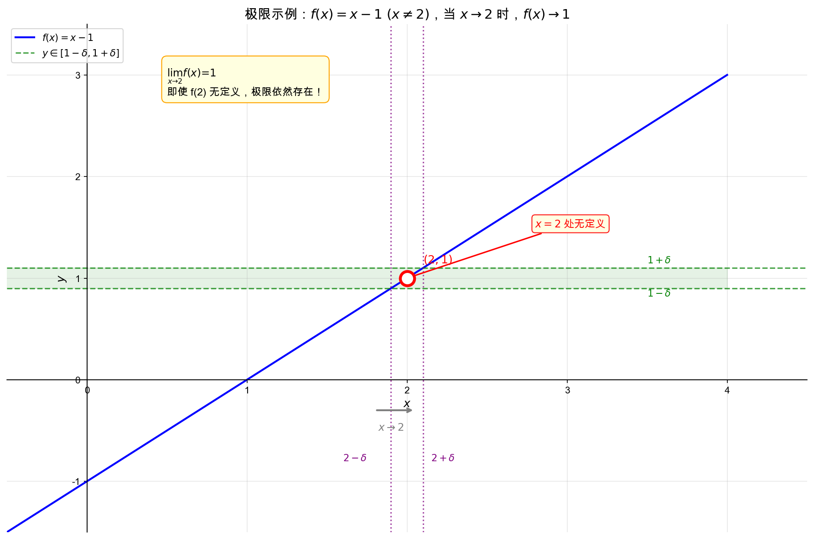
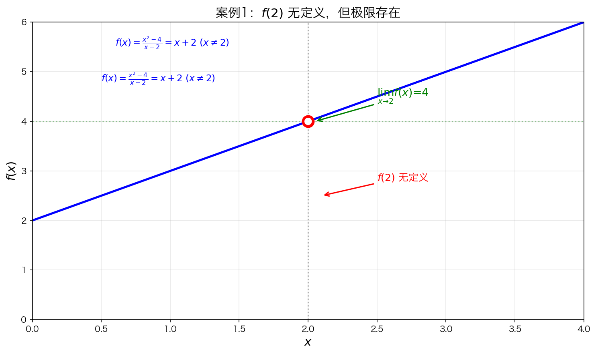
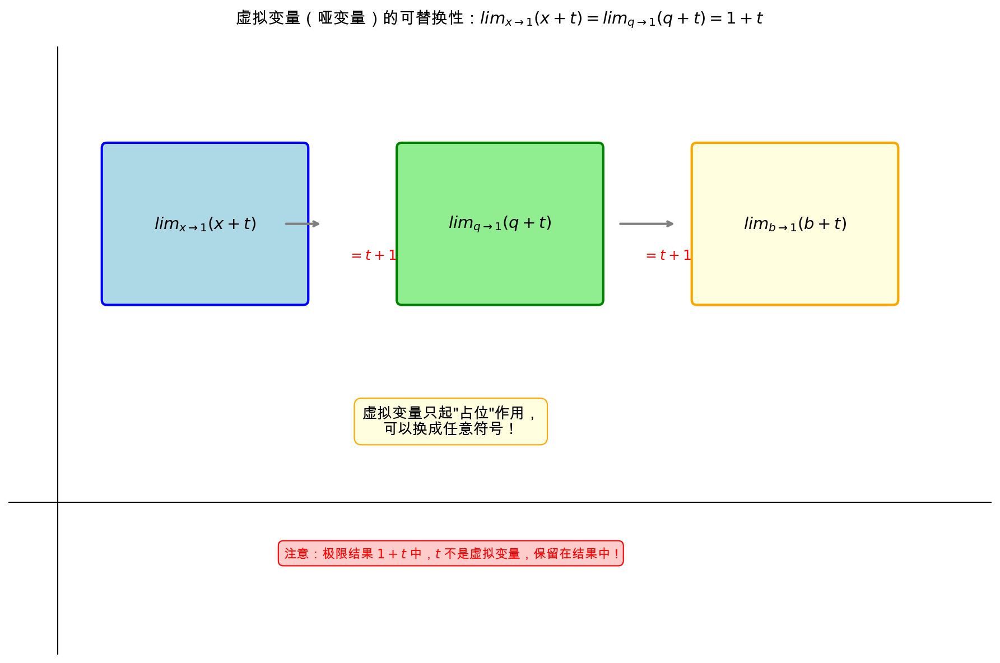

## 本节总览

这一节只做了一件事——**帮你建立"极限"的直觉理解**，而不是上来就讲严格定义。

### 核心问题：我们到底在问什么？

当 $x$ **越来越接近某个数 $a$**（但不等于它）时，$f(x)$ 会变成什么样？

> **我们关心的是"靠近时的趋势"，而不是"刚好等于时的值"**

### 极限的本质（最重要的一句话）

- 极限**不关心**：$x = a$ 时函数值是多少（甚至可以不存在）
- 极限**只关心**：**当 $x$ 无限接近 $a$ 时，函数"趋向哪里"**

### 知识结构（4句话总结）

1. **极限研究的是"接近时的趋势"**，不是"点上的值"
2. **可以没有函数值，但仍然有极限**（如 $f(2)$ 不存在，极限可能存在）
3. **函数在该点的值不影响极限**（就算 $f(2) = 3$，极限可能还是 1）
4. **极限表达式里的变量只是符号**，可以随便换

### 一句话总结

> 极限 = **"无限接近时的行为"**
>
> 而不是：**"等于那个点时的值"**

---

## 极限引入示例

让我们从一个具体的例子开始。考虑函数：

$$f(x) = x - 1 \quad (x \neq 2)$$

这个函数的图像是直线 $y = x - 1$，但在 $x = 2$ 处有一个**空心点**（即该点无定义）。

当 $x$ 越来越接近 2（但不等于 2）时，$f(x)$ 越来越接近 1：

- 如果要求 $f(x)$ 在 $1 \pm 0.0001$ 范围内，只需 $x$ 在 $1.9999$ 和 $2.0001$ 之间

这就是**极限**的思想：**$x$ 趋近于 2 时，$f(x)$ 趋近于 1**。

---

## 极限的符号表示

### 标准符号

我们用 "limit"（缩写 "Lim"）来表示极限：

$$\lim_{x \to 2} f(x) = 1$$

- $x \to 2$：写在 "Lim" 下方，表示 $x$ 趋近于 2
- $f(x)$：正常大小书写

### 描述性写法

> "当 $x$ 趋于 2 时，$f(x)$ 趋于 1"

这种写法偏描述性，做题时一般用标准符号更准确。

---

## 极限与定义的关系

> **重要结论**：极限存在与否和该点有无定义**完全无关**！

即使 $f(2)$ 无定义（如上例），极限依然可以存在。

反过来，即使 $f(2)$ 有定义，极限值和定义值也**没有任何必然联系**。

### 案例详解

**案例1：$f(2)$ 无定义，但极限存在**

$$
f(x) = \frac{x^2 - 4}{x - 2}, \quad x \neq 2
$$

当 $x \to 2$ 时：
- 分子：$x^2 - 4 = (x-2)(x+2)$
- 化简后：$f(x) = x + 2$
- 所以 $\lim\limits_{x \to 2} f(x) = 4$

虽然 $f(2)$ 无定义（分母为0），但极限值 = 4。

---

**案例2：$f(2)$ 有定义，但极限值 ≠ 函数值**

$$
f(x) = \begin{cases}
x + 2 & x \neq 2 \\ 0 & x = 2
\end{cases}
$$

**分段函数解读**：

| 条件 | 函数表达式 | 举例 |
|------|-----------|------|
| $x \neq 2$ 时 | $f(x) = x + 2$ | $f(1) = 3$, $f(3) = 5$ |
| $x = 2$ 时 | $f(x) = 0$ | $f(2) = 0$ |

- $\lim\limits_{x \to 2} f(x) = 4$（因为 $x \neq 2$ 时 $f(x) = x + 2$，所以趋近于 $2+2=4$）
- 但 $f(2) = 0$

极限值是 4，函数值是 0，两者**没有任何必然联系**。

---

### 分段函数的应用场景

分段函数在实际中很常见：

**1. 成本函数**
$$
C(x) = \begin{cases}
5x & x \leq 100 \\ 4x + 100 & x > 100
\end{cases}
$$
- 订购量 $\leq 100$ 件时，每件 5 元
- 订购量 $> 100$ 件时，批发价每件 4 元，外加固定成本 100 元

**2. 税费计算**
$$
T(x) = \begin{cases}
0.1x & x \leq 3000 \\ 300 + 0.2(x-3000) & x > 3000
\end{cases}
$$
- 月薪 $\leq 3000$ 时，税率 10%
- 月薪 $> 3000$ 时，超出部分税率 20%

**3. 运费计算**
$$
F(x) = \begin{cases}
10 & x \leq 5 \\ 10 + 2(x-5) & x > 5
\end{cases}
$$
- 5 kg 以内统一 10 元
- 超过 5 kg 后，每 kg 加 2 元

> **微积分中的意义**：分段函数的**转折点**往往是考察极限和连续性的关键。

---

## 虚拟变量（哑变量）

在求极限过程中，变量只是一个**占位符**，可以替换成任意符号：

$$\lim_{x \to 1} (x + t) = \lim_{q \to 1} (q + t) = \lim_{b \to 1} (b + t) = 1 + t$$

### 关键点

- 虚拟变量只起"占位"作用，可以换成任意符号（$q$、$b$ 等）
- 求极限的**结果不包含虚拟变量**
- 但结果中可能包含**与虚拟变量无关的其他变量**（如上例中的 $t$）

---

### 极限的应用场景

极限不仅是一个数学概念，在实际中也有广泛应用：

**1. 物理学：瞬时速度**
- 物体做变速运动，平均速度 $\bar{v} = \frac{\Delta s}{\Delta t}$
- 当 $\Delta t \to 0$ 时，平均速度的极限就是**瞬时速度**
- 这也是导数的物理意义

**2. 经济学：边际分析**
- 边际成本：产量增加一个单位时，总成本的增量
- $\text{边际成本} = \lim_{\Delta x \to 0} \frac{\Delta C}{\Delta x}$
- 当 $\Delta x \to 0$ 时， discrete（离散）变成 continuous（连续）

**3. 工程学：信号处理**
- 系统的响应特性
- 当输入信号趋于稳定时，输出的极限值

**4. 数学本身：导数定义**
- 导数本质上是极限：$f'(x) = \lim_{\Delta x \to 0} \frac{f(x+\Delta x) - f(x)}{\Delta x}$
- 微分、积分都建立在极限基础上

> **核心思想**：极限帮助我们从"离散"过渡到"连续"，从"有限"理解"无限"。

---

## 本节核心要点

1. **极限描述的是"趋近"过程**，而不是"到达"
   - $x \to 2$ 意味着 $x$ 无限接近 2 但不等于 2

2. **极限与定义无关**：
   - 函数在某点无定义，极限可能存在
   - 函数在某点有定义，极限值和定义值可能不同

3. **虚拟变量可替换**：极限符号中的变量只是占位符

---

