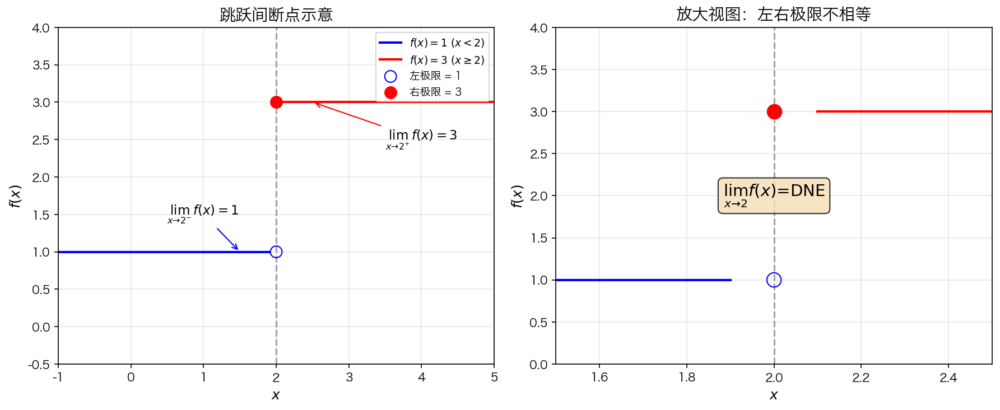
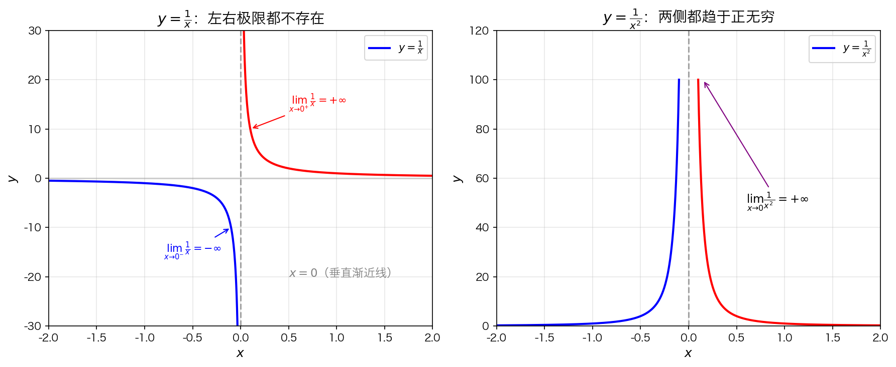
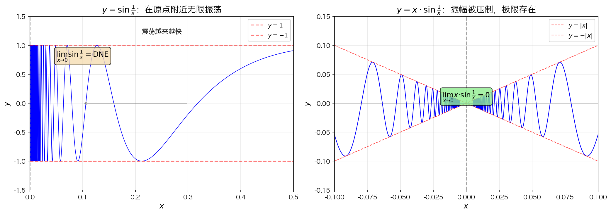

## 1. 极限不存在的三种情况

根据 3.2 节的结论：极限 $\lim\limits_{x \to a} f(x)$ 存在的充要条件是左、右极限都存在且相等。

因此，**极限不存在（DNE）** 对应以下三种情况：

| 情况 | 原因 | 典型示例 |
|------|------|----------|
| 情况1：左右极限不相等 | 跳跃间断点 | 分段函数在断点处左右值不同 |
| 情况2：极限趋于无穷大 | 无穷间断点 | 分母为零导致函数值无限增长 |
| 情况3：极限震荡 | 振荡间断点 | 三角函数等周期性波动 |

---

## 2. 情况1：左右极限不相等（跳跃间断）

**典型示例**：分段函数在 $x = 2$ 处发生跳跃

$$
f(x) = \begin{cases}
1 & x < 2 \\ 3 & x \geq 2
\end{cases}
$$

- 当 $x \to 2^-$ 时，$f(x) \to 1$
- 当 $x \to 2^+$ 时，$f(x) \to 3$

因为 $1 \neq 3$，所以 $\lim\limits_{x \to 2} f(x)$ 不存在。

---

## 3. 情况2：极限趋于无穷大（无穷间断）

### 核心理解：为什么 $\infty$ 不是极限？

**在实数范围内，极限必须是有限值**。当函数趋于无穷时，称为"极限发散"，通常记为不存在（DNE）。

> **类比**：就像你从1数到无穷大——你永远数不到"无穷大"，只能一直数下去。

以 $y = \frac{1}{x^2}$ 为例：

| $x$ 趋近于... | $f(x) = \frac{1}{x^2}$ 趋近于... |
|---------------|-----------------------------------|
| $\pm 0.1$ | $100$ |
| $\pm 0.01$ | $10000$ |
| $\pm 0.001$ | $1000000$ |
| ... | 无限增长 |

函数值**无限增长**，永远不会停在一个具体的数上，所以极限不存在。

### 对比：极限存在 vs 不存在

| 情况 | $x \to a$ 时 $f(x)$ 趋近于... | 极限存在？ |
|------|-------------------------------|-----------|
| 正常函数 | 一个具体的数（比如 5） | ✅ 存在 |
| 无穷间断 | 无限增长（$\infty$） | ❌ 不存在 |

### 示例1：$y = \frac{1}{x}$

$$
f(x) = \frac{1}{x}
$$

**为什么 $\frac{1}{x}$ 会"无限变大"？**

关键规律：**x 越小 → 1/x 越大**

当 $x > 0$ 且越来越接近 0：

| $x$ 的值 | $\frac{1}{x}$ 的值 |
|---------|-------------------|
| $0.1$ | $10$ |
| $0.01$ | $100$ |
| $0.001$ | $1000$ |
| $0.0001$ | $10000$ |

> **本质**：除以一个"越来越小的正数"，结果会变得越来越大

**"没有上限"的原因**：

- 想让 $\frac{1}{x} > 10000$？→ 取 $x < 0.0001$
- 想让 $\frac{1}{x} > 1亿$？→ 取 $x < 10^{-8}$

👉 **无论你想多大，都可以找到更小的 x 让它超过**

**严格数学表达**：
> 对任意大的数 $M$，都存在一个足够小的 $x$，使得 $\frac{1}{x} > M$

---

**结论**：

- 当 $x \to 0^-$ 时，$f(x) \to -\infty$（负方向无限增大）
- 当 $x \to 0^+$ 时，$f(x) \to +\infty$（正方向无限增大）

正无穷和负无穷都不是有限极限值，所以该函数在 $x = 0$ 处极限不存在。

### 示例2：$y = \frac{1}{x^2}$

$$
f(x) = \frac{1}{x^2}
$$

- 当 $x \to 0^-$ 时，$f(x) \to +\infty$
- 当 $x \to 0^+$ 时，$f(x) \to +\infty$

虽然左右极限都趋于正无穷，但正无穷仍不是有限极限值，所以极限不存在。

---

## 4. 情况3：极限震荡（振荡间断）

### 直观理解：为什么震荡就没有极限？

**核心问题**：当 $x \to 0$ 时，sin(1/x) 在不停地震荡，永远不停下来。

把 $\sin\frac{1}{x}$ 拆开看：

| $x$ 越来越接近 0 | $\frac{1}{x}$ 越来越大 | $\sin\frac{1}{x}$ |
|-----------------|----------------------|-------------------|
| 0.1 | 10 | 在 [-1,1] 之间震荡 |
| 0.01 | 100 | 震荡更快 |
| 0.001 | 1000 | 震荡非常快 |
| → 0 | → ∞ | **永远不停** |

> **类比**：就像你问一个人"你离我多远"，他回答"1米"，然后转了一圈还是说"1米"，再转一圈还是"1米"...他永远不停在一个固定的距离上。

### 典型示例：$\sin\frac{1}{x}$

$$
f(x) = \sin\left(\frac{1}{x}\right) \quad (x \neq 0)
$$

当 $x \to 0^+$ 时，$\frac{1}{x}$ 趋于正无穷，$\sin\frac{1}{x}$ 在 $[-1, 1]$ 之间来回震荡，且震荡速度越来越快，永远不会趋于某一个固定的值。

所以 $\lim\limits_{x \to 0} \sin\frac{1}{x}$ 不存在。

---

## 5. 情况4：被压制的振荡（极限反而存在）

这里出现了一个**反直觉**的情况：

$$
f(x) = x \cdot \sin\left(\frac{1}{x}\right)
$$

虽然 $\sin\frac{1}{x}$ 仍在震荡，但乘以 $x$ 后，震荡的"幅度"被压小了：

$$-|x| \leq x \cdot \sin\left(\frac{1}{x}\right) \leq |x|$$

也就是说：
- $\sin\frac{1}{x}$ 本身在 $[-1, 1]$ 之间震荡
- 乘以 $x$ 后，震荡范围被限制在 $[-|x|, |x|]$ 之间
- 当 $x \to 0$ 时，这个范围越来越小，最终趋近于 0

所以 $\lim\limits_{x \to 0} x \cdot \sin\frac{1}{x} = 0$

### 对比记忆

| 函数 | 当 $x \to 0$ 时的行为 | 极限存在？ |
|------|----------------------|-----------|
| $\sin\frac{1}{x}$ | 永远在 [-1,1] 震荡，不停下来 | ❌ 不存在 |
| $x \cdot \sin\frac{1}{x}$ | 震荡幅度被压到越来越小 → 0 | ✅ 存在 (= 0) |

> **简单记忆**：振荡不可怕，关键看振幅会不会"缩小"到0——会缩小就有极限，不会缩小就没有。

---

## 6. 垂直渐近线

**定义**：当 $x \to a$ 时，函数值趋于无穷（至少一侧），则 $x = a$ 是**垂直渐近线**。

例如：
- $x = 0$ 是 $y = \frac{1}{x}$ 的垂直渐近线
- $x = 0$ 是 $y = \frac{1}{x^2}$ 的垂直渐近线

---

## 7. 汇总对比

| 类型 | 左极限 | 右极限 | 结论 |
|------|--------|--------|------|
| 极限存在 | $L$ | $L$ | $\lim\limits_{x \to a} f(x) = L$ |
| 跳跃间断 | $L_1$ | $L_2 \neq L_1$ | DNE |
| 无穷间断 | $-\infty$ 或 $+\infty$ | $-\infty$ 或 $+\infty$ | DNE |
| 振荡间断 | 不存在 | 不存在 | DNE |

---

## 8. 判断极限存在性的三步法

1. **Step 1**：求左极限 $\lim\limits_{x \to a^-} f(x)$
2. **Step 2**：求右极限 $\lim\limits_{x \to a^+} f(x)$
3. **Step 3**：比较结果
   - 若左右极限都存在且相等 → 极限存在
   - 否则 → 极限不存在（DNE）

---

## 9. 本节核心要点

1. **极限不存在的三种情况**：跳跃、无穷、振荡

2. **跳跃间断**：函数在该点有"突变"，左右极限不相等

3. **无穷间断**：函数在该点附近趋于无穷大

4. **振荡间断**：函数在该点附近无限振荡，无法趋近于任何值

5. **关键区分**：
   - 振荡但被压制 → 极限可能存在（如 $x \sin(1/x)$）
   - 振荡且振幅不衰减 → 极限不存在（如 $\sin(1/x)$）

6. **垂直渐近线**：函数趋于无穷大的地方
