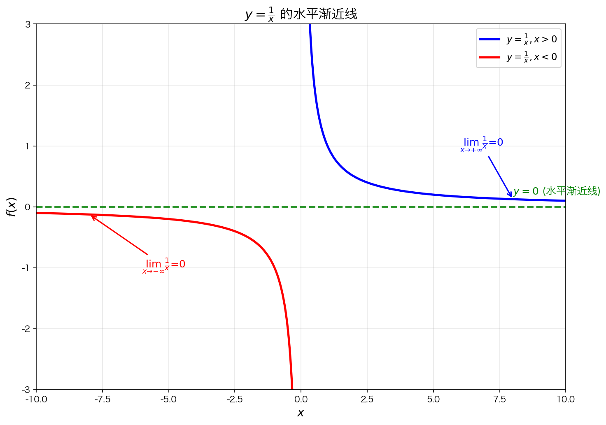
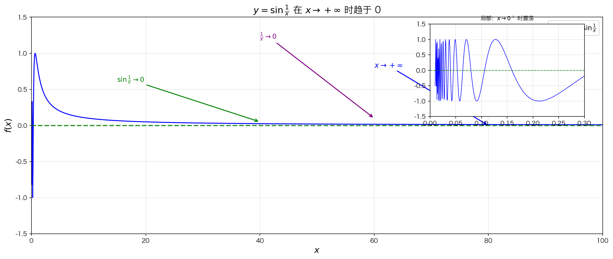
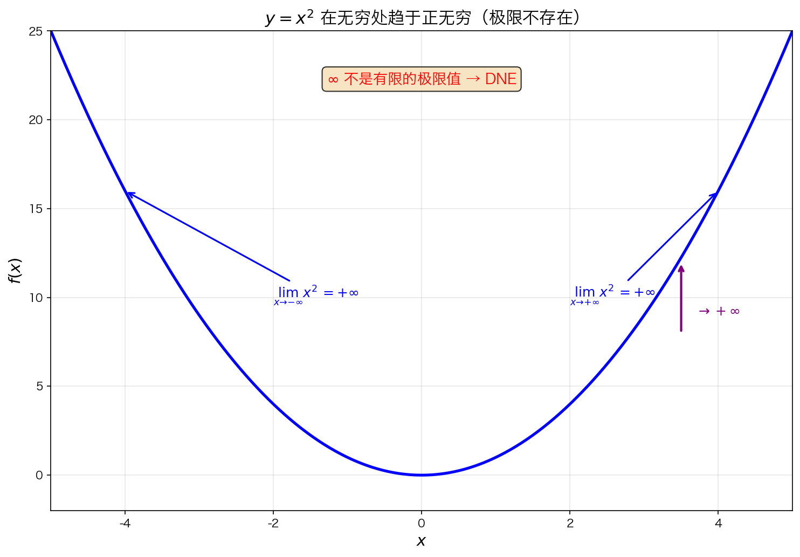
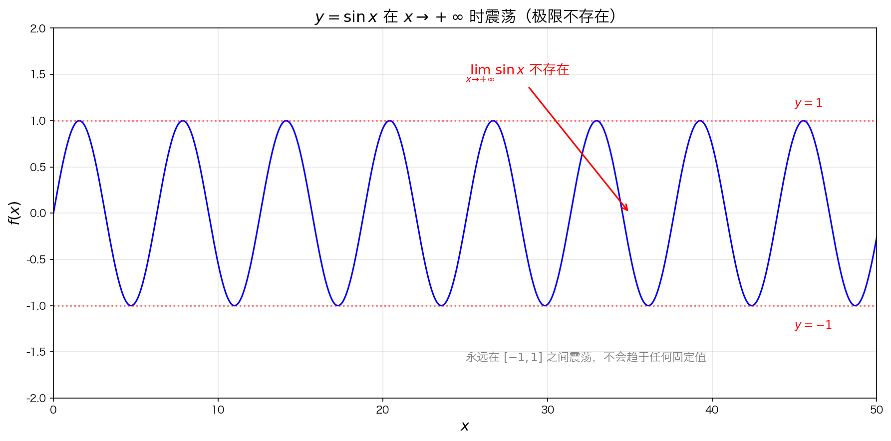
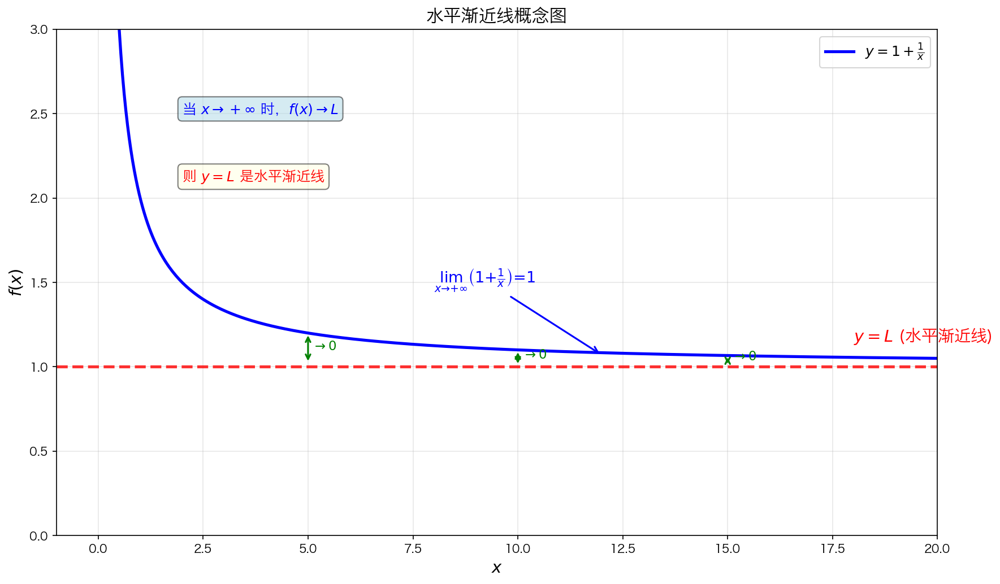

## 核心目标

前面学的是 $x \to a$（靠近某个点），这一节研究的是：

> **当 $x$ 越来越大 / 越来越小时，函数会怎么样？**

| 变化 | 表示 | 含义 |
|------|------|------|
| $x \to +\infty$ | 往右走到无穷远 |
| $x \to -\infty$ | 往左走到无穷远 |

---

## 1. x 趋于无穷的六种情况

求极限时，x 的变化过程有六种情况：

| 变化过程 | 表示方法 | 含义 |
|---------|---------|------|
| x 趋于 a | $x \to a$ | 从两边逼近 |
| x 趋于 a⁺ | $x \to a^+$ | 从右边逼近 |
| x 趋于 a⁻ | $x \to a^-$ | 从左边逼近 |
| x 趋于 +∞ | $x \to +\infty$ | 正无穷方向（向右走到无穷远） |
| x 趋于 -∞ | $x \to -\infty$ | 负无穷方向（向左走到无穷远） |
| x 趋于 ∞ | $x \to \infty$ | 通常表示 $x \to +\infty$ |

---

## 2. 函数在无穷处的极限

### 极限存在的情况

#### 示例1：$y = \frac{1}{x}$

当 $x \to +\infty$ 或 $x \to -\infty$ 时，$\frac{1}{x} \to 0$

| $x \to$ | $\frac{1}{x} \to$ |
|---------|-------------------|
| $+\infty$ | $0$ |
| $-\infty$ | $0$ |

- 当 $x \to +\infty$ 时，$\lim\limits_{x \to +\infty} \frac{1}{x} = 0$
- 当 $x \to -\infty$ 时，$\lim\limits_{x \to -\infty} \frac{1}{x} = 0$

两个方向的极限都存在且相等。

> **水平渐近线**：$y = 0$（x 轴）

#### 示例2：$y = \sin\frac{1}{x}$

当 $x \to \pm\infty$ 时，$\frac{1}{x} \to 0$（无论从正还是负方向），而 $\sin$ 在 $0$ 处连续，因此：

$$\frac{1}{x} \to 0 \Rightarrow \sin\left(\frac{1}{x}\right) \to \sin(0) = 0$$

所以 $\lim\limits_{x \to \infty} \sin\frac{1}{x} = 0$

---

### 极限不存在的情况

#### 示例3：$y = x^2$

当 $x \to +\infty$ 或 $x \to -\infty$ 时，$x^2 \to +\infty$

| $x \to$ | $x^2 \to$ |
|---------|----------|
| $+\infty$ | $+\infty$ |
| $-\infty$ | $+\infty$ |

函数值发散到正无穷，不是有限的极限值。因此它没有有限极限（但可以说极限为 $+\infty$）。

#### 示例4：$y = \sin x$

当 $x \to +\infty$ 时，$\sin x$ 在 $[-1, 1]$ 之间来回震荡，永远不会趋于某一个固定的值。

所以 $\lim\limits_{x \to +\infty} \sin x$ 不存在。

---

## 3. 水平渐近线

**定义**：若 $\lim\limits_{x \to +\infty} f(x) = L$ 或 $\lim\limits_{x \to -\infty} f(x) = L$，则 $y = L$ 是水平渐近线。

| 类型 | 条件 | 图像特点 |
|------|------|---------|
| 右侧水平渐近线 | $\lim\limits_{x \to +\infty} f(x) = L$ | 右边趋近 L |
| 左侧水平渐近线 | $\lim\limits_{x \to -\infty} f(x) = L$ | 左边趋近 L |

#### 示例：$y = \frac{1}{x}$

- $\lim\limits_{x \to +\infty} \frac{1}{x} = 0$ → 右侧水平渐近线 $y = 0$
- $\lim\limits_{x \to -\infty} \frac{1}{x} = 0$ → 左侧水平渐近线 $y = 0$

当 $x \to +\infty$ 和 $x \to -\infty$ 时函数都趋于 $0$，因此水平渐近线是 $y = 0$（只有一条）。

---

## 4. 大的数与小的数

### "大"和"小"是相对的

> **关键思想**："$x$ 很大"的意思是：大到让 $f(x)$ 已经接近极限值

例如：
- $100$ 大吗？👉 不一定！对某些函数来说，100 可能还不够大
- "接近 0" 也不是固定标准，要看具体函数

### 概念区分

| 概念 | 定义 | 举例 |
|------|------|------|
| 大的数 | 绝对值比较大的**确定常数** | $100000$, $-100000$ |
| 小的数 | 绝对值非常接近 0 的**确定常数** | $0.001$, $-0.001$ |
| 无穷大 | 变量可以任意大，不是一个具体数 | $x \to +\infty$ |
| 无穷小 | 极限为 0 的变量（不是固定数） | $x \to 0$ |

> **注意**：大的数和小的数是**确定的数**，而无穷大/无穷小是**变化过程**。

---

## 5. 三种极限形式对比

| 类型 | 表达式 | 研究对象 |
|------|--------|---------|
| 点极限 | $\lim\limits_{x \to a} f(x)$ | 某个点附近 |
| 单侧极限 | $\lim\limits_{x \to a^+} f(x)$, $\lim\limits_{x \to a^-} f(x)$ | 从某侧靠近 |
| 无穷远极限 | $\lim\limits_{x \to \infty} f(x)$ | 整体长期趋势 |

---

## 6. 极限三种情况总结

| 类型 | 表现 | 结论 |
|------|------|------|
| 收敛 | $f(x) \to L$（有限数） | 极限存在 |
| 发散 | $f(x) \to \pm\infty$ | 没有有限极限（发散） |
| 不存在 | $f(x)$ 不趋于任何值（如震荡） | 极限不存在 |

---

## 7. 本节核心要点

1. **六种 x 的变化过程**：$a$, $a^+$, $a^-$, $+\infty$, $-\infty$，以及 $x \to \infty$（通常表示 $+\infty$）

2. **水平渐近线**：$x \to \pm\infty$ 时 $f(x) \to L$，则 $y = L$ 是水平渐近线

3. **极限存在**：如 $y = \frac{1}{x}$，当 $x \to \pm\infty$ 时趋于 0

4. **极限发散（没有有限极限）**：$y = x^2$ 在 $\infty$ 处 $\to +\infty$

5. **极限不存在（震荡）**：$y = \sin x$ 在 $\infty$ 处来回震荡

6. **大数vs小数**：都是确定的常数，与趋于无穷/零的过程不同

7. **"大/小"是相对的**：取决于函数是否接近极限值
