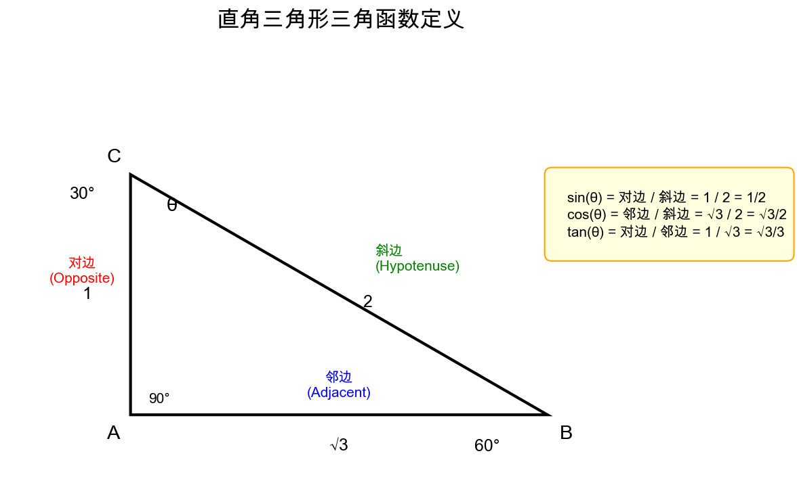
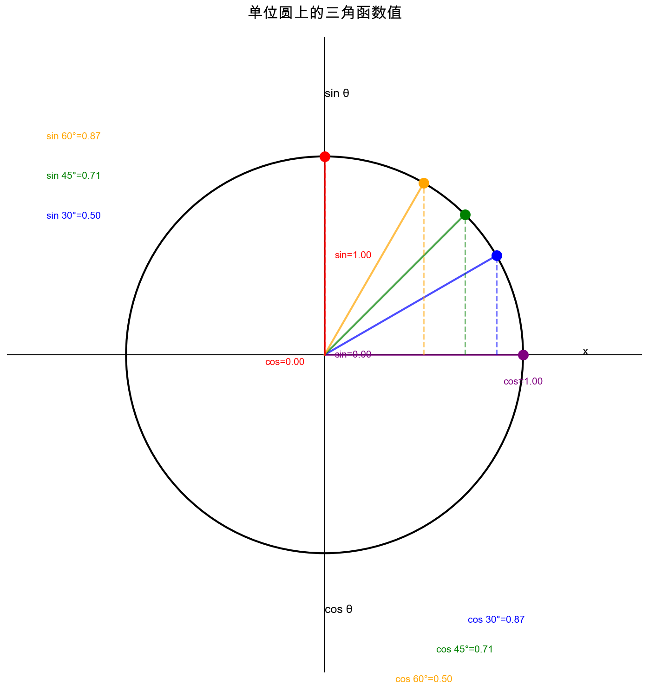
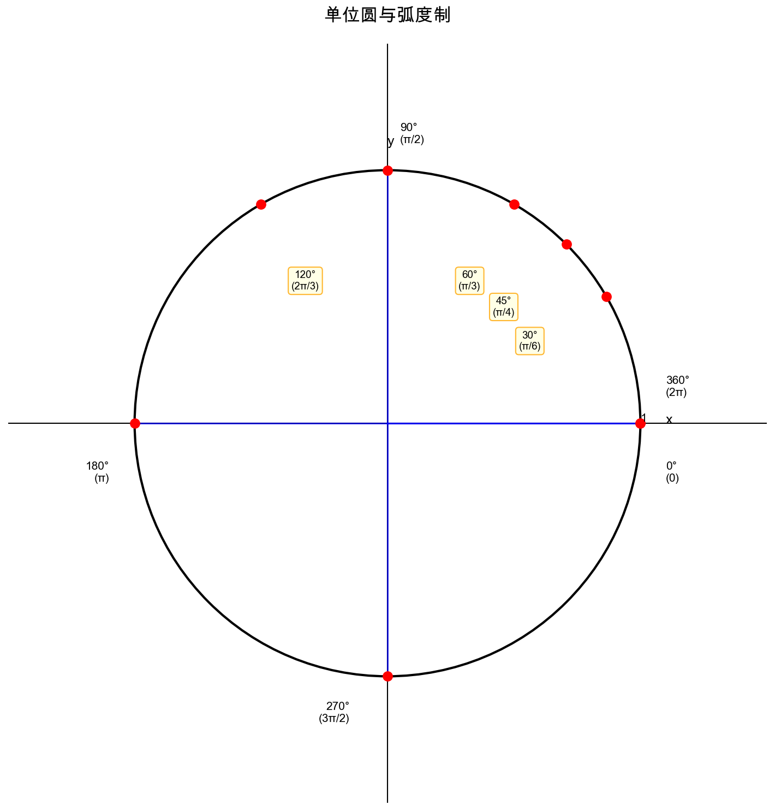
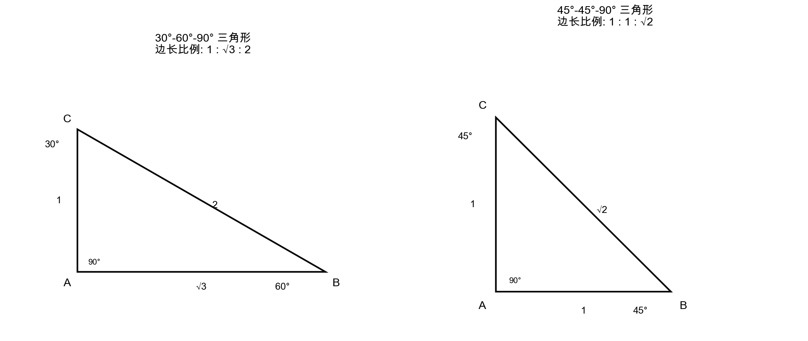
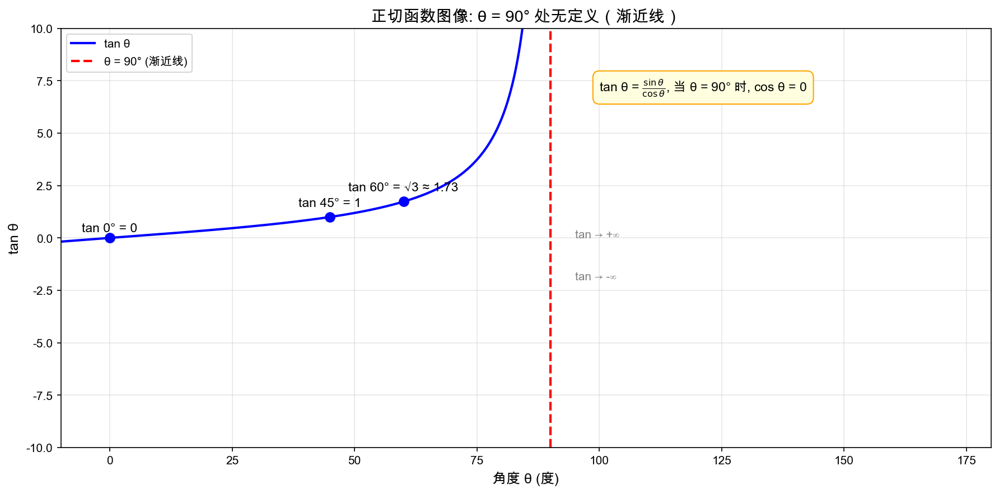

# 三角函数基础知识

> **核心思想**：三角函数本质上是在描述 **"角度决定了边的比例关系"**，而不是死记公式。

---

## 1. 从直角三角形出发

### 三角形基本元素

在一个直角三角形中（必须有一个 $90°$）：

| 名称 | 定义 | 说明 |
|------|------|------|
| **斜边** | 最长的一条边 | 对着直角 |
| **对边** | 相对于角 $\theta$，对面的边 | "对"是相对于 $\theta$ 来说的 |
| **邻边** | 贴着角 $\theta$，但不是斜边的那条 | "邻"是相对于 $\theta$ 来说的 |

> ⚠️ **注意**："对边/邻边" 是相对于我们关注的角度 $\theta$ 而言的，不是固定的边

---

## 2. 为什么是"比值"？（核心理解）

### 关键思想

> **同一个角度 $\theta$，可以对应无数个相似三角形，但边的"比例"是固定的**

例如：两个都是 $30°$ 的三角形：

- 一个斜边 = 1
- 一个斜边 = 100

虽然长度不同，但 $\dfrac{\text{对边}}{\text{斜边}}$ **永远一样**

### 三角函数的本质

$$**\text{角度} \rightarrow \text{唯一确定比例}**$$

---

## 3. sin / cos / tan 的几何直觉

### 🔵 sin（正弦）— 垂直比例

$$\sin(\theta) = \frac{\text{对边}}{\text{斜边}}$$

> **几何意义**："这个角 $\theta$ 有多'陡'（竖起来的程度）"
>
> - 对边 = 垂直方向
> - 斜边 = 总长度

✅ **sin 越大 → 越"竖"**

---

### 🟢 cos（余弦）— 水平比例

$$\cos(\theta) = \frac{\text{邻边}}{\text{斜边}}$$

> **几何意义**："这个角 $\theta$ 有多'平'（贴地程度）"
>
> - 邻边 = 水平方向

✅ **cos 越大 → 越"平"**

---

### 🔴 tan（正切）— 斜率

$$\tan(\theta) = \frac{\text{对边}}{\text{邻边}}$$

> **几何意义**："斜率（坡度）"
>
> $$\tan = \frac{\text{上升}}{\text{前进}} = \text{slope}$$

✅ **tan 就是函数的斜率 $k$**

---

## 4. 三者的统一理解

| 函数 | 本质 | 几何直觉 |
|------|------|----------|
| $\sin\theta$ | 垂直比例 | 高度占比 → 有多"竖" |
| $\cos\theta$ | 水平比例 | 长度占比 → 有多"平" |
| $\tan\theta$ | 倾斜程度 | 斜率 → 有多"陡" |

---

## 5. 单位圆理解（进阶）

如果把三角形"缩放"到斜边 = 1（单位圆）：

- $\sin(\theta)$ = **y 坐标**
- $\cos(\theta)$ = **x 坐标**
- $\tan(\theta)$ = **y / x**

> 👉 这时候你会发现：**三角函数本质是"坐标关系"**

---

## 6. 弧度制

### 弧度的定义

- 假设半径 $r = 1$，弧长为 $s$，则对应的弧度数为 $s$
- 整圆周长 $C = 2\pi r = 2\pi$，因此整圆为 $2\pi$ 弧度

### 单位圆弧度图示

### 常见角度与弧度对应

| 度数 | 弧度 |
|------|------|
| $360°$ | $2\pi$ |
| $180°$ | $\pi$ |
| $90°$ | $\pi/2$ |
| $60°$ | $\pi/3$ |
| $45°$ | $\pi/4$ |
| $30°$ | $\pi/6$ |
| $120°$ | $2\pi/3$ |
| $270°$ | $3\pi/2$ |

### 度数与弧度转换

- **度转弧度**：$\text{弧度} = \text{度数} \times \frac{\pi}{180}$
- **弧度转度**：$\text{度数} = \text{弧度} \times \frac{180}{\pi}$

---

## 7. 特殊三角形边长比例

> 这些比例关系是推导三角函数值的基础

---

## 8. 常见角度的三角函数值

### 三角函数值速查表

| 角度 | $\sin$ | $\cos$ | $\tan$ |
|------|--------|--------|--------|
| $0°$ | $0$ | $1$ | $0$ |
| $30°$ ($\pi/6$) | $\dfrac{1}{2}$ | $\dfrac{\sqrt{3}}{2}$ | $\dfrac{\sqrt{3}}{3}$ |
| $45°$ ($\pi/4$) | $\dfrac{\sqrt{2}}{2}$ | $\dfrac{\sqrt{2}}{2}$ | $1$ |
| $60°$ ($\pi/3$) | $\dfrac{\sqrt{3}}{2}$ | $\dfrac{1}{2}$ | $\sqrt{3}$ |
| $90°$ ($\pi/2$) | $1$ | $0$ | **无定义** |

### tan 90° 为什么无定义？

$$\tan\theta = \frac{\sin\theta}{\cos\theta}$$

当 $\theta = 90°$ 时，$\cos\theta = 0$，除数为零，所以 **无定义**

---

## 9. 一句话总结

> **三角函数不是在算边，而是在描述"角度决定的比例关系"**
>
> - $\sin$ → 高度比例（有多竖）
> - $\cos$ → 水平比例（有多平）
> - $\tan$ → 倾斜程度（有多陡）

---

## 10. 记忆技巧

想象你在爬坡：

- **sin**：你爬高了多少（高度）
- **cos**：你走了多远（水平）
- **tan**：坡有多陡（斜率）

---

> 💡 **记忆口诀**：**S**in = **O**pposite / **H**ypotenuse（撒-正弦，O/H）
