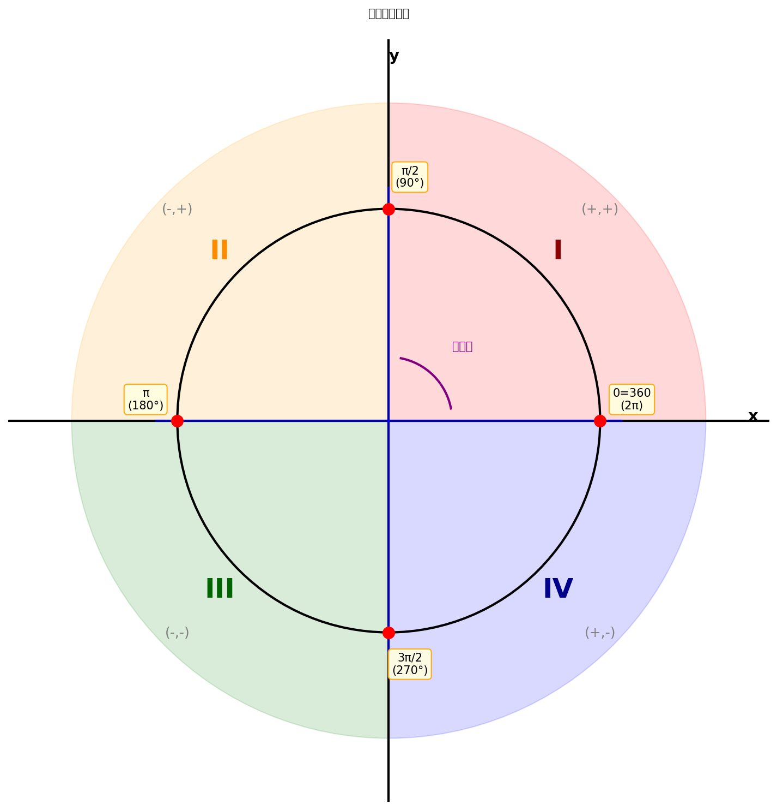
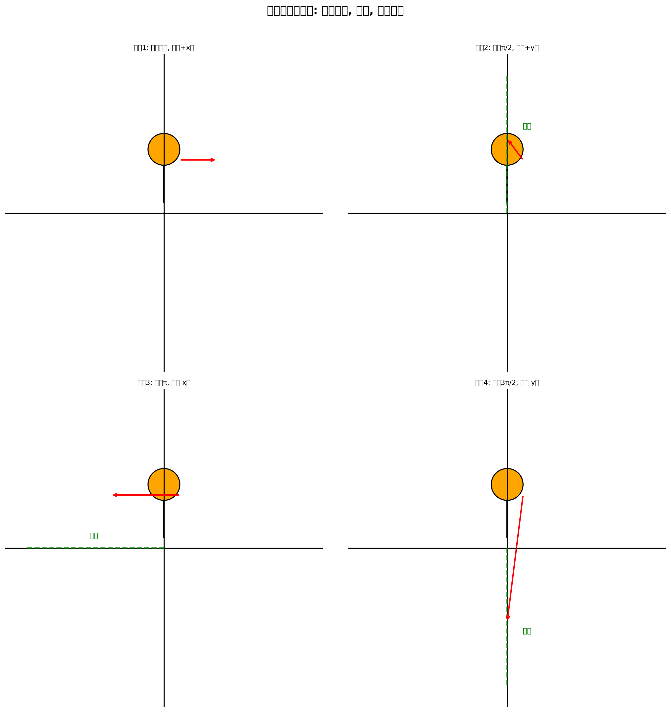
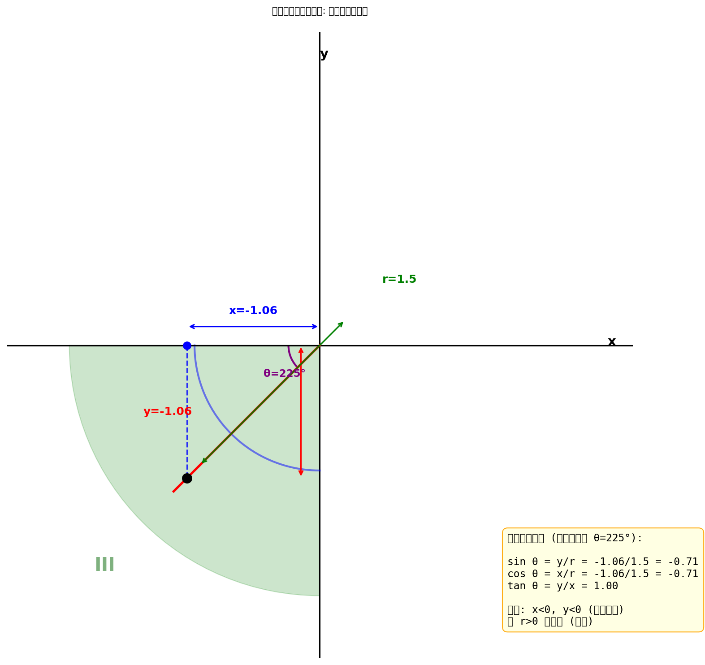
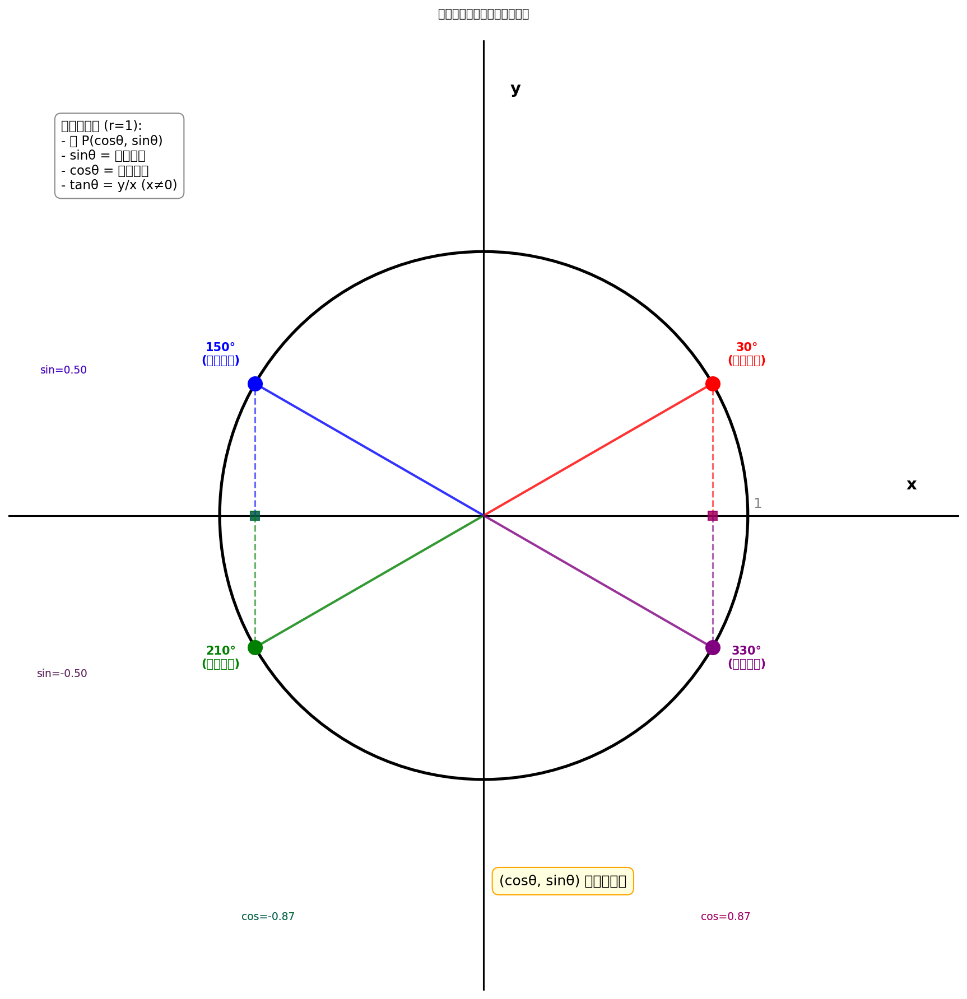
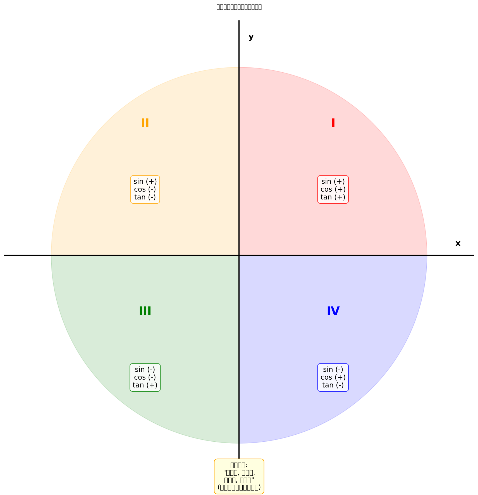

上表（你背熟了吗？）仅仅包括介于 $0$ 到 $\dfrac{\pi}{2}$ 的一些角。但事实上，我们可以取任意角的正弦或者余弦，哪怕这个角是负的。对于正切函数，我们则不得不小心些。例如，上面我们看到的 $\tan(\pi/2)$ 是无定义的。尽管如此，我们还是能够对**几乎每一个角**取正切。

---

## 四象限坐标系

让我们首先来看看介于 $0$ 到 $2\pi$（记住，$2\pi$ 就是 $360^\circ$）的角吧。

为了看得更清楚，我们先来画一个带有一点古怪标记的坐标平面：

注意到坐标轴将平面分成了**四个象限**，标记为 I 到 IV，且标记的走向为**逆时针方向**。这些象限分别被称为：
- **第一象限**：x > 0, y > 0
- **第二象限**：x < 0, y > 0
- **第三象限**：x < 0, y < 0
- **第四象限**：x > 0, y < 0

---

## 角度旋转的物理意义

下一步是要画一条**始于原点的射线**（就是半直线）。那么究竟是哪一条射线呢？这取决于角 $\theta$。

来想象一下，**你自己站在原点上，面向 x 轴的正半轴**。现在沿着**逆时针方向**转动角 $\theta$，然后你沿着一条直线向前走。你的足迹就是你要找的那条射线了。

现在，图中的其他标记就说得通了：
- 如果你转动了角 $\dfrac{\pi}{2}$，你将正面向上并且你的足迹将是 **y 轴的正半轴**
- 如果你转动了角 $\pi$，你将得到 **x 轴的负半轴**
- 如果你转动了角 $\dfrac{3\pi}{2}$，你将得到 **y 轴的负半轴**
- 最后，如果你转动了角 $2\pi$，那么就又会回到了你起始的那个位置，即面向 x 轴的正半轴

> **这就好像你根本没转动过！** 这就是为什么图中会有 $0 \equiv 2\pi$。对于角度而言，$0$ 和 $2\pi$ 是**等价**的。

---

## 任意角的三角函数定义

好了，让我们取某个角 $\theta$ 并以恰当的方式画出它。或许它就在第三象限的某个地方：

注意到我们将这条射线标记为 $\theta$，而不是这个角本身。不管怎样，现在在这条射线上选取某个点并从该点画一条垂线至 x 轴。我们对**三个量**感兴趣：
- 该点的 **x 坐标**
- 该点的 **y 坐标**
- 该点到原点的**距离 r**

> 注意：x 和 y 可能会同时为负（事实上，在第三象限它们均为负）。然而，**r 总是正的**，因为它是距离。

事实上，根据**毕达哥拉斯定理**（即勾股定理），不管 x 和 y 是正还是负，我们总会有：

$$r = \sqrt{x^2 + y^2}$$

（平方会消除任何负号。）

---

## 三角函数公式

有了这三个量，我们就可以定义如下的三个三角函数了：

$$\sin(\theta) = \frac{y}{r}, \quad \cos(\theta) = \frac{x}{r}, \quad \tan(\theta) = \frac{y}{x}$$

将量 x、y 和 r 分别解释为**邻边**、**对边**和**斜边**，这些函数恰好就是 2.1 节中的固定公式了。

不过等一下，**如果你在那条射线上选取了另外一个点，那会是什么样子呢？**

> 这不要紧，因为你得到的新的三角形和原来的那个三角形是**相似**的，而上述**比值不会受到任何影响**。

---

## 单位圆

事实上，为方便起见，我们常常假设 $r = 1$，这样得到的点 $(x, y)$ 会落在所谓的**单位圆**（就是以原点为中心，半径为 1 的圆）上。

在单位圆上，**三角函数有了直观的几何意义**：
- $\sin\theta$ = P 点到 x 轴的垂直距离（y 坐标）
- $\cos\theta$ = P 点到 y 轴的水平距离（x 坐标）
- **点 $P(\cos\theta, \sin\theta)$ 正好落在单位圆上！**

---

## 象限与符号

| 象限 | sin | cos | tan |
|:---:|:---:|:---:|:---:|
| I   | +   | +   | +   |
| II  | +   | -   | -   |
| III | -   | -   | +   |
| IV  | -   | +   | -   |

**记忆口诀**：一全正，二正弦，三正切，四余弦

---

## 本节核心要点

1. **任意角都可以有三角函数值**（除了 tan 在分母为 0 时无定义）
2. 三角函数值由 **比值 y/r, x/r, y/x** 决定，与射线上点的位置无关
3. **单位圆**是理解三角函数的几何神器：点 $(\cos\theta, \sin\theta)$ 落在单位圆上
4. **象限决定符号**：一二正弦正，三四余弦正；正切则看 x 和 y 是否同号
