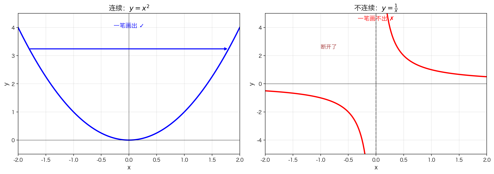

# 本节要解决的问题

上一章我们学了极限。极限描述的是：当 $x$ 趋近某一点 $a$ 时，$f(x)$ 会趋近什么值。

但极限有一个"漏洞"：它只描述**趋近的过程**，不保证函数在 $a$ 点的图像真的"连得上"。

> **本节核心问题**：如何用数学语言精确描述"函数图像一笔画出、中间不断开"这件事？

---

# 直觉：连续就是"一笔画"

想象你用笔在纸上画函数图像：

- **连续函数**：笔尖始终不离开纸面，从头到尾一笔画完
- **不连续函数**：必须在某处抬笔，跳过"断点"，才能继续画下去


$y = x^2$ 的图像是一条完整的抛物线，你可以从左下角开始沿着曲线一直画到右下角，笔尖从未离开纸面——这就是连续。

---

# 为什么光有"极限"还不够？

极限只问：$x$ 趋近 $a$ 时，$f(x)$ 趋近什么？

它**不关心** $f(a)$ 是否存在，也**不关心** $f(a)$ 是否等于那个极限值。

## 反例：图像"断开"但极限存在

考虑函数：

$$f(x) = x+1\ (x \neq 2),\quad f(2) = 5$$

当 $x$ 趋近 2 时，$f(x)$ 显然趋近于 3：

$$\lim_{x \to 2} f(x) = 3$$

但函数在 $x=2$ 处的值却是 $f(2)=5$。图像在 $x=2$ 处有一个"洞"（极限 3），但函数点被强行放到了高度 5——笔尖必须抬一下才能继续画。

> 所以：极限存在 $\neq$ 图像不断开。

## 反例：$y = \frac{1}{x}$


$$f(x) = \frac{1}{x}$$

- 在 $x = 0$ 处函数无定义（分母为零）
- $x = 0$ 处有一条垂直渐近线，把图像分成左右两支
- 你无法一笔画出完整图像，必须跳过 $x=0$ 这个缺口

### 重要结论

> $f(x) = \frac{1}{x}$ 在除了 $x=0$ 以外的所有点处都是连续的。

这说明：**连续性是"逐点"的性质**。一个函数可以在某些点连续，在另一些点不连续。

---

# 连续 vs 不连续：直观对比



| | $y = x^2$ | $y = \frac{1}{x}$ |
|---|---|---|
| 图像 | 完整的一条曲线 | 被渐近线分成两段 |
| 能否一笔画 | 能 | 不能 |
| 问题点 | 没有 | $x=0$ 处断开 |
| 连续性 | 处处连续 | $x \neq 0$ 时连续 |

---

# 研究路线：从一点到区间，再到性质

笼统地说"函数连续"不够精确。$y=\frac{1}{x}$ 在大部分地方连续，只在 $x=0$ 不连续。

所以我们必须：

1. 先定义**在一点处连续**
2. 再推广到**在区间上连续**
3. 最后研究**连续函数的性质**（介值定理、最值定理等）

用流程图表示：

```
在一点处连续 → 在区间上连续 → 连续函数的性质
```

---

# 本节总结

## 核心要点

- **直觉**：连续 = 图像可以一笔画出
- **关键观察**：不连续发生在函数"断开"或"跳跃"的地方
- **极限的不足**：极限存在不能保证图像不断开
- **逐点性**：连续性是针对每一个点而言的性质
- **下一步**：严格定义"在一点处连续"

## 常见误区

❌ **误区**："不连续 = 图像分成两部分"

✅ **正解**：分成两部分只是不连续的一种表现形式。即使图像看起来"连在一起"，也可能在某点不连续（如可去间断点、跳跃间断点）。

---

# 本节内容

1. [5.1.1 在一点处连续](5.1.1%20在一点处连续.md) —— 连续性的严格定义
2. [5.1.2 在区间上连续](5.1.2%20在区间上连续.md) —— 从单点推广到区间
3. [5.1.3 连续函数的一些例子](5.1.3%20连续函数的一些例子.md) —— 常见连续函数
4. [5.1.4 介值定理](5.1.4%20介值定理.md) —— 连续函数不漏掉中间值
5. [5.1.5 奇数次多项式必有根](5.1.5%20奇数次多项式必有根.md) —— 介值定理的漂亮应用
6. [5.1.6 连续函数的最大值和最小值](5.1.6%20连续函数的最大值和最小值.md) —— 闭区间上必有最值
