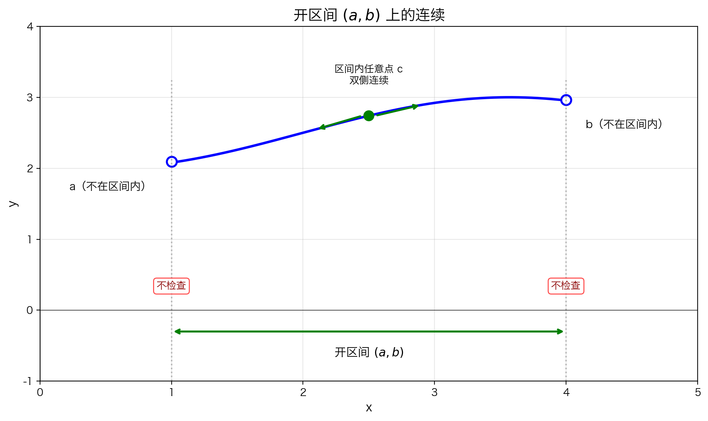
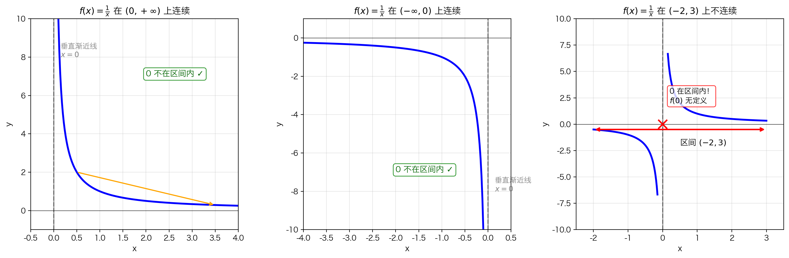
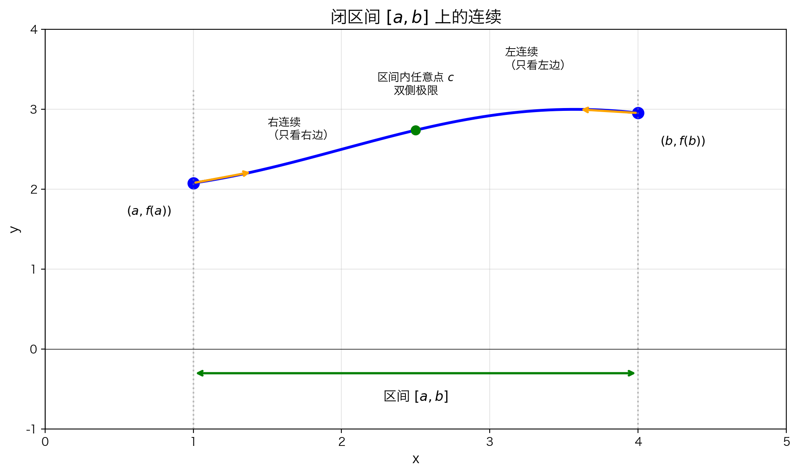
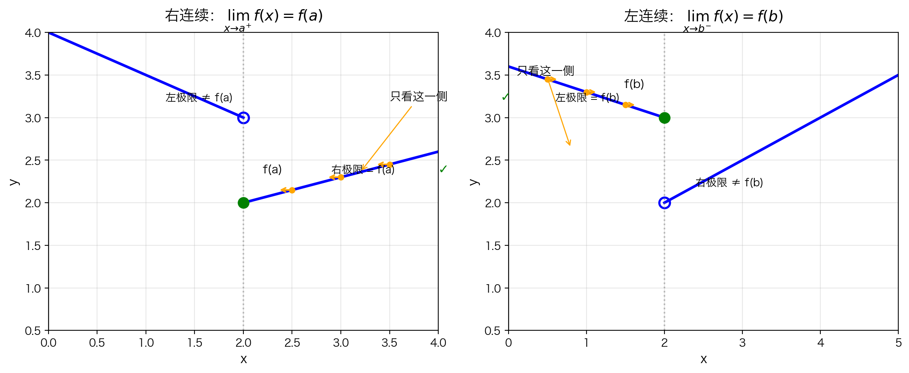

# 5.1.2 在区间上连续

## 本节要解决的问题

上一节我们学会了判断函数在**一个点**是否连续：

$$\lim_{x \to a} f(x) = f(a)$$

但实际问题里，我们更关心的是：

> 函数在**一整段区间**上是不是连续的？

比如一辆汽车的速度在 0 到 10 秒内是否连续变化？一段函数图像在某个窗口内是否一笔画成？

本节就是把**单点连续**推广到**区间连续**。

---

## 一、从单点连续到区间连续

### 1.1 核心思想

**区间上的连续，本质上就是区间内每一个点都连续。**

就像一段路平坦不平坦，取决于路上每一个点平不平。

| 区间类型 | 形象说法 | 端点要不要检查 |
|---------|---------|--------------|
| 开区间 $(a, b)$ | 只看区间内部 | 不检查 |
| 闭区间 $[a, b]$ | 把端点包进来 | 检查单侧 |

### 1.2 为什么要区分开区间和闭区间？

因为端点很特殊：

- 左端点 $a$ 的**左边**可能根本没有函数定义
- 右端点 $b$ 的**右边**可能根本没有函数定义

所以端点不能要求"左右双侧都连续"，只能看**有定义的那一侧**。

---

## 二、开区间上的连续

### 2.1 定义

如果函数 $f$ 在开区间 $(a, b)$ 上的**每一点**都连续，就说 $f$ 在 $(a, b)$ 上连续。



"每一点都连续"的意思是：随便在 $(a, b)$ 内取一个点 $c$，都必须满足

$$\lim_{x \to c} f(x) = f(c)$$

也就是：

- 从左边趋近 $c$ 时，$f(x) \to f(c)$
- 从右边趋近 $c$ 时，$f(x) \to f(c)$

因为 $c$ 在区间**内部**，左右两侧都有定义，所以必须检查双侧极限。

### 2.2 为什么端点不需要检查？

开区间的符号是 $(a, b)$，小括号表示**端点被排除在外**：

- $a \notin (a, b)$
- $b \notin (a, b)$

所以 $f$ 在端点处有没有定义、连不连续，都不影响它在 $(a, b)$ 上的连续性。

> 类比：一家 club 只管理 club **里面**的人，站在门口的人不归你管。

### 2.3 例子：$f(x) = \dfrac{1}{x}$



**在 $(0, +\infty)$ 上连续**

- 每一点 $x > 0$ 都有定义
- 每一点的极限都等于函数值
- $x = 0$ 不在区间内，不需要考虑

**在 $(-\infty, 0)$ 上也连续**

- 同理，每一点 $x < 0$ 都连续
- $x = 0$ 不在区间内

**但在 $(-2, 3)$ 上不连续**

- 因为 $0 \in (-2, 3)$，而 $f(0)$ 无定义
- 区间内存在一个点不连续，整个区间就不连续

> **关键结论**：只要区间内有**一个点**不连续，函数在该区间上就不连续。

---

## 三、闭区间上的连续

### 3.1 问题：端点怎么办？



当函数定义在闭区间 $[a, b]$ 上时，端点处出现特殊情况：

- **左端点 $x = a$**：图像从 $a$ 开始，左边没有定义
  - 只能看右极限 $\displaystyle\lim_{x \to a^+} f(x)$

- **右端点 $x = b$**：图像到 $b$ 结束，右边没有定义
  - 只能看左极限 $\displaystyle\lim_{x \to b^-} f(x)$

### 3.2 定义

函数 $f$ 在闭区间 $[a, b]$ 上连续，需要同时满足三个条件：

**条件 1**：$f$ 在开区间 $(a, b)$ 内的每一点都连续

> 任取 $c \in (a, b)$，必须有 $\displaystyle\lim_{x \to c} f(x) = f(c)$（双侧极限）。

**条件 2**：$f$ 在左端点 $a$ 处右连续

$$\lim_{x \to a^+} f(x) = f(a)$$

**条件 3**：$f$ 在右端点 $b$ 处左连续

$$\lim_{x \to b^-} f(x) = f(b)$$

### 3.3 拆解理解

| 位置 | 需要检查什么 | 原因 |
|------|------------|------|
| 内部点 $c \in (a, b)$ | 双侧连续 | 左右两侧都有定义 |
| 左端点 $x = a$ | 右连续 | 左侧没有定义 |
| 右端点 $x = b$ | 左连续 | 右侧没有定义 |

> **直观记忆**：闭区间用方括号 $[\quad]$，表示"把端点包进来"。包进来的点就要检查连续性，但由于端点外侧可能没有函数定义，所以只能检查**有定义的那一侧**。

**一句话总结**：

$$\text{闭区间连续} = \text{内部双侧连续} + \text{左端点右连续} + \text{右端点左连续}$$

三个条件**缺一不可**。

---

## 四、单侧连续

### 4.1 直观理解



**右连续**（左图）：只看端点**右侧**的情况

- $x$ 从 $a$ 的右边趋近时，$f(x) \to f(a)$
- 左边是什么无所谓

**左连续**（右图）：只看端点**左侧**的情况

- $x$ 从 $b$ 的左边趋近时，$f(x) \to f(b)$
- 右边是什么无所谓

### 4.2 定义

**右连续**：

$$\lim_{x \to a^+} f(x) = f(a)$$

即：从右侧趋近 $a$ 时，极限值等于 $a$ 点的函数值。$a$ 点左侧的函数行为**完全不影响**右连续的判定。

**左连续**：

$$\lim_{x \to b^-} f(x) = f(b)$$

即：从左侧趋近 $b$ 时，极限值等于 $b$ 点的函数值。$b$ 点右侧的函数行为**完全不影响**左连续的判定。

### 4.3 与双侧连续的关系

| 位置 | 左极限 = 函数值？ | 右极限 = 函数值？ | 结论 |
|------|----------------|----------------|------|
| 区间内点 | 需要 | 需要 | 双侧连续 |
| 左端点 $a$ | 不需要 | 需要 | 右连续 |
| 右端点 $b$ | 需要 | 不需要 | 左连续 |

---

## 五、函数的整体连续性

### 5.1 定义

如果函数 $f$ 在**其定义域中的每一个点**都连续，我们就说 $f$ 是**连续的**。

判断流程：

1. 取出 $f$ 的定义域 $\text{dom}(f)$
2. 对定义域中的每一个点 $x$，检查 $f$ 在 $x$ 处是否连续
3. 如果**全部通过**，才说"$f$ 是连续的"

### 5.2 端点怎么处理？

如果定义域包含闭区间的端点，那些端点只需要单侧连续：

- $x = 0$ 处：右连续即可
- $x = 1$ 处：左连续即可

这和闭区间上连续的逻辑完全一致。

### 5.3 为什么强调"在定义域上"？

函数只能在自己的定义域内讨论连续性。定义域外的点，函数连定义都没有，更谈不上连续不连续。

### 5.4 例子

| 函数 | 定义域 | 连续性结论 |
|------|--------|-----------|
| $f(x) = x^2$ | $\mathbb{R}$ | 处处连续 |
| $f(x) = \dfrac{1}{x}$ | $(-\infty, 0) \cup (0, +\infty)$ | 在其定义域上连续 |

> 注意：说"$f(x) = \dfrac{1}{x}$ 连续"时，隐含的意思是"**在定义域上**连续"。我们不会说它在整个 $\mathbb{R}$ 上连续，因为 $x = 0$ 处没有定义。

---

## 六、本节总结

### 6.1 区间连续的判断流程

```txt
区间类型？
├── 开区间 (a, b)
│   └── 检查区间内每一点是否双侧连续
└── 闭区间 [a, b]
    ├── 检查 (a, b) 内每一点是否双侧连续
    ├── 检查 x = a 是否右连续
    └── 检查 x = b 是否左连续
```

### 6.2 核心要点

1. **开区间**：只管内部，不管端点
2. **闭区间**：内部双侧连续 + 端点单侧连续
3. **整体连续**：定义域内每一点都连续（端点只需单侧）
4. **区间内有一个点不连续** → 整个区间上不连续

### 6.3 常见误区

❌ **误区**："闭区间上连续，端点也需要双侧极限"

✅ **正解**：端点外可能没有定义，只能用单侧极限。左端点看右极限，右端点看左极限。

❌ **误区**："$f(x) = \dfrac{1}{x}$ 不连续"

✅ **正解**：$f(x) = \dfrac{1}{x}$ **在其定义域上是连续的**，只是在 $x = 0$ 处没有定义，因此不能说它在包含 0 的区间上连续。

---

## 七、苏格拉底自测题

> [!faq]- 基础题：$f(x) = \sqrt{x}$ 在 $[0, 1]$ 上连续吗？
> 连续。内部 $(0, 1)$ 每点双侧连续；左端点 $0$ 只需右连续，$\displaystyle\lim_{x \to 0^+} \sqrt{x} = 0 = f(0)$；右端点 $1$ 只需左连续，$\displaystyle\lim_{x \to 1^-} \sqrt{x} = 1 = f(1)$。

> [!faq]- 理解题：为什么开区间端点不需要检查连续性？
> 因为开区间 $(a, b)$ 不包含端点 $a$ 和 $b$，端点本来就不在讨论范围内。

> [!faq]- 应用题：$f(x) = \dfrac{1}{x}$ 在 $[-1, 1]$ 上连续吗？
> 不连续。因为 $0 \in [-1, 1]$，而 $f(0)$ 无定义。

---

## 下一节

知道了连续的定义和判断方法，来看看**哪些常见函数是连续的**：

→ [5.1.3 连续函数的一些例子](5.1.3%20连续函数的一些例子.md)
