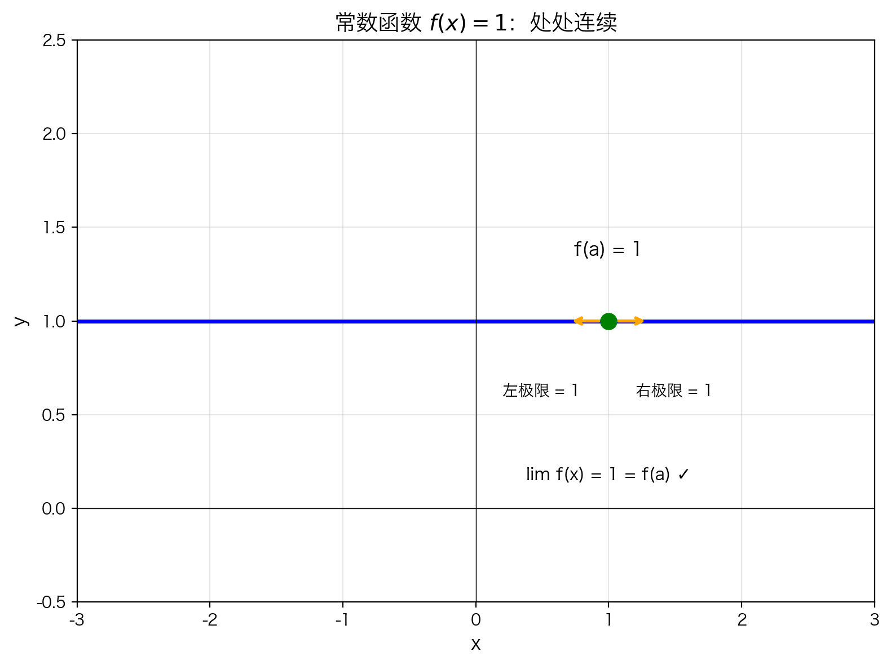
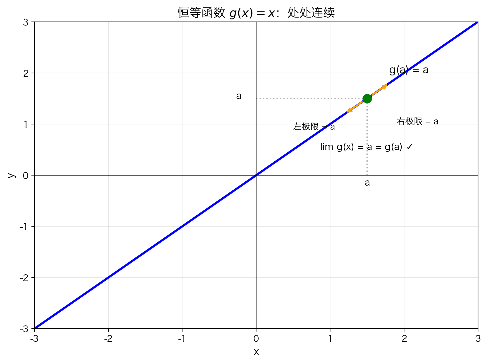
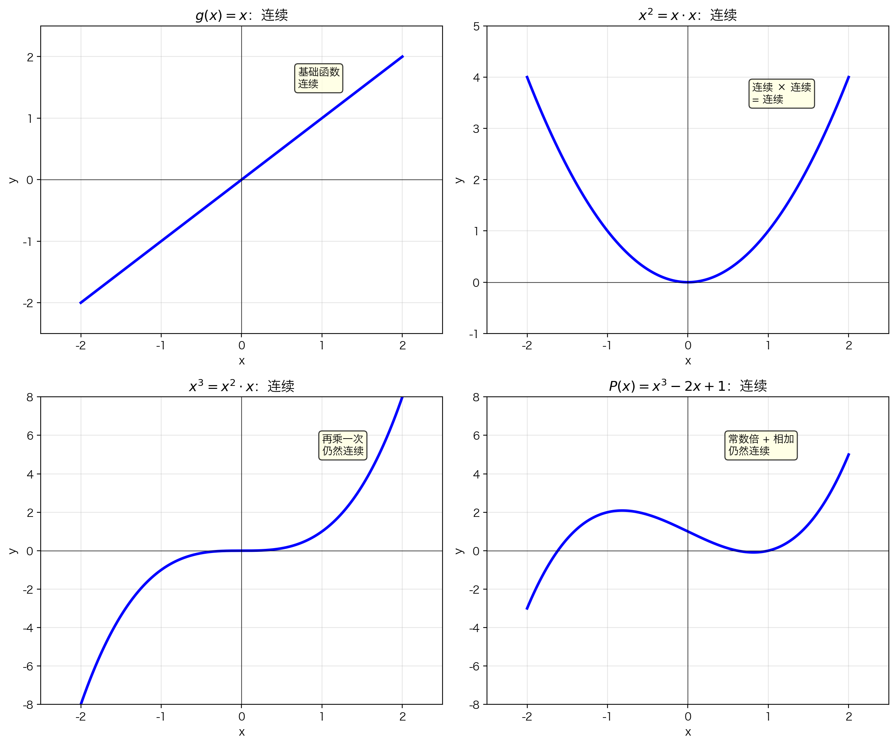
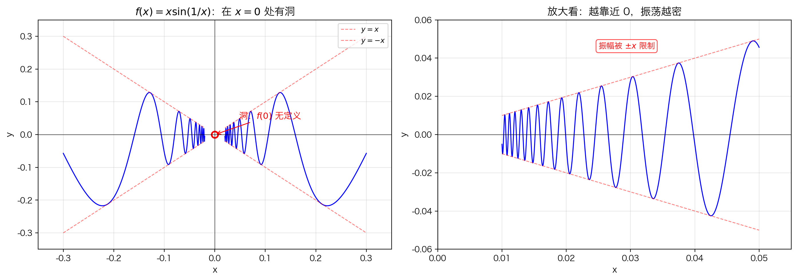
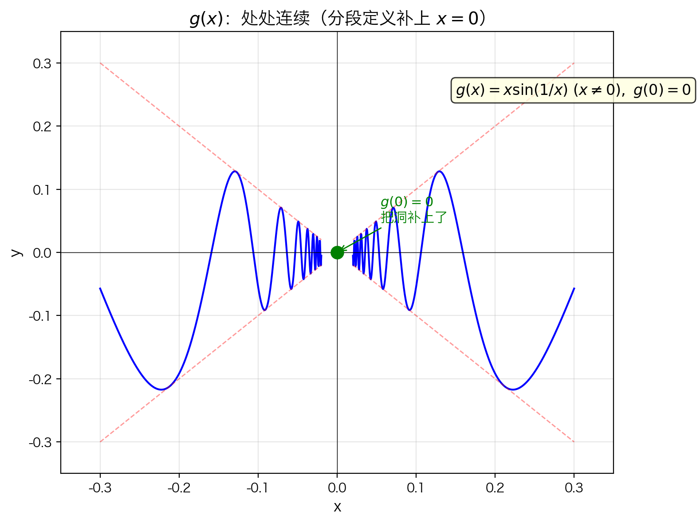
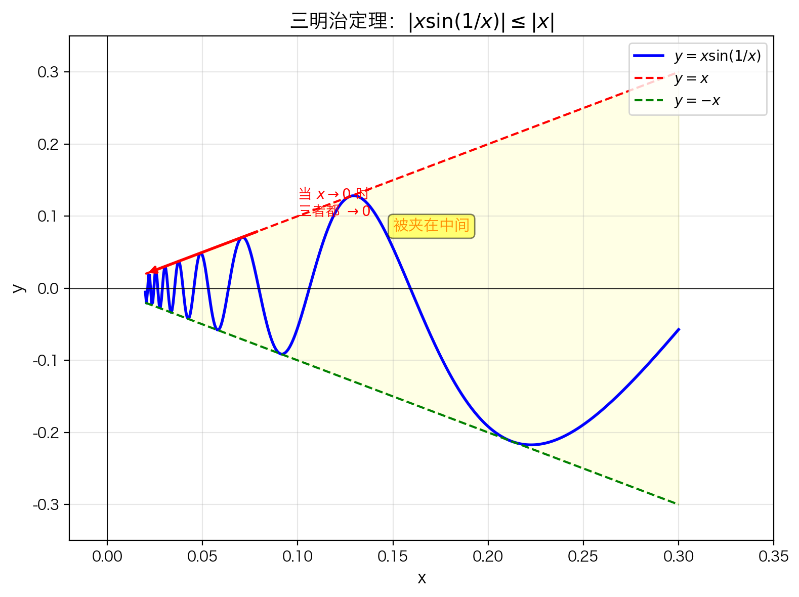
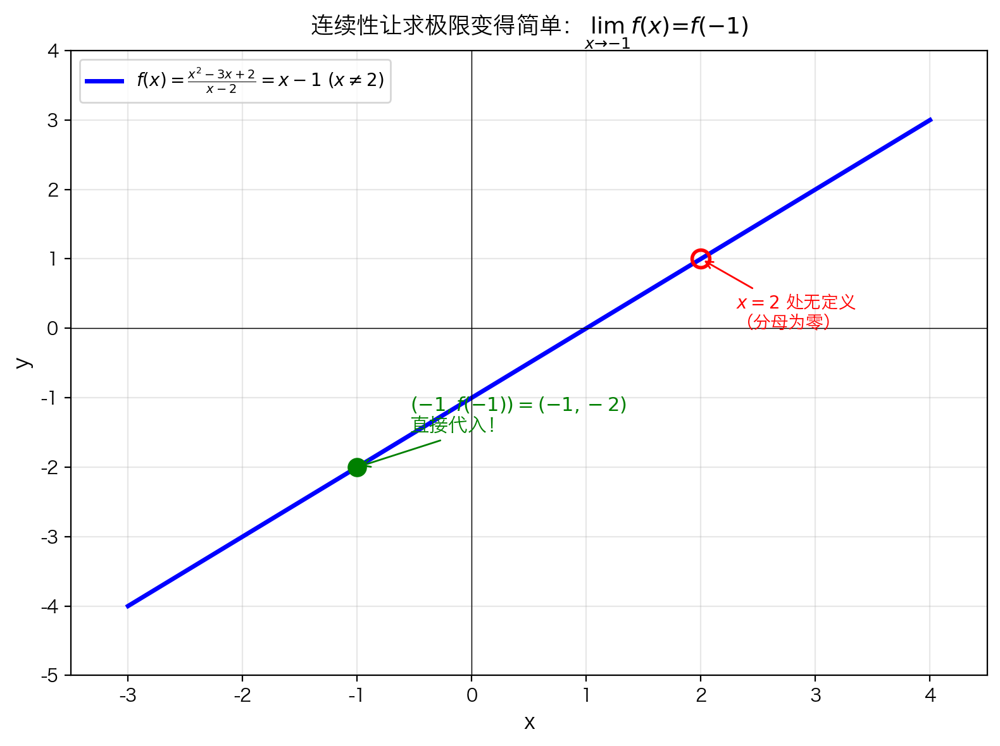

# 5.1.3 连续函数的一些例子

## 本节要解决的问题

上一节我们学会了判断函数在区间上是否连续。现在来回答一个更实际的问题：

> **哪些常见函数是连续的？**

这一节通过具体例子，帮你建立"常见函数连续性"的直觉，并学会利用连续性**直接代入求极限**。

---

## 一、核心结论预览

**大多数常见函数都是连续的**：

- ✅ 所有多项式
- ✅ 指数函数、对数函数
- ✅ 三角函数（渐近线除外）
- ✅ 连续函数的和、差、积、复合
- ⚠️ 连续函数的商：分母为零处不连续

---

## 二、从最简单的函数开始

### 2.1 常数函数 $f(x) = 1$

要证明 $f$ 在任意点 $a$ 处连续，需要验证：

$$\lim_{x \to a} f(x) = f(a)$$

因为 $f(x) = 1$ 对所有 $x$ 成立，所以 $f(a) = 1$。等式变成：

$$\lim_{x \to a} 1 = 1$$

无论 $x$ 从左边还是右边趋近 $a$，函数值始终停在 $y = 1$。极限 = 函数值 = 1，等式显然成立。

> **结论**：常数函数处处连续。

### 2.2 恒等函数 $g(x) = x$

同样验证：

$$\lim_{x \to a} g(x) = g(a)$$

即：

$$\lim_{x \to a} x = a$$

从图像上看，当 $x$ 从左右两侧趋近 $a$ 时，对应的 $y$ 值也沿着直线 $y = x$ 趋近 $a$。极限 = 函数值 = $a$，等式显然成立。

> **结论**：恒等函数处处连续。

---

## 三、连续函数的运算性质

从 $f(x) = 1$ 和 $g(x) = x$ 这两个基本函数出发，可以"构造"出大量连续函数：

| 运算 | 结果 | 连续性 |
|------|------|--------|
| 常数倍 | $c \cdot f(x)$ | 连续 |
| 加法 | $f(x) + g(x)$ | 连续 |
| 减法 | $f(x) - g(x)$ | 连续 |
| 乘法 | $f(x) \cdot g(x)$ | 连续 |
| 复合 | $f(g(x))$ | 连续 |
| 除法 | $\dfrac{f(x)}{g(x)}$ | **分母不为零处**连续 |

### 3.1 推论：所有多项式都连续

我们已经知道两个最基本的连续函数：

- $f(x) = 1$（常数函数）连续
- $g(x) = x$（恒等函数）连续

**从它们出发，可以"搭建"出任意多项式。**

**第一步：乘法构造幂函数**

因为 $g(x) = x$ 连续，把它和自身相乘：

$$x^2 = x \cdot x$$

两个连续函数的乘积仍连续，所以 $x^2$ 连续。

想要多少次幂，就乘多少次：

- $x^3 = x^2 \cdot x$ 连续
- $x^4 = x^3 \cdot x$ 连续
- $x^n$（任意正整数幂）连续

**第二步：乘以常数系数**

常数也是连续函数，连续函数乘以常数仍连续：

- $3x^2$ 连续
- $-5x^3$ 连续
- $a_n x^n$（任意系数）连续

**第三步：把各项相加**

连续函数相加仍连续：

$$P(x) = a_n x^n + a_{n-1} x^{n-1} + \cdots + a_1 x + a_0$$

每一项都连续，加在一起当然还连续。

> **结论**：任意多项式 $P(x)$ 都**处处连续**。

### 3.2 其他常见连续函数

- **指数函数**：$e^x$、$a^x$ 处处连续
- **对数函数**：$\ln x$、$\log_a x$ 在定义域 $(0, +\infty)$ 上连续
- **三角函数**：$\sin x$、$\cos x$、$\tan x$（在定义域内）连续

> 三角函数的渐近线处（如 $\tan x$ 在 $x = \dfrac{\pi}{2}$）不连续，因为这些点根本不在定义域内。

---

## 四、一个奇异的例子：$f(x) = x \sin(1/x)$

### 4.1 图像观察

这个函数很奇特：

- 在 $x = 0$ 附近，函数值在 $y = x$ 和 $y = -x$ 之间疯狂振荡
- 越靠近 $x = 0$，振荡越密集
- $x = 0$ 处**无定义**（因为 $1/0$ 不存在），图像上有一个**洞**

### 4.2 为什么在 $x \neq 0$ 处连续？

- $x$ 是连续函数
- $\sin(1/x)$：因为 $1/x$ 在 $x \neq 0$ 处连续，$\sin$ 也是连续函数，复合后仍连续
- 两个连续函数的乘积仍连续

所以 $f(x) = x \sin(1/x)$ 在**除 $x = 0$ 外的所有点都连续**。

---

## 五、分段函数：用补洞法构造处处连续的函数

### 5.1 分段定义

定义一个新函数：

> $g(x) = x \sin(1/x)$（当 $x \neq 0$ 时），且 $g(0) = 0$。

用更紧凑的写法可以记为：

$$
g(x) = x \sin\frac{1}{x}\ \ (x \neq 0),\quad g(0) = 0
$$

$g$ 和 $f$ 的区别只在 $x = 0$：

- $f(0)$ 无定义
- $g(0) = 0$

### 5.2 $g$ 在 $x = 0$ 处连续吗？

需要验证：

$$\lim_{x \to 0} g(x) = g(0) = 0$$

**用三明治定理证明**：

因为 $|\sin(1/x)| \leq 1$，所以：

$$-|x| \leq x \sin(1/x) \leq |x|$$

当 $x \to 0$ 时：

- 左边 $-|x| \to 0$
- 右边 $|x| \to 0$
- 所以中间的 $x \sin(1/x) \to 0$

因此：

$$\lim_{x \to 0} g(x) = 0 = g(0)$$

**$g$ 在 $x = 0$ 处连续**。

> **结论**：$g$ 是一个**处处连续**的函数，即使它是用分段形式定义的！

---

## 六、连续性的实用价值：直接代入求极限

### 6.1 核心原理

如果 $f$ 在 $x = a$ 处连续，那么：

$$\lim_{x \to a} f(x) = f(a)$$

这意味着：**求极限可以直接代入**！

### 6.2 例子

求极限：

$$\lim_{x \to -1} \frac{x^2 - 3x + 2}{x - 2}$$

**分析**：

- 分子 $x^2 - 3x + 2$ 是多项式，处处连续
- 分母 $x - 2$ 也是多项式，处处连续
- 商函数 $f(x) = \dfrac{x^2 - 3x + 2}{x - 2}$ 在**分母不为零处**连续
- $x = -1$ 时分母 $= -3 \neq 0$，所以 $f$ 在 $x = -1$ 处连续

**因此可以直接代入**：

$$\lim_{x \to -1} \frac{x^2 - 3x + 2}{x - 2} = \frac{(-1)^2 - 3(-1) + 2}{(-1) - 2} = \frac{1 + 3 + 2}{-3} = -2$$

> 注意：这个函数在 $x = 2$ 处不连续（分母为零），但我们在 $x = -1$ 处求极限，与 $x = 2$ 无关。

---

## 七、本节总结

### 7.1 常见连续函数

| 函数类型 | 例子 | 连续性 |
|---------|------|--------|
| 常数函数 | $f(x) = c$ | 处处连续 |
| 多项式 | $x^2 + 3x - 1$ | 处处连续 |
| 指数函数 | $e^x$、$2^x$ | 处处连续 |
| 对数函数 | $\ln x$ | 定义域内连续 |
| 三角函数 | $\sin x$、$\cos x$ | 定义域内连续 |
| 有理函数 | $\dfrac{P(x)}{Q(x)}$ | $Q(x) \neq 0$ 处连续 |

### 7.2 构造连续函数的方法

- 连续函数的 **和、差、积、复合** → 连续
- 连续函数的 **商** → 分母不为零处连续
- 通过**分段定义补洞** → 可以得到处处连续的函数（如 $g(x)$）

### 7.3 连续性的应用

- 连续函数求极限：**直接代入**
- 极限值 = 函数值，省去了复杂的极限计算

---

## 八、苏格拉底自测题

> [!faq]- 基础题：$x^3 - 2x + 5$ 连续吗？
> 处处连续，因为它是多项式。

> [!faq]- 理解题：$\tan x$ 在 $\mathbb{R}$ 上连续吗？
> 不是处处连续。$\tan x$ 在 $x = \dfrac{\pi}{2} + k\pi$（$k \in \mathbb{Z}$）处无定义，这些点不在定义域内。但在定义域内，$\tan x$ 连续。

> [!faq]- 应用题：求 $\displaystyle\lim_{x \to 2} \dfrac{e^x}{x^2 + 1}$
> 可以直接代入：$\dfrac{e^2}{2^2 + 1} = \dfrac{e^2}{5}$。分子分母都是连续函数，分母在 $x = 2$ 处不为零。

---

## 下一节

连续性不只是让计算更方便，它还能带来一些非常强大的结论。比如：

> **连续函数从负到正，必然经过零。**

→ [5.1.4 介值定理](5.1.4%20介值定理.md)
