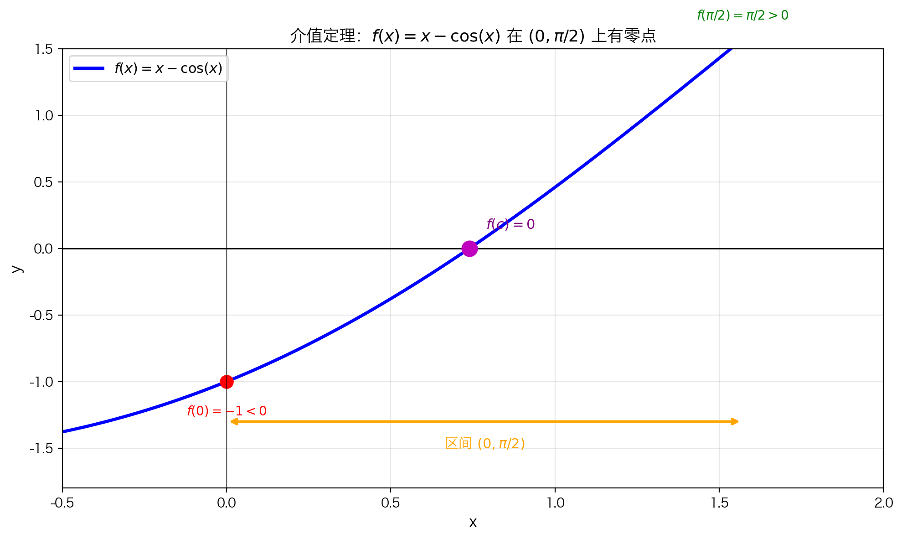
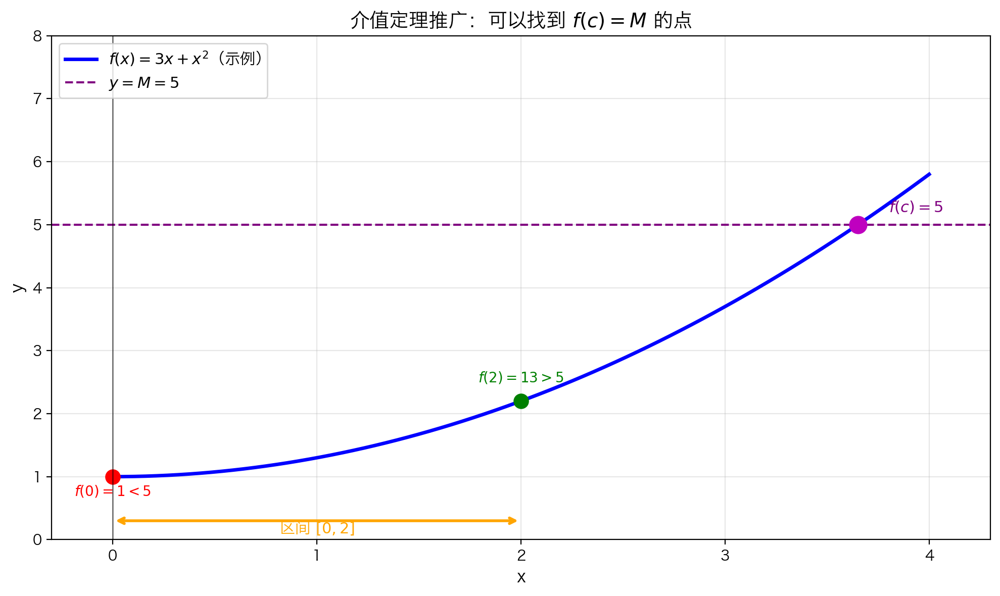

# 5.1.4 介值定理

## 本节总览

[上一节](5.1.3%20连续函数的一些例子.md)我们知道了如何判断函数是否连续。现在要问一个更关键的问题：

> **连续性到底有什么用？**

连续函数的图像可以**一笔画成**，中间不会断开。这个看似简单的性质，其实隐藏着一个非常强大的结论——**介值定理**。

这一节我们会用"提出问题 → 建立直觉 → 严格表述 → 实际应用 → 总结"的路径，把介值定理彻底讲清楚。

### 本节知识结构

- 连续性有什么用
- 介值定理的生活直觉（温度、爬山、电梯）
- 严格表述（零点形式）
- 为什么必须连续
- 应用一：证明多项式有零点
- 应用二：证明方程 $x = \cos x$ 有解
- 推广：目标值不限于 0
- 常见误区

---

## 一、提出问题：连续性有什么用？

上一节我们学会判断连续性，就像学会判断一辆车能不能平稳行驶。但光知道"平稳"还不够，我们更想知道：

> 一辆平稳行驶的车，能带来什么保证？

连续函数也是一样。知道它连续之后，我们能推出什么重要结论？

介值定理就是答案之一。它告诉我们：

> 如果一个连续函数从负数变到正数，那它**一定经过 0**。

就像你站在地下室里，要走到地面上，必然要经过地面高度（海拔 0 米）一样。

---

## 二、建立概念：介值定理的生活直觉

### 直觉图像

假设函数 $f$ 在闭区间 $[a, b]$ 上连续，并且：

- $f(a) < 0$：左端点在 x 轴下方
- $f(b) > 0$：右端点在 x 轴上方

图像从下方一笔画到上方，必然要穿过 x 轴。

```
      f(b) > 0  ★
              ╱
             ╱
    ────────●────────  ← 这里必然穿过 x 轴！
           ╱
          ╱
    ★ f(a) < 0
```


### 例子 1：温度变化

昨天凌晨最低气温是 $5^\circ\mathrm{C}$，今天午后最高气温是 $25^\circ\mathrm{C}$。

问：这段时间里，温度有没有恰好是 $15^\circ\mathrm{C}$ 的时刻？

**一定有。** 因为气温是连续变化的，不会从 $5^\circ\mathrm{C}$ 瞬间跳到 $25^\circ\mathrm{C}$。从 5 到 25 的过程中，必然要经过 15。

### 例子 2：爬山

你从山脚（海拔 100 米）爬到山顶（海拔 1000 米），全程没有瞬间传送。

问：你有没有经过海拔 500 米的地方？

**一定有。** 连续爬升的过程中，不可能跳过 500 米这个高度。

### 例子 3：电梯

电梯从 1 楼平稳上升到 10 楼。

问：电梯有没有经过 5 楼？

**一定有。** 这就是连续性的力量：**中间值一个都漏不掉**。

---

## 三、数学推导：介值定理的严格表述

### 最简单的情况：零点形式

把生活直觉翻译成数学语言，就得到介值定理。


假设函数 $f$ 在闭区间 $[a, b]$ 上连续。如果：

- $f(a) < 0$（图像在 x 轴下方）
- $f(b) > 0$（图像在 x 轴上方）

那么从下方走到上方的过程中，图像必然会在某处穿过 x 轴。也就是说，存在某个 $c \in (a, b)$，使得：

$$f(c) = 0$$

### 严格表述（零点形式）

**如果**：

1. $f$ 在闭区间 $[a, b]$ 上连续
2. $f(a)$ 和 $f(b)$ 符号相反（一正一负）

**那么**：一定存在某个 $c \in (a, b)$，使得 $f(c) = 0$。

用符号简洁地写：

$$f \in C[a,b], \quad f(a) \cdot f(b) < 0 \quad \Rightarrow \quad \exists c \in (a,b),\; f(c) = 0$$

### 为什么必须连续？


如果图像在某处断开，函数可以直接从下方"跳"到上方，跳过 x 轴。这时候就不存在零点了。

所以介值定理的前提是：**整个区间上都必须连续**，不能有任何断开。

---

## 四、应用一：证明多项式有零点

### 问题

证明多项式 $p(x) = -x^5 + x^4 + 3x + 1$ 在 $(1, 2)$ 内有一个零点。

### 解题步骤

**第一步：验证连续性**

$p(x)$ 是多项式，所以**处处连续**，自然在 $[1, 2]$ 上连续。

**第二步：计算端点值**

$$p(1) = -1 + 1 + 3 + 1 = 4 > 0$$

$$p(2) = -32 + 16 + 6 + 1 = -9 < 0$$

**第三步：应用介值定理**

$p(1) > 0$ 且 $p(2) < 0$，符号相反。

根据介值定理，存在 $c \in (1, 2)$，使得 $p(c) = 0$。

> **注意**：介值定理只告诉我们**存在**这样的 $c$，但不告诉我们 $c$ 具体是多少，也不告诉我们有多少个这样的 $c$。

---

## 五、应用二：证明方程 $x = \cos x$ 有解

### 问题

证明方程 $x = \cos x$ 至少有一个解。

### 这题在问什么？

$x = \cos x$ 就是问：**有没有一个数 $x$，它恰好等于自己的余弦值？**

直接找这样的数很难。我们换一个思路：把方程变形，让右边变成 0。

### 核心思路：把方程有解变成函数有零点

$$x = \cos x \quad \xrightarrow{\text{移项}} \quad x - \cos x = 0$$

令：

$$f(x) = x - \cos x$$

那么：

> **原方程有解** $\Leftrightarrow$ **存在某个 $c$，使得 $f(c) = 0$**

找到 $f$ 的零点，就找到了原方程的解。

### 第一步：构造函数

令：

$$f(x) = x - \cos x$$

$f(c) = 0$ 意味着 $c - \cos c = 0$，也就是 $c = \cos c$。

### 第二步：找区间——试两个点，看符号

先试 $x = 0$：

$$f(0) = 0 - \cos 0 = -1 < 0$$

$f(0)$ 是负数，说明在 $x = 0$ 处，图像在 x 轴下方。

再试 $x = \frac{\pi}{2}$：

$$f\left(\frac{\pi}{2}\right) = \frac{\pi}{2} - \cos\left(\frac{\pi}{2}\right) = \frac{\pi}{2} > 0$$

$f(\pi/2)$ 是正数，说明在 $x = \pi/2$ 处，图像在 x 轴上方。

一头负、一头正，介值定理的条件凑齐了。



### 第三步：验证连续性

- $y = x$ 是多项式，处处连续
- $y = \cos x$ 是三角函数，处处连续
- 两个连续函数的差 $f(x) = x - \cos x$，仍然处处连续

所以 $f(x)$ 在 $[0, \pi/2]$ 上连续，前提满足。

### 完整证明

**已知**：$f(x) = x - \cos x$

1. $f$ 在 $[0, \pi/2]$ 上连续
2. $f(0) = -1 < 0$
3. $f(\pi/2) = \pi/2 > 0$

$f(0)$ 和 $f(\pi/2)$ 符号相反。

由介值定理：存在 $c \in (0, \pi/2)$，使得 $f(c) = 0$。

即 $c - \cos c = 0$，也就是 $c = \cos c$。

**结论**：方程 $x = \cos x$ 在 $(0, \pi/2)$ 内至少有一个解。

### 这题妙在哪里？

| 方面 | 说明 |
|------|------|
| 解不出来 | $x = \cos x$ 没有初等函数的闭式解，没法像解 $x^2 = 4$ 那样直接写出 $x = \pm 2$ |
| 但能证明存在 | 介值定理不需要知道解是多少，只要证明"一定存在"就够了 |
| 实际解 | 数值计算可知 $c \approx 0.739$，介值定理告诉我们"它就在那儿" |

这就是介值定理的强大之处：对于"解不出来"的方程，依然可以严谨地证明它有解。

---

## 六、推广：介值定理的一般形式

### 从 0 推广到任意 $M$

介值定理不限于 $f(c) = 0$，可以换成任意目标值 $M$：

**如果**：

1. $f$ 在 $[a, b]$ 上连续
2. $f(a) < M < f(b)$（或反过来）

**那么**：存在 $c \in (a, b)$，使得 $f(c) = M$。



### 生活例子：热水器温度

热水器从 $20^\circ\mathrm{C}$ 加热到 $60^\circ\mathrm{C}$，加热过程是连续的。

问：加热过程中有没有恰好达到 $40^\circ\mathrm{C}$ 的时刻？

**一定有。** 40 被 20 和 60 夹在中间，连续变化过程中必然会经过。

### 数学例子

设 $f(x) = 3^x + x^2$，方程 $f(x) = 5$ 有解吗？

- $f(0) = 1 < 5$
- $f(2) = 13 > 5$

1 和 13 夹着 5，且 $f$ 连续，所以必然存在某个 $c \in (0, 2)$ 使得 $f(c) = 5$。

> 小技巧：也可以移项变成 $g(x) = 3^x + x^2 - 5 = 0$，用原来的零点形式来解决。

---

## 七、本节总结

### 介值定理核心

$$f \text{ 在 } [a,b] \text{ 连续，且 } f(a) \text{ 与 } f(b) \text{ 异号} \quad \Rightarrow \quad \exists c \in (a,b), \; f(c) = 0$$

### 关键点

| 要点 | 说明 |
|------|------|
| 连续性 | 必须在整个闭区间上连续 |
| 闭区间 | 定理要求 $[a, b]$，不是 $(a, b)$ |
| 符号相反 | $f(a)$ 和 $f(b)$ 必须一正一负 |
| 存在性 | 只保证至少存在一个 $c$，不保证唯一 |
| 推广 | 0 可以换成任意目标值 $M$ |

### 常见用法

1. **证明多项式有零点**：计算两个点的函数值，看是否异号
2. **证明方程有解**：移项构造函数，验证端点异号
3. **证明存在某函数值**：用推广形式，目标值夹在两端函数值之间

### 常见误区

> [!warning] 误区：介值定理能帮我找到零点的精确位置
> 正解：介值定理只证明**存在性**，不给出具体值。要找精确值需要用数值方法（如二分法）。

> [!warning] 误区：开区间上的连续函数也满足介值定理
> 正解：定理明确要求闭区间 $[a, b]$。开区间端点可能无定义或极限不存在。

---

## 下一节

介值定理看似简单，却能证明一些非常深刻的结论。比如：**任意奇数次多项式都至少有一个根**。

→ [5.1.5 奇数次多项式必有根](5.1.5%20奇数次多项式必有根.md)
