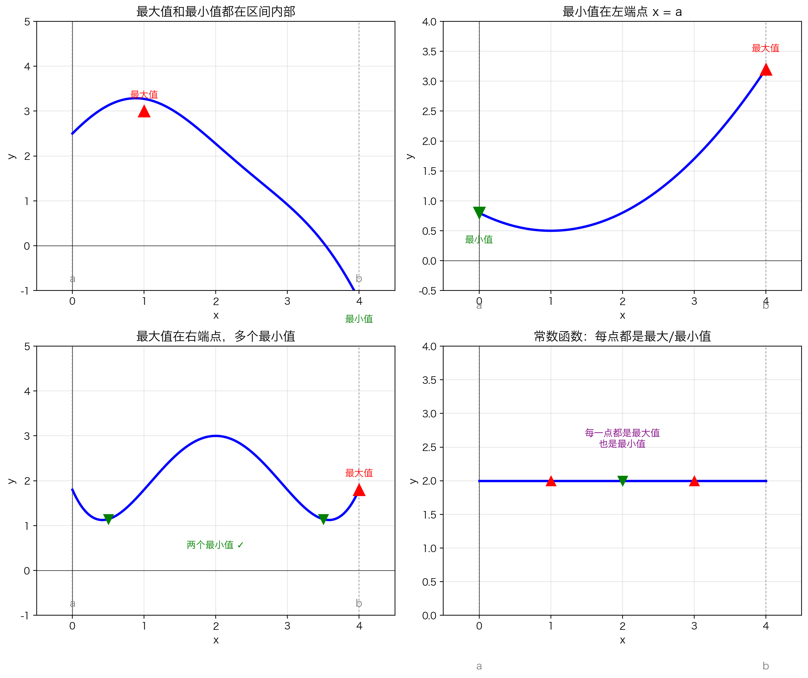

# 5.1.6 连续函数的最大值和最小值

---

## 一、提出问题

上一节我们用介值定理说明了：**连续函数不会漏掉中间值**。

这一节要回答另一个更实际的问题：

> 如果一条曲线在闭区间上连续不断，它有没有最高点？有没有最低点？

答案是：**一定有**。这就是**最大值与最小值定理**（Extreme Value Theorem，简称 EVT）。

---

## 二、建立概念：EVT 的直觉

### 1. 生活案例

想象你沿着一条连绵起伏的山路，从 $a$ 点走到 $b$ 点：

- 路必须全程连通，不能断（**连续**）
- 路的起点 $a$ 和终点 $b$ 都明确存在（**闭区间**）

**问：这段路上一定有最高点和最低点吗？**

**一定有。**

- 你不能永远往上走，因为路在 $b$ 点就结束了
- 你也不能永远往下走，因为路在 $a$ 点才开始
- 有头有尾、连绵不断，必然有一个最高点和一个最低点

> **一句话直觉**：有头有尾（闭区间）、连绵不断（连续）的曲线，必有最高点和最低点。

---

## 三、严格表述：最大值与最小值定理

### 定理

**如果**：

- 函数 $f$ 在**闭区间** $[a, b]$ 上**连续**

**那么**：

- 至少存在一点 $c \in [a, b]$，使得 $f(c)$ 是 $[a, b]$ 上的**最大值**
- 至少存在一点 $d \in [a, b]$，使得 $f(d)$ 是 $[a, b]$ 上的**最小值**

用符号写：

$$
\exists c, d \in [a, b], \quad f(c) = \max_{x \in [a, b]} f(x), \quad f(d) = \min_{x \in [a, b]} f(x)
$$

> **符号说明**：$\exists$ 表示"存在"，$\exists c, d \in [a, b]$ 即"在 $[a, b]$ 中至少存在 $c$ 和 $d$ 两点"。

---

## 四、最值可能出现的位置

EVT 只保证最值**存在**，但不指定它们在哪里。下面四种情况都满足 EVT：

### 情况 1：最值都在区间内部

- 最大值和最小值都出现在 $(a, b)$ 内的某个点
- 就像山顶和谷底都在山的中间部分
- 这些点往往是"峰"或"谷"，后面可用导数寻找

### 情况 2：最值在端点

- 最小值在左端点 $x = a$，最大值在右端点 $x = b$
- 函数单调递增时，起点最低、终点最高
- **所以求最值时端点一定要检查**

### 情况 3：多个最值点

- 函数可能有两个或更多点同时达到最小值或最大值
- EVT 只说"至少有一个"，不保证唯一

### 情况 4：常数函数

- 例如 $f(x) = 2$
- 每一点的函数值都相同
- **每一点既是最大值点，也是最小值点**

> **关键理解**：EVT 保证最值**存在**，但不告诉我们具体在哪里、有几个。

---

## 五、两个前提缺一不可

EVT 成立必须同时满足两个条件：

| 前提 | 含义 | 缺少它的后果 |
|------|------|--------------|
| **闭区间** $[a, b]$ | 有明确的起点和终点 | 最值可能"漏掉"，无限接近端点但永远达不到 |
| **连续** | 图像一笔画出，中间不断 | 最值可能"逃逸到无穷"，无限上升或无限下降 |

**结论**：两个条件同时满足 $\Rightarrow$ 最大值和最小值必然存在。

缺少任何一个，结论都可能不成立。

### 反例 1：不连续的函数

$f(x) = \dfrac{1}{x - 2}$ 在 $[0, 4]$ 上。

- 在 $x = 2$ 处不连续，存在垂直渐近线
- 当 $x \to 2^-$ 时，$f(x) \to -\infty$
- 当 $x \to 2^+$ 时，$f(x) \to +\infty$
- **没有最小值，也没有最大值**

> 连续性被破坏，最值就"逃逸到无穷"。

### 反例 2：开区间上的连续函数

$f(x) = \dfrac{1}{2}(x - 2)^2 + 0.5$ 只在开区间 $(0, 4)$ 上定义。

- 函数在开区间上连续，是一条完整的抛物线
- **最小值存在**：在 $x = 2$ 处，函数值为 $0.5$
- **但最大值不存在**：
  - 最大值"应该"在端点 $x = 0$ 或 $x = 4$ 附近取得（函数值约为 $2.5$）
  - 但端点不在区间 $(0, 4)$ 内
  - 无论取多接近端点的点，总有更接近端点的点函数值更大

> 开区间就像"没有围墙的院子"，函数值可以无限接近边界，但永远达不到。最值就可能"漏掉"。

---

## 六、应用：为什么 EVT 很重要？

EVT 是一个**存在性定理**：它告诉你最值一定存在，但不告诉你具体在哪里。

这看起来抽象，却是后续很多结论的基础：

- 求最大利润、最小成本时，首先要知道最值**是否存在**——EVT 保证它存在
- 后面用导数找"可疑点"，再结合 EVT，就能确定找到了真正的最值
- 没有 EVT，即使算出导数为零的点，也不敢确定是不是全局最大或最小

---

## 七、本节总结

### 核心定理

$$
f \text{ 在 } [a, b] \text{ 上连续} \quad \Rightarrow \quad \exists \text{ 最大值和最小值}
$$

### 关键点

| 要点 | 说明 |
|------|------|
| **闭区间** | 必须是 $[a, b]$，不能是 $(a, b)$ |
| **连续性** | 整个区间上图像不能断开 |
| **存在性** | 至少有一个最大值点、一个最小值点 |
| **不唯一** | 最值点可能有多个，甚至无穷多个 |
| **位置不定** | 最值可以在内部，也可以在端点 |

### 常见误区

❌ **误区**："最大值一定在区间内部"

✅ **正解**：最大值和最小值完全可能出现在**端点**。例如单调递增函数，最小值在左端点，最大值在右端点。

❌ **误区**："开区间上的连续函数也有最值"

✅ **正解**：开区间没有端点，函数值可以无限接近边界但达不到。例如 $f(x) = x$ 在 $(0, 1)$ 上没有最大值也没有最小值。

❌ **误区**："最值点是唯一的"

✅ **正解**：最值点可以有多个。常数函数的每一点都是最值点。

### 思考一个问题

假设函数 $f$ 在 $[0, 1]$ 上连续，且 $f(0) = 1$，$f(1) = 1$，中间在某点降到了 $f(0.5) = 0$。

**最大值在哪里？最小值又在哪里？**

> 提示：最大值不一定只有一个点哦。

---

## 下一节

EVT 告诉我们"最值一定存在"，但还不知道具体怎么找。接下来将学习**可导性**——连续性的"升级版"，它能帮我们精确找到最值点的位置。

→ [5.2 可导性](5.2%20可导性.md)
