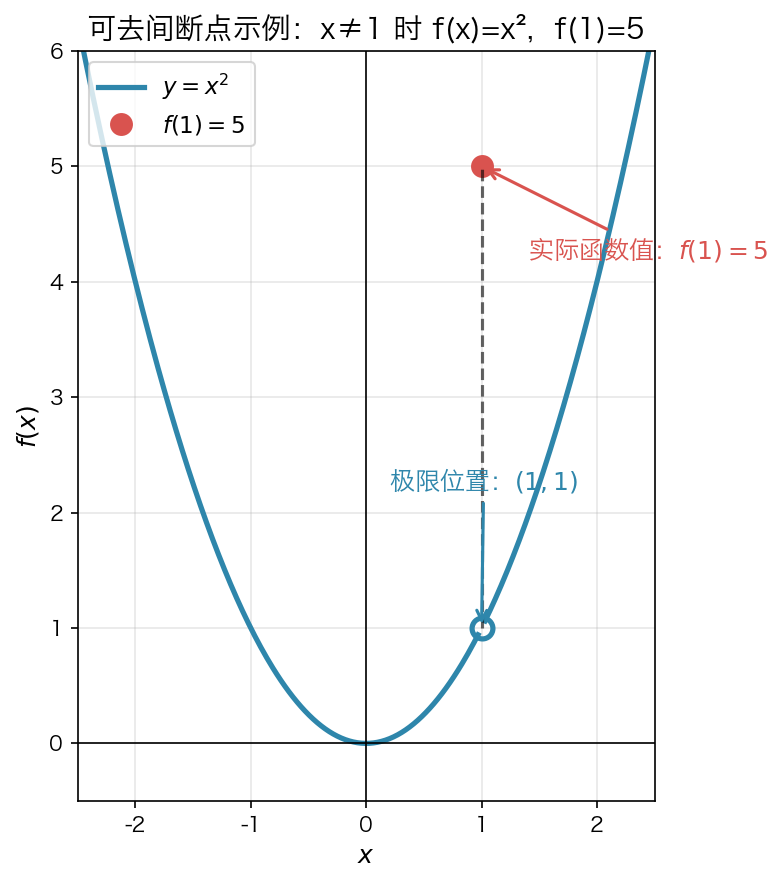
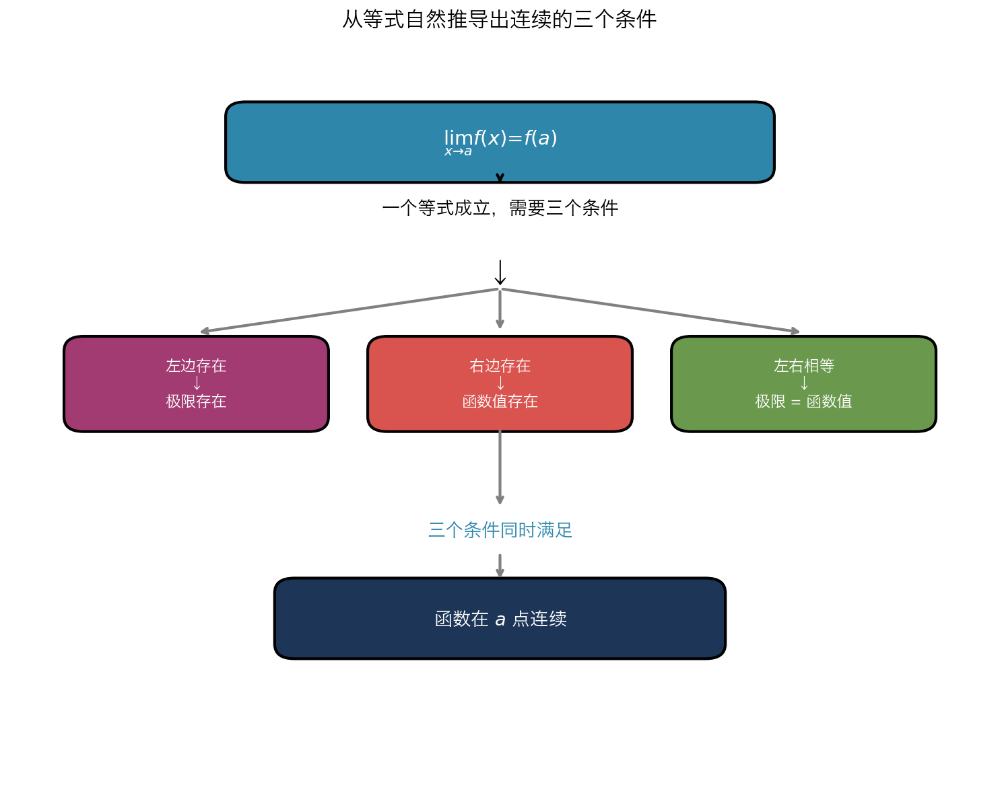
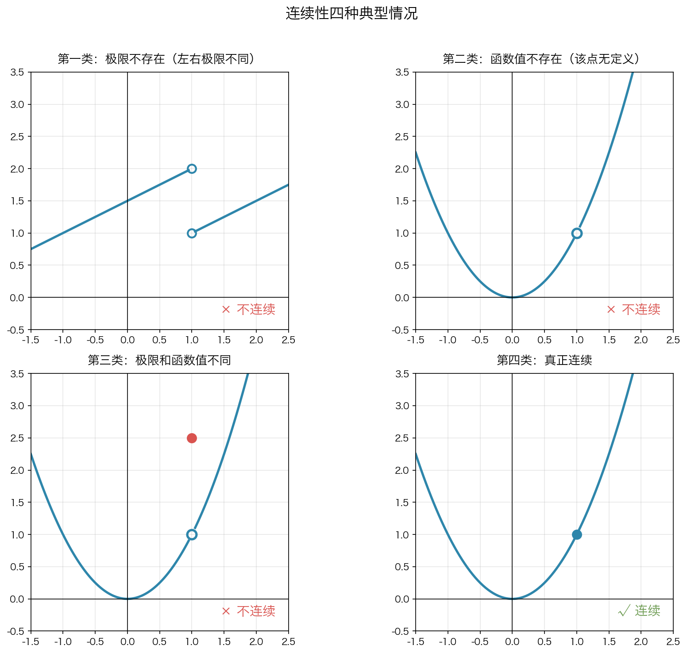

# 5.1 连续性

> **本章目标**
>
> 学会回答三个问题：
>
> 1. 什么叫连续？
> 2. 如何判断函数是否连续？
> 3. 连续函数为什么如此重要？

---

# 一、为什么需要连续性？

## 极限解决不了所有问题

第四章学习了**极限**。

极限告诉我们：

> 当 $x$ 趋近某一点时，函数值会如何变化。

例如：

$$
\lim_{x \to 1} x^2 = 1
$$

说明：

当 $x$ 越来越靠近 1 时，

函数值越来越靠近 1。

但是：

极限并没有说明：

> **函数在这一点真正取什么值。**

例如

$$
f(x)=
\begin{cases}
x^2,&x\ne1\\
5,&x=1
\end{cases}
$$



当

$x\to1$

附近，

函数越来越接近

1。

但是：

真正函数值却等于

5。

因此：

极限存在，

图像仍然可能断开。

---

## 这个案例到底说明什么？

它说明了一件事情：

> **极限存在，并不能保证图像连续。**

很多人初学时会误以为：

```text
极限存在
    ↓
  一定连续
```

其实这是**错误**的。

这个案例就是专门用来打破这个误区。

正确关系应该是：

```text
极限存在
    │
    │
    ├── 函数值刚好等于极限
    │          ↓
    │        连续
    │
    └── 函数值不等于极限
               ↓
            不连续
```

所以：

> **连续比极限要求更高。**

---

### 为什么会出现这种情况？

因为：

**极限只关心附近发生什么。**

它根本不关心：

> **这一点到底是什么。**

例如：

极限一直看到的是：

```text
……
0.99
0.999
0.9999
……
```

它根本不会真正走到 $x = 1$。

所以：

把 $f(1)$ 改成 $0$、$5$、$100$、$1000$……

极限都不会变化。

因为：

> **极限研究的是"无限接近"，不是"真正等于"。**

---

### 连续为什么比极限多一个要求？

连续要求：

> **附近最终必须能够"接上"函数值。**

也就是说：

```text
附近
 ↓
越来越接近
 ↓
真正函数值
```

必须连接起来。

于是数学家自然提出：

$$
\lim_{x \to a} f(x) = f(a)
$$

如果这两个一样，图像就接上了。

如果不一样，图像就断了。

---

### 这个案例真正想告诉你的思想

> 第四章学习的极限，只描述了函数在某一点附近的变化趋势，却没有约束函数在该点本身的取值。因此，即使极限存在，图像仍可能发生断裂。为了保证函数在某一点附近的变化趋势与函数值保持一致，数学上引入了连续性的概念。连续性的本质就是：函数在某点附近的发展趋势必须与该点的函数值完全一致。

---

### 一张图总结整个案例

**极限研究：**

```text
x → a
  │
  ▼
附近函数值
  │
  ▼
越来越接近 L

（这里只研究附近）
```

**连续研究：**

```text
x → a
  │
  ▼
附近函数值
  │
  ▼
越来越接近 L
  │
  ▼
L 必须等于 f(a)
  │
  ▼
图像才能接上
```

因此，这个案例不是为了说明一个特殊函数，而是为了回答整章最根本的问题：

> **为什么仅有极限还不够？为什么数学上还需要引入"连续性"这个概念？**

---

## 连续性的产生

于是数学家提出一个新的问题：

> **函数附近的发展趋势，与函数本身是否一致？**

如果一致，

图像就是连续的。

如果不一致，

图像就是断开的。

因此：

> **连续性是在极限基础上的进一步要求。**

---

# 二、连续性的本质

## 图像理解

连续函数：

```text
────────●────────
```

画图时：

可以一笔画过去。

不会抬笔。

---

不连续函数：

```text
──────○

       ●
```

必须抬笔。

因此：

> **连续的本质不是"没有空洞"，而是附近能够自然连接到函数值。**

---

## 真正的理解

不要把连续理解成：

> 图像没有断。

真正应该理解为：

> **函数附近最终能够走到函数值那里。**

即：

```text
x→a

↓

附近函数值越来越接近

↓

f(a)
```

如果能够接上，

函数就在这一点连续。

---

# 三、连续性的数学定义

于是得到连续性的定义：

$$
\boxed{
\lim_{x\to a}f(x)=f(a)
}
$$

这就是连续性的本质。

> **附近的发展趋势 = 函数本身。**

---

# 四、为什么连续要这样定义？

前面我们已经知道：

连续的本质是：

> **函数在某一点附近的发展趋势，与函数在该点真正的函数值保持一致。**

那么：

数学上应该怎样描述这句话？

---

## 第一步：附近的发展趋势怎么表示？

第四章已经学习过：

> 当 $x$ 越来越接近 $a$ 时，

函数的发展趋势可以用**极限**表示。

即：

$$
\lim_{x\to a}f(x)
$$

它表示：

> **函数在 $a$ 点附近最终趋向哪里。**

注意：

这里研究的是：

```text
附近

......

↓

最终趋向
```

它并没有真正到达

$$
a
$$

这一点。

---

## 第二步：函数真正的位置怎么表示？

但是：

连续不仅关心附近。

还关心：

> **函数在这一点真正在哪里。**

这个值就是：

$$
f(a)
$$

因此：

我们现在得到两个量。

```text
附近的发展趋势

↓

lim f(x)

-------------------

真正函数值

↓

f(a)
```

---

## 第三步：什么时候图像才能真正接上？

回到最开始那个例子：

$$
f(x)=
\begin{cases}
x^2, & x\ne 1\\
5, & x=1
\end{cases}
$$

附近的发展趋势：

$$
\lim_{x\to 1}f(x)=1
$$

真正函数值：

$$
f(1)=5
$$


于是：

```text
附近

↓

1


真正位置

↓

5
```

两者不同。

图像必须跳一下。

因此：

不能连续。

---

反过来。

如果：

附近的发展趋势

就是

真正函数值。

例如：

```text
附近

↓

1

↓

真正函数值

↓

1
```

图像自然就连接起来了。

因此：

数学上要求：

$$
\boxed{
\lim_{x\to a}f(x)=f(a)
}
$$

这就是连续性的定义。

它不是人为规定的。

而是：

> **为了保证图像能够自然连接而得到的唯一要求。**

---

# 五、为什么连续需要三个条件？

现在我们已经得到：

$$
\lim_{x\to a}f(x)=f(a)
$$

接下来，

很多教材直接告诉你：

连续有三个条件。

其实：

这三个条件完全可以自己推导出来。

---

## 思考一个问题

要让一个等式成立，

至少需要什么？

例如：

```text
A = B
```

是不是必须：

第一：

左边存在。

第二：

右边存在。

第三：

左右相等。

否则：

这个等式根本没有意义。

连续性的定义也是一样。

---

## 第一步：左边必须存在

连续性的定义左边是：

$$
\lim_{x\to a}f(x)
$$

如果：

极限不存在。

例如：

左右极限不同。

那么：

```text
不存在

=

f(a)
```

这个等式根本没有意义。

因此：

第一条自然得到：

> **① 极限必须存在。**

---

## 第二步：右边必须存在

连续性的定义右边是：

$$
f(a)
$$

如果：

函数根本没有定义。

例如：

$$
\frac1x
$$

在

$$
0
$$

处。

那么：

等式变成：

```text
极限

=

不存在
```

同样没有意义。

于是得到第二条：

> **② 函数值必须存在。**

---

## 第三步：左右必须相等

现在：

左边存在。

右边也存在。

是不是就一定连续？

不是。

例如：

```text
附近

↓

3


真正函数值

↓

1
```

虽然：

两边都有。

但是：

位置不同。

图像仍然断开。

因此：

最后还必须满足：

$$
\lim_{x\to a}f(x)=f(a)
$$

于是得到第三条：

> **③ 极限必须等于函数值。**

---

## 最终推导

整个过程其实就是从一个等式自然推导出来的。



---

> 这一版比教材的讲法更自然。
>
> 教材通常是：
>
> > 定义 → 三个条件。
>
> 而这版是：
>
> > **连续的思想 → 数学定义 → 把定义看成一个等式 → 从等式自然推导出三个条件。**
>
> 这样读者不仅知道**是什么**，更知道**为什么一定是这三个条件，而不是两个或四个条件**。这也是数学中常见的思维方式：**定义是起点，性质是推导出来的。**

---

# 六、四种典型情况

教材图 5-1 其实是在说明：

三个条件究竟是谁失败了。



---

## 第一类：极限不存在

原因：左右极限不同。

典型图像：跳跃间断点。

结果：**× 不连续。**

---

## 第二类：函数值不存在

原因：极限存在，但该点没有定义。

典型图像：可去间断点（空心洞）。

结果：**× 不连续。**

---

## 第三类：极限和函数值不同

原因：极限存在，函数值也存在，但两者位置不同。

典型图像：可去间断点（点放错了位置）。

结果：**× 不连续。**

---

## 第四类：真正连续

满足：

* 极限存在
* 函数值存在
* 极限 = 函数值

结果：**√ 连续。**

---

# 七、如何判断连续？

以后考试，

统一按照下面流程。

---

## 第一步

求

$f(a)$

---

## 第二步

求

$\lim_{x\to a}f(x)$

如果是分段函数：

先求：

* 左极限
* 右极限

判断极限是否存在。

---

## 第三步

判断：

```text
极限

=

函数值？
```

如果相等：

连续。

否则：

不连续。

---

## 判断流程图

```text
求函数值

↓

求极限

↓

极限存在？

↓

函数值存在？

↓

极限=函数值？

↓

连续
```

---

# 八、区间上的连续

连续不仅研究一个点。

还研究整个区间。

---

## 开区间连续

若：

$(a,b)$

内每一点连续。

称：

函数在

$(a,b)$

连续。

原因：

端点不属于区间。

不用检查。

---

例如：

$\frac1x$

在：

$(0,+\infty)$

连续。

因为：

0 根本不属于这个区间。

---

## 闭区间连续

若：

$$[a,b]$$

连续。

需要：

① 内部每一点连续。

② 左端右连续：

$\lim_{x\to a^+}f(x)=f(a)$

③ 右端左连续：

$\lim_{x\to b^-}f(x)=f(b)$

原因：

端点只有一侧有定义。

---

# 九、哪些函数天然连续？

很多函数不用证明。

直接知道。

---

## 基本连续函数

* 常数函数
* 恒等函数
* 多项式
* 指数函数
* 对数函数
* 三角函数（定义域内）

---

## 连续函数的运算

如果

$f(x)$

连续，

$g(x)$

连续。

那么：

仍连续：

* 加法
* 减法
* 乘法
* 复合

除法：

必须：

```text
分母≠0
```

---

## 因此得到

多项式一定连续。

有理函数：

分母不为零时连续。

---

# 十、经典例子：$x\sin(1/x)$

这是分析学中最经典的函数之一。

---

## 为什么特殊？

因为：

$\sin\frac1x$

在

0

附近无限振荡。

但是：

前面的

$x$

越来越小。

于是：

振荡越来越弱。

最终：

```text
越来越贴近0
```

---

定义：

$$
g(x)=
\begin{cases}
x\sin\frac1x,&x\ne0\\
0,&x=0
\end{cases}
$$

利用夹逼定理：

$|x\sin(1/x)|\le|x|$

于是：

$\lim_{x\to0}x\sin\frac1x=0$

因此：

$g(0)=0$

极限也等于

0。

所以：

> **这个分段函数在0连续。**

说明：

> **分段函数完全可以连续。**

---

# 十一、连续函数为什么重要？

连续真正重要的地方：

不是判断图像。

而是能够推出很多重要结论。

---

## 第一条：介值定理

若：

函数在

$$[a,b]$$

连续。

并且：

$f(a)<0,\qquad f(b)>0$

那么：

一定存在

$c\in(a,b)$

使：

$f(c)=0$

即：

连续函数从负数走到正数。

一定经过0。

---

### 应用

证明：

方程有解。

例如：

$x=\cos x$

令：

$f(x)=x-\cos x$

验证：

$f(0)<0$

$f(\pi/2)>0$

因此：

一定存在解。

注意：

介值定理只能证明：

> **至少存在一个解。**

---

## 第二条：奇数次多项式一定有根

原因：

奇数次多项式：

左边趋向

$-\infty$

右边趋向

$+\infty$

连续。

因此：

一定经过0。

所以：

至少存在一个实根。

---

## 第三条：最大值最小值定理

若：

函数在：

$$[a,b]$$

连续。

则：

一定存在：

* 最大值；
* 最小值。

注意：

必须：

> **闭区间连续。**

开区间：

不一定成立。

例如：

$y=x,\qquad (0,1)$

没有最大值。

因为：

始终可以找到更接近1的点。

---

# 十二、本章知识体系

```text
连续性
│
├── 为什么研究连续
│      极限不能保证图像接上
│
├── 连续的本质
│      附近最终走到函数值
│
├── 数学定义
│      limf(x)=f(a)
│
├── 三个条件
│      ├── 极限存在
│      ├── 函数值存在
│      └── 二者相等
│
├── 判断连续
│      ├── 求函数值
│      ├── 求极限
│      └── 比较是否相等
│
├── 区间连续
│      ├── 开区间
│      └── 闭区间
│
├── 常见连续函数
│      ├── 多项式
│      ├── 有理函数
│      ├── 指数函数
│      └── 三角函数
│
├── 经典例子
│      xsin(1/x)
│
└── 连续函数的重要定理
       ├── 介值定理
       ├── 奇数次多项式必有根
       └── 最大值最小值定理
```

---

# 十三、本章必须掌握的内容

## 理解

* 为什么会提出连续性的概念。
* 连续性的本质：**附近的发展趋势与函数值一致**。
* 连续定义为什么包含三个条件。

## 会判断

* 一点处是否连续。
* 分段函数是否连续。
* 区间是否连续。
* 常见函数的连续区间。

## 会应用

* 利用连续直接代入求极限。
* 利用介值定理证明方程有解。
* 利用最大值最小值定理判断最值存在性。
* 理解奇数次多项式必有根的证明思路。

---


