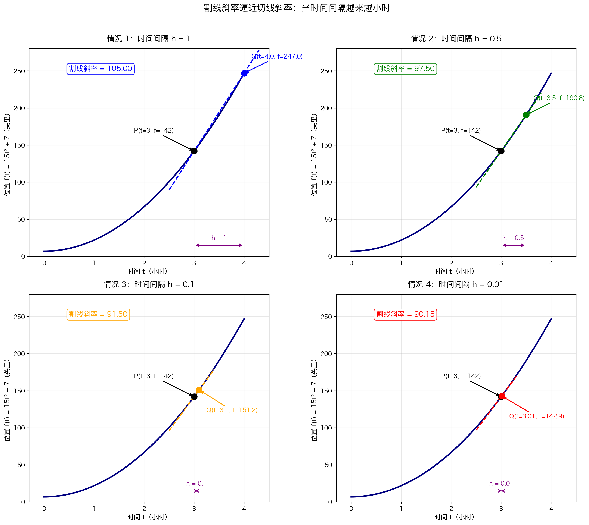

## 本节核心目标

上一节我们知道，可导性是一种"光滑性"，灵感来自运动。这一节要回答三个问题：

| 问题 | 答案 |
|------|------|
| **解决什么问题？** | 如何定义和计算"某一瞬间的速度" |
| **为什么学？** | 瞬时速度就是导数的前身，理解了它，导数的定义水到渠成 |
| **核心目的？** | 掌握从"平均变化率"到"瞬时变化率"的极限思想，为导数定义铺路 |

---

## 关键知识地图

- **平均速率、速度和瞬时速度**
  - **平均速率**
    - 定义：$v_{\text{平均}} = \frac{\Delta \text{距离}}{\Delta \text{时间}}$
    - 局限：时间间隔太长，无法反映某一时刻的真实快慢
    - 直觉：照片拍不出速度
  - **位移 vs 距离**
    - 距离：实际走过的路程（总是 $\geq 0$）
    - 位移：$\Delta s = s_{\text{终点}} - s_{\text{起点}}$（可正可负可为零）
    - $v = \frac{\Delta s}{\Delta t}$（速度），$v_{\text{速率}} = \frac{\text{距离}}{\text{时间}}$（速率）
  - **瞬时速度**
    - 核心思想：让 $\Delta t \to 0$，平均速度逼近瞬时速度
    - 公式（u 写法）：$\displaystyle\lim_{u \to t} \frac{f(u) - f(t)}{u - t}$
    - 公式（h 写法）：$\displaystyle\lim_{h \to 0} \frac{f(t+h) - f(t)}{h}$
    - 本质：位置函数的瞬时变化率
  - **计算方法**
    - 代入 $f(t+h)$ 和 $f(t)$
    - 展开、化简
    - 消去 $h$（解决 $\frac{0}{0}$ 型）
    - 令 $h = 0$，得到结果

---

## 本节知识结构

1. **平均速率**：为什么"照片"无法告诉你速度
2. **位移与速度**：区分距离和位移，理解速度的正负
3. **瞬时速度**：用极限从"平均"逼近"瞬时"
4. **一个完整例子**：从位置函数求瞬时速度

---

## 平均速率：照片能告诉你什么？

### 白话解释

想象在高速路上给一辆汽车拍照。快门按下的一瞬间，车"定格"了——你甚至看不出它在动。

**问：拍照那一刻，汽车的速度是多少？**

经典公式：

$$\text{速率} = \frac{\text{距离}}{\text{时间}}$$

但照片告诉你：
- **距离**：没有（车在照片里没动）
- **时间**：一瞬间（几乎为零）

所以你**无法回答**这个问题。

### 缩短时间间隔

好吧，我再告诉你一些信息：

| 已知信息 | 计算的平均速率 | 准确吗？ |
|---------|--------------|---------|
| 1 分钟走了 1 英里 | 60 英里/小时 | 不够——1 分钟里可能加速减速了很多次 |
| 10 秒走了 0.25 英里 | 90 英里/小时 | 好一些——但 10 秒里仍可能改变速率 |
| 1 秒走了 ... | 更接近 | 更好，但还不够精确 |
| 0.0001 秒走了 ... | 非常接近 | 几乎了，但严格来说仍不是"瞬时" |

**关键观察**：时间间隔越短，平均速率越接近拍照那一刻的真实速率。

> 这就是极限的用武之地——让时间间隔**趋近于零**，平均速率就趋近于**瞬时速率**。

### 一句话记忆

> 平均速率是"一段路"的快慢，瞬时速率是"一瞬间"的快慢。把一段路缩成一个点，就得到了瞬时。

### 常见误区

| ❌ 错误理解 | ✅ 正确理解 |
|-----------|-----------|
| "平均速率 90 英里/小时，说明每一刻都是 90" | 平均速率只是"总和 ÷ 总时间"，过程中可能时快时慢 |
| "时间间隔很小了，所以就是瞬时的" | 无论多小，只要不是零，就还是平均。只有**极限**才能给出瞬时 |

---

## 位移与速度

### 概念精讲

#### 1. 定义（是什么）

- **距离**：汽车实际走过的路程（总是非负数）
- **位移**：终点位置 − 初始位置（可以是负数）

#### 2. 本质（为什么需要区分）

如果只关心"走了多远"，用距离；如果关心"最终在哪、朝哪个方向"，用位移。

物理学中，速度 = 位移 / 时间，所以速度有方向；速率 = 距离 / 时间，所以速率只有大小。

#### 3. 直觉理解（生活案例）

| 情况 | 距离 | 位移 |
|------|------|------|
| 从 2 驶到 5 | 3 英里 | $5 - 2 = 3$ 英里 |
| 从 2 驶到 −1 | 3 英里 | $-1 - 2 = -3$ 英里 |
| 从 2 走到 11 再返回 5 | 15 英里 | $5 - 2 = 3$ 英里 |
| 从 2 走到 −4 再返回 2 | 12 英里 | $2 - 2 = 0$ 英里 |


> 位移只关心起点和终点，不关心中间过程。距离则记录了全程。

#### 4. 常见错误

| ❌ 错误 | ✅ 正确 | 原因 |
|--------|--------|------|
| 把"走了很远"当成"位移很大" | 位移可能为零（绕一圈回来） | 位移只看起点和终点 |
| 认为位移一定是正的 | 位移可以是负数（向左/向后） | 位移有方向 |

#### 5. 一句话记忆

> 位移是"直线箭头"（起点 → 终点），距离是"实际轨迹"（走了多少路）。

### 平均速度

$$\text{平均速度} = \frac{\text{位移}}{\text{时间}}$$

- 速度可以是**负的**（向左行驶）
- 速率一定是**非负的**
- 如果汽车只朝一个方向行驶，平均速率 = 平均速度的绝对值

---

## 瞬时速度：从平均到瞬时

### 核心问题

**在某一瞬间，如何测量汽车的速度？**

### 思路

在拍照时刻 $t$ 之后，取一个越来越小的时间间隔，计算平均速度，然后取极限。

### 符号设定

- $t$：我们关心的时刻
- $u$：$t$ 之后很近的时刻
- $f(t)$：汽车在时刻 $t$ 的位置
- $v_{t \leftrightarrow u}$：从时刻 $t$ 到时刻 $u$ 的平均速度

现在就可以准确地计算平均速度 $v_{t \leftrightarrow u}$ 了：

$$v_{t \leftrightarrow u} = \frac{\text{在时刻 } u \text{ 的位置} - \text{在时刻 } t \text{ 的位置}}{u - t} = \frac{f(u) - f(t)}{u - t}$$

### 平均速度公式

$$v_{t \leftrightarrow u} = \frac{f(u) - f(t)}{u - t}$$

为什么分子是 $f(u) - f(t)$？因为这就是**位移**：

- $f(t)$：时刻 $t$ 的位置（初始位置）
- $f(u)$：时刻 $u$ 的位置（终点位置）
- $f(u) - f(t)$：位移（终点 − 起点）
- $u - t$：经过的时间（终点时刻 − 起始时刻）

所以 $\dfrac{f(u) - f(t)}{u - t} = \dfrac{\text{位移}}{\text{时间}} = \text{平均速度}$

### 取极限得到瞬时速度

让 $u$ 越来越靠近 $t$：

$$\text{在时刻 } t \text{ 的瞬时速度} = \lim_{u \to t} \frac{f(u) - f(t)}{u - t}$$

### 另一种写法

为什么需要另一种写法？因为用 $u$ 表示"另一个时刻"不够直观。我们换一个思路：用 $h$ 表示**时间间隔**。

**令 $h = u - t$**，也就是说 $h$ 是从 $t$ 到 $u$ 经过了多长时间。

那么反过来：$u = t + h$（终点时刻 = 起始时刻 + 时间间隔）

**代入过程**：

把 $u = t + h$ 代入公式中每个出现 $u$ 的地方：

| 原来 | 代入后 | 为什么 |
|------|--------|--------|
| $f(u)$ | $f(t + h)$ | 因为 $u = t + h$ |
| $f(t)$ | $f(t)$ | 没有 $u$，不变 |
| $u - t$ | $(t + h) - t = h$ | 因为 $u = t + h$ |

所以：

$$\frac{f(u) - f(t)}{u - t} \quad \xrightarrow{u = t + h} \quad \frac{f(t + h) - f(t)}{h}$$

**极限的变化**：当 $u \to t$ 时，$h = u - t \to 0$

$$\text{在时刻 } t \text{ 的瞬时速度} = \lim_{h \to 0} \frac{f(t + h) - f(t)}{h}$$

> **为什么要换？** $u$ 写法需要同时记住 $t$ 和 $u$ 两个时刻；$h$ 写法只需要关注"经过了多久"一个变量，更简洁。本质上就是**换元**：用 $h = u - t$ 替换了 $u$。

### 割线逼近切线（核心直觉图）



这张图展示了核心思想：
- **割线**：连接曲线上两点的直线，斜率 = 平均速度
- **切线**：当两点无限靠近时，割线的极限位置，斜率 = 瞬时速度
- 时间间隔 $h$ 越小，割线越接近切线，斜率越接近真实瞬时速度

### 用数字验证

假设 $f(t) = 15t^2 + 7$，在 $t = 3$ 处：

**准备**：先算出起点位置 $f(3) = 15 \times 9 + 7 = 142$

**公式 A**（$u$ 写法）：$\dfrac{f(u) - f(3)}{u - 3}$

**公式 B**（$h$ 写法）：$\dfrac{f(3 + h) - f(3)}{h}$

---

**当 $u = 4$，$h = 4 - 3 = 1$**：

- 公式 A：$\dfrac{f(4) - f(3)}{4 - 3} = \dfrac{(15 \times 16 + 7) - 142}{1} = \dfrac{247 - 142}{1} = \dfrac{105}{1} = 105$

- 公式 B：$\dfrac{f(3 + 1) - f(3)}{1} = \dfrac{f(4) - 142}{1} = \dfrac{247 - 142}{1} = \dfrac{105}{1} = 105$ ✓

---

**当 $u = 3.1$，$h = 3.1 - 3 = 0.1$**：

- 公式 A：$\dfrac{f(3.1) - f(3)}{3.1 - 3} = \dfrac{(15 \times 9.61 + 7) - 142}{0.1} = \dfrac{151.15 - 142}{0.1} = \dfrac{9.15}{0.1} = 91.5$

- 公式 B：$\dfrac{f(3 + 0.1) - f(3)}{0.1} = \dfrac{f(3.1) - 142}{0.1} = \dfrac{151.15 - 142}{0.1} = \dfrac{9.15}{0.1} = 91.5$ ✓

---

**当 $u = 3.01$，$h = 3.01 - 3 = 0.01$**：

- 公式 A：$\dfrac{f(3.01) - f(3)}{3.01 - 3} = \dfrac{(15 \times 9.0601 + 7) - 142}{0.01} = \dfrac{142.9015 - 142}{0.01} = \dfrac{0.9015}{0.01} = 90.15$

- 公式 B：$\dfrac{f(3 + 0.01) - f(3)}{0.01} = \dfrac{f(3.01) - 142}{0.01} = \dfrac{142.9015 - 142}{0.01} = \dfrac{0.9015}{0.01} = 90.15$ ✓

---

**当 $u = 3.001$，$h = 3.001 - 3 = 0.001$**：

- 公式 A：$\dfrac{f(3.001) - f(3)}{3.001 - 3} = \dfrac{(15 \times 9.006001 + 7) - 142}{0.001} = \dfrac{142.090015 - 142}{0.001} = \dfrac{0.090015}{0.001} = 90.015$

- 公式 B：$\dfrac{f(3 + 0.001) - f(3)}{0.001} = \dfrac{f(3.001) - 142}{0.001} = \dfrac{142.090015 - 142}{0.001} = \dfrac{0.090015}{0.001} = 90.015$ ✓

---

### 汇总观察

| $u$ | $h$ | 平均速度（两种公式结果相同） | 趋势 |
|-----|-----|--------------------------|------|
| 4 | 1 | 105 | |
| 3.1 | 0.1 | 91.5 | |
| 3.01 | 0.01 | 90.15 | |
| 3.001 | 0.001 | 90.015 | $\searrow$ |
| $\to 3$ | $\to 0$ | $\to 90$ | **瞬时速度** |

> **观察**：$h$ 越小，平均速度越接近 **90**。而 $90 = 30 \times 3$，正好是速度公式 $30t$ 在 $t = 3$ 处的值。这验证了我们的计算是对的。

> **这就是导数的定义！** 瞬时速度就是位置函数的导数。

### 常见误区

| ❌ 错误做法 | ✅ 正确做法 | 原因 |
|-----------|-----------|------|
| 直接把 $h = 0$ 代入 $\dfrac{f(t+h) - f(t)}{h}$ | 先化简消去分母的 $h$，再令 $h = 0$ | 直接代入会得到 $\dfrac{0}{0}$，没有意义 |
| 认为 $h$ "非常小的数"就是极限 | $h$ **趋近于** 0，但永远不等于 0，直到最后一步 | 极限是一个过程，不是一个具体的数 |

---

## 一个完整例子

### 先搞懂：这题在问什么？

汽车从 7 英里标志处出发，在时刻 $t$（小时）的位置是：

$$f(t) = 15t^2 + 7$$

求汽车在任意时刻 $t$ 的瞬时速度。

**翻译**：在每一个瞬间，汽车跑得有多快？因为速度一直在变，答案不是一个数字，而是一个**关于 $t$ 的公式**。

### 物理背景拆解

$$f(t) = \underbrace{15t^2}_{\text{走了多远}} + \underbrace{7}_{\text{起点位置}}$$

| 部分 | 含义 | 验证 |
|------|------|------|
| $7$ | 起点位置（7 英里标志处） | $f(0) = 15 \times 0 + 7 = 7$（$t=0$ 时在 7 英里处） ✓ |
| $15t^2$ | 从起点开始**走了多远** | 随时间增大，走得越来越多 |

#### 为什么是 $t^2$ 而不是 $t$？

如果位置是 $f(t) = 60t + 7$（一次函数），说明汽车**匀速行驶**——每小时走 60 英里，永远不变。

但这里是 $f(t) = 15t^2 + 7$（二次函数），说明汽车在**加速**：

- 第一个小时：从 7 走到 22，走了 **15** 英里
- 第二个小时：从 22 走到 67，走了 **45** 英里
- 第三个小时：从 67 走到 142，走了 **75** 英里

每小时走的距离**越来越大**——这就是加速。所以不存在一个固定的"每小时走多少英里"，必须用导数来求**瞬时速度**。

### 解题步骤

**第一步**：写出公式

$$\text{瞬时速度} = \lim_{h \to 0} \frac{f(t + h) - f(t)}{h}$$

**第二步**：代入 $f(t) = 15t^2 + 7$

公式里有两处需要代入：$f(t + h)$ 和 $f(t)$。分别计算：

- **$f(t + h)$**：把 $f(t)$ 里每个 $t$ 都替换成 $(t + h)$

$$f(t + h) = 15(t + h)^2 + 7$$

> 怎么替换？$f(t) = 15\boldsymbol{t}^2 + 7$，把 $\boldsymbol{t}$ 换成 $\boldsymbol{(t + h)}$，就得到 $15\boldsymbol{(t+h)}^2 + 7$

- **$f(t)$**：就是原函数本身，不用改

$$f(t) = 15t^2 + 7$$

- **代入公式**：分子 $= f(t+h) - f(t)$

$$= \lim_{h \to 0} \frac{[15(t + h)^2 + 7] - [15t^2 + 7]}{h}$$

> 注意：$f(t+h)$ 是"终点位置"，$f(t)$ 是"起点位置"，两者相减就是**位移**。

**第三步**：展开 $(t + h)^2 = t^2 + 2th + h^2$

$$= \lim_{h \to 0} \frac{15t^2 + 30th + 15h^2 + 7 - 15t^2 - 7}{h}$$

**第四步**：化简

$$= \lim_{h \to 0} \frac{30th + 15h^2}{h} = \lim_{h \to 0} (30t + 15h)$$

**第五步**：消去 $h$（关键一步！$h$ 是造成 $0/0$ 的元凶），代入 $h = 0$

$$= 30t$$

### 结论

在时刻 $t$ 的瞬时速度 $= 30t$（英里/小时）

| 时刻 | 速度 |
|------|------|
| $t = 0$ | $30 \times 0 = 0$ 英里/小时（静止） |
| $t = 0.5$ | $30 \times 0.5 = 15$ 英里/小时 |
| $t = 1$ | $30 \times 1 = 30$ 英里/小时 |

> 汽车每小时速度增加 30 英里/小时，即以 **30 英里/小时²** 加速。注意 $30 = 2 \times 15$——位置函数中 $t^2$ 的系数 15，和速度中 $t$ 的系数 30 之间是**2 倍关系**。这不是巧合，后面学了求导法则就自然明白了。

---

## 最容易混淆内容

| 概念A | 概念B | 核心区别 | 一句话区分 |
|-------|-------|---------|-----------|
| **速率** | **速度** | 速率 ≥ 0，无方向；速度可正可负，有方向 | 速率是"多快"，速度是"多快+朝哪" |
| **平均速度** | **瞬时速度** | 平均速度是一段时间内的；瞬时速度是一个时刻的 | 平均是"一段"，瞬时是一个"点" |
| **u 写法** | **h 写法** | $u$ 是"另一个时刻"；$h$ 是"时间间隔" | $u$ 写两点，$h$ 写间隔，数学上等价 |
| **$h$ 很小** | **$h \to 0$** | $h$ 很小是一个具体的数；$h \to 0$ 是一个极限过程 | 极限不是"很小的数"，而是"无限接近的过程" |

---

## 本节复习清单

### 你必须记住：
- [ ] 平均速度公式：$\dfrac{f(u) - f(t)}{u - t}$
- [ ] 瞬时速度公式（两种写法）：$\displaystyle\lim_{u \to t} \frac{f(u) - f(t)}{u - t} = \lim_{h \to 0} \frac{f(t + h) - f(t)}{h}$
- [ ] 计算步骤：代入 → 展开 → 化简 → 消 $h$ → 令 $h = 0$

### 你必须理解：
- [ ] 为什么需要极限才能定义瞬时速度
- [ ] 距离和位移的区别（路程 vs 起点到终点的箭头）
- [ ] 为什么不能直接把 $h = 0$ 代入（会得到 0/0）
- [ ] 割线斜率如何逼近切线斜率

### 你必须会做：
- [ ] 已知位置函数，求任意时刻的瞬时速度
- [ ] 用 $u$ 写法和 $h$ 写法分别计算，并验证结果相同
- [ ] 解释 $f(t) = 15t^2 + 7$ 中各项的物理意义

---

## 苏格拉底自测题

### 基础题

**Q1**：一辆汽车从位置 10 驶到位置 4，用时 2 小时。求平均速度和平均速率。

> [!faq]- 点击查看答案
> - 位移 = $4 - 10 = -6$ 英里
> - 距离 = $|-6| = 6$ 英里
> - 平均速度 = $-6 / 2 = -3$ 英里/小时
> - 平均速率 = $6 / 2 = 3$ 英里/小时
> 
> > 速度为负说明汽车在往回开。

**Q2**：平均速度公式 $v_{t \leftrightarrow u} = \dfrac{f(u) - f(t)}{u - t}$ 中，分子和分母分别代表什么？

> [!faq]- 点击查看答案
> - 分子 $f(u) - f(t)$：**位移**（终点位置 − 起点位置）
> - 分母 $u - t$：**时间间隔**（终点时刻 − 起始时刻）
> - 整体 = 位移 / 时间 = 平均速度

**Q3**：为什么瞬时速度不能直接用 $\dfrac{f(t) - f(t)}{t - t}$ 计算？

> [!faq]- 点击查看答案
> 因为分子 $f(t) - f(t) = 0$，分母 $t - t = 0$，得到 $\dfrac{0}{0}$，这是**未定式**，没有确定的值。
> 
> 所以必须用极限：让 $h$ 趋近于 0 但不等于 0，先化简消去分母的 $h$，最后再代入 $h = 0$。

### 理解题

**Q4**：时间间隔 $h = 0.001$ 秒时算出的平均速度，和瞬时速度有什么区别？

> [!faq]- 点击查看答案
> $h = 0.001$ 算出的还是**平均速度**，只不过是在极短的时间间隔内。它非常接近瞬时速度，但**严格来说不等于**瞬时速度。
> 
> 瞬时速度是 $h \to 0$ 的**极限**，是一个数学概念，不是某个具体的 $h$ 值算出来的。
> 
> 类比：$0.999$ 很接近 $1$，但不等于 $1$。极限就是那个"无限接近但可能永远达不到"的目标值。

**Q5**：公式 $\displaystyle\lim_{h \to 0} \frac{f(t + h) - f(t)}{h}$ 中，$h$ 能不能等于 0？

> [!faq]- 点击查看答案
> **不能**。在整个极限过程中，$h \neq 0$。如果 $h = 0$，分母为零，式子无意义。
> 
> "$h \to 0$" 的意思是 $h$ **无限接近** 0，但始终保持 $h \neq 0$，直到最后一步把化简后的表达式中的 $h$ 替换成 0。

**Q6**：从位置函数 $f(t) = 15t^2 + 7$ 得到速度 $v(t) = 30t$，$t^2$ 的系数 15 和 $t$ 的系数 30 之间有什么关系？

> [!faq]- 点击查看答案
> $30 = 2 \times 15$，速度中 $t$ 的系数是位置函数中 $t^2$ 系数的 **2 倍**。
> 
> 这不是巧合。对于任何 $f(t) = at^2 + b$，其瞬时速度都是 $v(t) = 2at$。这是求导法则的一个特例，后面会系统学习。

### 应用题

**Q7**：一个球从高处落下，$t$ 秒后的高度是 $h(t) = 100 - 5t^2$（米）。求 $t = 2$ 秒时的瞬时速度。

> [!faq]- 点击查看答案
> $$v(2) = \lim_{h \to 0} \frac{h(2+h) - h(2)}{h}$$
> 
> $$= \lim_{h \to 0} \frac{[100 - 5(2+h)^2] - [100 - 5 \times 4]}{h}$$
> 
> $$= \lim_{h \to 0} \frac{100 - 5(4 + 4h + h^2) - 80}{h}$$
> 
> $$= \lim_{h \to 0} \frac{100 - 20 - 20h - 5h^2 - 80}{h}$$
> 
> $$= \lim_{h \to 0} \frac{-20h - 5h^2}{h} = \lim_{h \to 0} (-20 - 5h) = -20$$
> 
> 速度为 $-20$ 米/秒（负号表示向下运动）。

**Q8**：为什么位置函数是 $t^2$（而不是 $t$）时，汽车一定在加速？

> [!faq]- 点击查看答案
> 如果 $f(t) = kt + b$（一次函数），每秒走固定的距离 $k$，速度恒定为 $k$。
> 
> 如果 $f(t) = at^2 + b$（二次函数）：
> - $t = 0$ 到 $t = 1$：走了 $a(1)^2 - a(0)^2 = a$
> - $t = 1$ 到 $t = 2$：走了 $a(4) - a(1) = 3a$
> - $t = 2$ 到 $t = 3$：走了 $a(9) - a(4) = 5a$
> 
> 每段时间走的距离越来越大（$a, 3a, 5a, \ldots$），所以速度在增加，即**加速**。

---

## 终极总结

> 这一节本质上是在解决**"如何用极限从平均变化率得到瞬时变化率"**的问题。

### 核心公式

| 概念 | 公式 | 含义 |
|------|------|------|
| 平均速度 | $\dfrac{f(u) - f(t)}{u - t}$ | 一段时间内的平均快慢 |
| 瞬时速度（写法1） | $\displaystyle\lim_{u \to t} \frac{f(u) - f(t)}{u - t}$ | 某一时刻的精确快慢 |
| 瞬时速度（写法2） | $\displaystyle\lim_{h \to 0} \frac{f(t + h) - f(t)}{h}$ | 等价写法，用 $h$ 表示时间间隔 |

### 核心思路

```
照片无法告诉你速度
    ↓ 缩短时间间隔
平均速度越来越接近真实速度
    ↓ 取极限（间隔 → 0）
瞬时速度 = 导数
```

### 关键理解

- **导数的本质**：函数在某一点的瞬时变化率
- **物理直觉**：瞬时速度 = 位置函数的导数
- **计算方法**：先写出 $\dfrac{f(t+h) - f(t)}{h}$，化简消去 $h$，再令 $h = 0$

---

## 知识链路

```
极限 → 连续 → 可导性（5.2） → 平均速率/瞬时速度（5.2.1） → 导数的定义（5.2.2）
  ↑                                                              ↓
  └──────────────── 导数是极限的应用，可导必连续 ────────────────┘
```

### 前置知识
- **极限**（第三章）：理解 $\lim_{h \to 0}$ 的含义
- **连续**（5.1）：函数图像不断笔，是可导的前提

### 当前知识
- **平均速率**：$\dfrac{\Delta \text{位置}}{\Delta \text{时间}}$
- **瞬时速度**：$\displaystyle\lim_{\Delta t \to 0} \dfrac{\Delta \text{位置}}{\Delta \text{时间}}$

### 后续用途
- **导数的定义**（5.2.2）：把"瞬时速度"推广到任意函数的"瞬时变化率"
- **求导法则**：不用每次都算极限，直接用公式求导
- **切线方程**：导数 = 切线斜率

---

## 下一节

瞬时速度的公式 $\displaystyle\lim_{h \to 0} \frac{f(t + h) - f(t)}{h}$ 就是**导数**的定义。下一节将正式给出导数的严格定义。

→ [5.2.2 导数的定义](5.2.2%20导数的定义.md)
