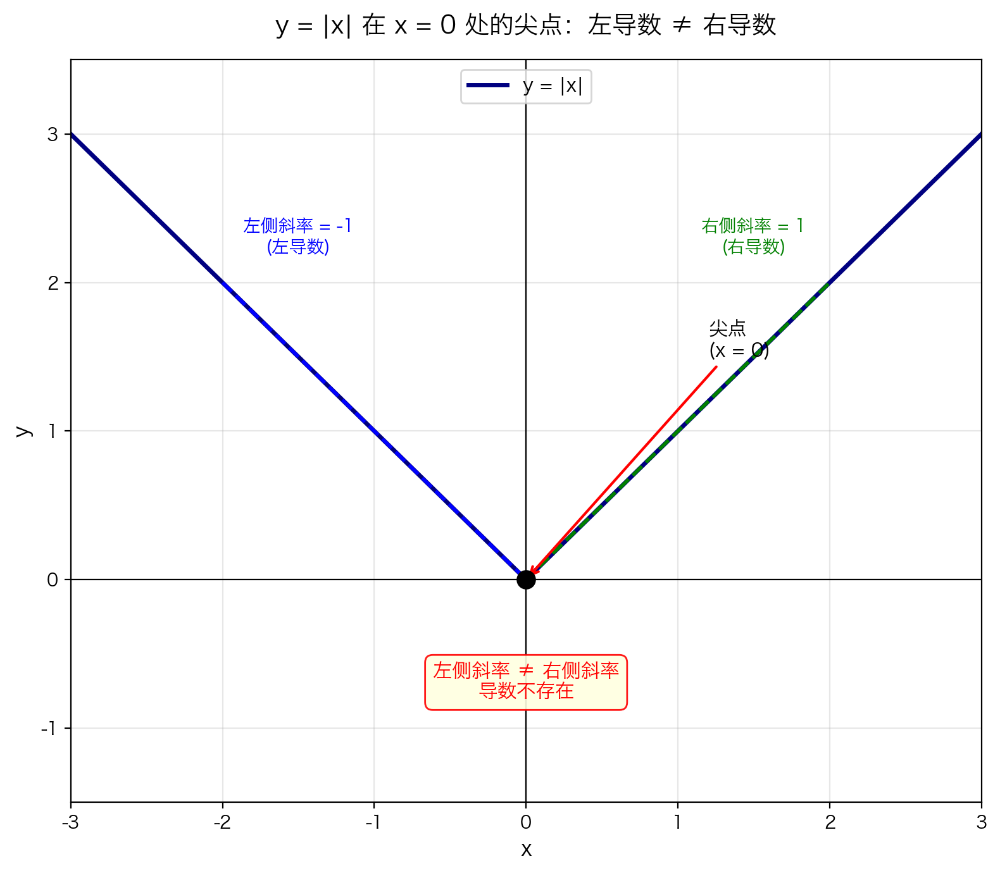
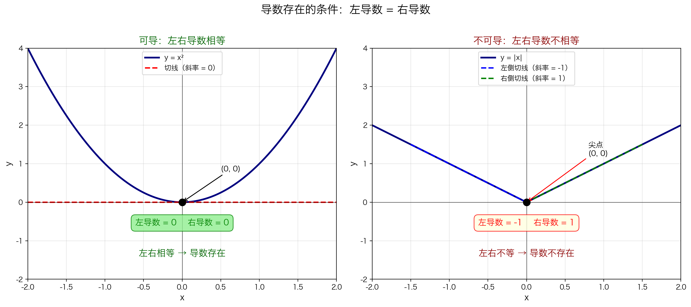

## 本节核心目标

前面我们学了如何求导数，但有一个问题还没回答：**是不是所有函数在所有点都可导？**

| 问题 | 答案 |
|------|------|
| **解决什么问题？** | 识别导数不存在的场景，建立"可导"与"连续"的精确关系 |
| **为什么学？** | 避免盲目求导，理解导数存在的边界条件 |
| **核心目的？** | 掌握左导数、右导数的概念，理解"可导 ⟹ 连续"但逆命题不成立 |

---

## 关键知识地图

- **何时导数不存在**
  - 直观例子：$f(x) = |x|$ 在 $x = 0$ 处的尖点
    - 左侧斜率 = $-1$
    - 右侧斜率 = $+1$
    - 两侧不一致 → 导数不存在
  - 左导数与右导数
    - 左导数：$h \to 0^-$ 时的极限
    - 右导数：$h \to 0^+$ 时的极限
  - 导数存在的充要条件
    - 左导数 = 右导数（且有限）
  - 重要关系
    - 可导 $\Rightarrow$ 连续
    - 连续 $\not\Rightarrow$ 可导

---

## 直觉引入：从"斜率"出发理解导数

---

### 一、先不要想"导数"，先想"斜率"

一条直线 $y = x$，它的斜率是多少？

**1。**

因为向右走 1，向上走 1。

再看 $y = 2x$，斜率是 **2**——向右 1，向上 2。

**注意：直线处处斜率相同。** 所以很好算。

---

### 二、但曲线麻烦了

例如 $y = x^2$，它不是直的。不同位置，"倾斜程度"不同。

问题来了：**曲线某一点的斜率怎么求？**

因为——**一个点根本无法形成斜率。** 斜率必须需要**两个点**。

回忆直线斜率公式：$\frac{y_2 - y_1}{x_2 - x_1}$。是不是一定要两个点、一个变化量？

---

### 三、于是数学家想了个办法

虽然"一个点没法求斜率"，但**我们可以找一个"非常靠近"的点。**

例如在 $x = 1$ 旁边找 $x = 1.1$，于是有两个点：$(1, 1)$ 和 $(1.1, 1.21)$。

现在能算斜率了：$\frac{1.21 - 1}{1.1 - 1}$。

这个斜率就是**割线斜率**。

---

### 四、关键来了：从割线到切线

如果第二个点越来越靠近第一个点：$1.1 \to 1.01 \to 1.001 \to 1.0001$。

你会发现：**割线越来越像切线。**

于是割线斜率会越来越接近**曲线在这一点真正的斜率**。

这里，"越来越接近"就是**极限**。

所以导数根本不是凭空来的。而是：

> **曲线某点斜率无法直接求 → 用"附近两点"的斜率逼近 → 让附近点无限靠近 → 这就是 $h \to 0$**

**因此：导数天然就是极限。**

---

### 五、为什么 $|x|$ 不可导？

现在你就能理解了。

$f(x) = |x|$ 的图像像一个尖尖的 V。现在想求 $x = 0$ 处斜率。

**从左边靠近：** 割线越来越像 $y = -x$，斜率逼近 **$-1$**。

**从右边靠近：** 割线越来越像 $y = x$，斜率逼近 **$1$**。

问题来了：到底应该是哪一个？$-1$ 还是 $1$？**无法统一。**

所以"逼近后的最终结果"不存在 → **极限不存在** → **导数不存在。**

> **一句话："不可导"本质上是"极限不存在"。**

---

### 六、最核心的一句话

导数并不是"突然定义出来的公式"。它本质上是：

> **"附近斜率"无限逼近后的稳定结果**

如果逼近后能稳定到一个值 → ✅ **可导**

如果逼近后左边一个结果、右边一个结果 → ❌ **不可导**

你现在的问题已经不是公式问题了，而是在建立**"极限"与"逼近"**之间的直觉。这是学微积分真正最难的一步。

---

## 直观引入：$f(x) = |x|$ 的尖点

### 白话解释

$f(x) = |x|$ 的图像是一个 **V 字形**。在原点 $(0, 0)$ 处，图像突然"拐弯"了。

想象一下：你开车沿着 V 字形道路行驶，到原点时突然要急转弯。这一刻，你的方向是向左还是向右？**说不清。**

导数描述的是"瞬时方向"。在尖点处，方向不明确，所以导数不存在。



> 在 $x = 0$ 处，左侧斜率是 $-1$，右侧斜率是 $+1$。两边"各说各话"，导数无法定义。

---

## 概念精讲：左导数与右导数

### 1. 定义（是什么）

回忆导数的定义：

$$f'(x) = \lim_{h \to 0} \frac{f(x+h) - f(x)}{h}$$

问题是：$h \to 0$ 意味着 $h$ 可以从**左侧**（负数）或**右侧**（正数）趋近 0。

**左导数**（$h$ 从左侧趋近 0）：

$$f'_-(x) = \lim_{h \to 0^-} \frac{f(x+h) - f(x)}{h}$$

**右导数**（$h$ 从右侧趋近 0）：

$$f'_+(x) = \lim_{h \to 0^+} \frac{f(x+h) - f(x)}{h}$$

### 2. 本质（为什么需要它）

有些函数在某一点"左边一个斜率，右边另一个斜率"。只有分别考察左右两侧，才能判断导数是否存在。

> 就像问"这条路往哪边走？"——你得先问清楚是从左边来还是从右边来。

### 3. 数学 / 逻辑核心

**以 $f(x) = |x|$ 在 $x = 0$ 处为例：**

当 $x = 0$ 时，$f(0) = |0| = 0$。

**计算右导数**（$h > 0$，即 $h \to 0^+$）：

$$f'_+(0) = \lim_{h \to 0^+} \frac{|0+h| - |0|}{h} = \lim_{h \to 0^+} \frac{|h|}{h}$$

因为 $h > 0$，所以 $|h| = h$：

$$f'_+(0) = \lim_{h \to 0^+} \frac{h}{h} = \lim_{h \to 0^+} 1 = 1$$

**计算左导数**（$h < 0$，即 $h \to 0^-$）：

$$f'_-(0) = \lim_{h \to 0^-} \frac{|0+h| - |0|}{h} = \lim_{h \to 0^-} \frac{|h|}{h}$$

因为 $h < 0$，所以 $|h| = -h$：

$$f'_-(0) = \lim_{h \to 0^-} \frac{-h}{h} = \lim_{h \to 0^-} (-1) = -1$$

**结论**：

$$f'_+(0) = 1 \quad \text{而} \quad f'_-(0) = -1$$

$$1 \neq -1 \quad \Rightarrow \quad f'(0) \text{ 不存在}$$

### 4. 直觉理解（生活案例）

**案例：V 字形坡道**

你站在 V 字形坡道的最低点：
- 向右看：坡道向上倾斜（正斜率）
- 向左看：坡道也向上倾斜（但从左往右看是负斜率）

你站在谷底，没法说"这里的坡度是多少"——因为左边和右边不一样。

**案例：折纸**

拿一张纸对折，折痕处就是一个"尖点"。折痕左边和右边的斜率完全不同。

### 5. 常见错误

| ❌ 错误 | ✅ 正确 | 原因 |
| ------- | ------ | ---- |
| 认为 $f(x)=\lvert x\rvert$ 在 $x=0$ 处导数为 $0$ | 导数不存在 | 左右导数不相等 |
| 认为"连续就一定可导" | 连续 $\not\Rightarrow$ 可导 | $f(x)=\lvert x\rvert$ 在 $x=0$ 连续但不可导 |
| 左导数和右导数算反了 | $h>0$ 是右，$h<0$ 是左 | 注意 $h$ 的符号 |
| 认为导数不存在就是"无穷大" | 也可能是左右不一致 | 导数不存在有多种原因 |

### 6. 一句话记忆

> **尖点处左右斜率"打架"，导数只能"弃权"。**

---

## 概念精讲：导数存在的充要条件

### 1. 定义（是什么）

函数 $f$ 在点 $x$ 处**可导**的充分必要条件是：

$$\boxed{f'_-(x) = f'_+(x) \text{（且两者都为有限值）}}$$

即：**左导数存在、右导数存在，且两者相等。**

### 2. 本质（为什么是这样）

导数定义中的极限 $\lim_{h \to 0}$ 要求从**所有方向**趋近时极限都相同。

$h \to 0$ 包含了 $h \to 0^-$ 和 $h \to 0^+$ 两个方向。如果左右极限不同，整体极限就不存在。

> 就像选举：左右两派票数必须一致，才能选出唯一的"导数代表"。

### 3. 数学 / 逻辑核心



> 左图 $y = x^2$ 在 $x = 0$ 处左右切线重合（斜率都是 0），导数存在。右图 $y = |x|$ 在 $x = 0$ 处左右切线方向不同（斜率 $-1$ 和 $1$），导数不存在。

**导数存在 ⟺ 左导数 = 右导数 = 有限值**

| 情况 | 左导数 | 右导数 | 导数是否存在？ | 例子 |
|:---:|:---:|:---:|:---:|:---|
| 两者相等且有限 | $L$ | $L$ | ✅ 存在，值为 $L$ | $f(x) = x^2$ 在任意点 |
| 两者不相等 | $-1$ | $1$ | ❌ 不存在 | $f(x)=\lvert x\rvert$ 在 $x=0$ |
| 至少一个为无穷 | $+\infty$ | $+\infty$ | ❌ 不存在（无穷导数）| $f(x) = \sqrt[3]{x}$ 在 $x = 0$ |
| 至少一个不存在 | 不存在 | ... | ❌ 不存在 | 间断点处 |

### 4. 直觉理解

**案例：山路的坡度**

一条山路在某一点：
- 从左边看，坡度是 $30°$
- 从右边看，坡度也是 $30°$

那么"这一点的坡度"就是 $30°$。但如果左边是 $30°$，右边是 $60°$，你就没法说"这一点的坡度"是多少——它取决于你从哪边来。

### 5. 常见错误

| ❌ 错误 | ✅ 正确 | 原因 |
|--------|--------|------|
| 看到左右导数都存在就认为导数存在 | 还必须**相等** | 两者相等是必要条件 |
| 认为左导数 = 右导数 = $\infty$ 时导数存在 | 无穷大不算"存在" | 导数定义要求有限值 |
| 忽略检查左右导数，直接套公式 | 先检查连续性，再检查可导性 | 不连续一定不可导 |

### 6. 一句话记忆

> **导数存在 = 左右"意见统一" + 都是有限数。**

---

## 概念精讲：可导与连续的关系

### 1. 核心定理（是什么）

$$\boxed{\text{可导} \Rightarrow \text{连续}}$$

**逆命题不成立：**

$$\text{连续} \not\Rightarrow \text{可导}$$

### 2. 本质（为什么可导必连续）

如果 $f$ 在 $a$ 处可导，那么：

$$\lim_{x \to a} \frac{f(x) - f(a)}{x - a} = f'(a) \text{（存在且有限）}$$

我们想证明 $\lim_{x \to a} f(x) = f(a)$，即 $f$ 在 $a$ 处连续。

关键技巧：把 $f(x) - f(a)$ 写成两个因子的乘积：

$$f(x) - f(a) = \frac{f(x) - f(a)}{x - a} \cdot (x - a)$$

两边取极限：

$$\lim_{x \to a} [f(x) - f(a)] = \lim_{x \to a} \frac{f(x) - f(a)}{x - a} \cdot \lim_{x \to a} (x - a)$$

$$= f'(a) \cdot 0 = 0$$

所以 $\lim_{x \to a} f(x) = f(a)$，即 $f$ 在 $a$ 处连续。

> **直觉**：如果函数在某点有"明确的方向"（可导），它一定"没有断开"（连续）。但有"明确方向"比"没有断开"要求更高。

### 3. 为什么连续不一定可导？

$|x|$ 在 $x = 0$ 处就是最好的**反例**：

- **连续？** 是的。$\lim_{x \to 0} |x| = 0 = |0|$，图像不断笔。
- **可导？** 不是。左导数 $-1$ $\neq$ 右导数 $1$。

> 连续只要求"不断笔"，可导还要求"不拐弯"。不断笔的曲线可以拐弯（尖点），所以连续推不出可导。

### 4. 常见错误

| ❌ 错误 | ✅ 正确 | 原因 |
|--------|--------|------|
| "连续所以可导" | 连续 $\not\Rightarrow$ 可导 | $\lvert x\rvert$ 是反例 |
| "不可导所以不连续" | 不可导 $\not\Rightarrow$ 不连续 | 逆否命题才对：不连续 $\Rightarrow$ 不可导 |
| 忽略检查连续性直接求导 | 先检查是否连续 | 不连续的点一定不可导 |

### 5. 一句话记忆

> **可导是连续的"升级版"——所有可导函数都连续，但连续函数不一定够"光滑"。**

---

## 最容易混淆内容

| 概念A | 概念B | 区别 | 常见错误 |
|-------|-------|------|---------|
| **左导数 $f'_-(x)$** | **右导数 $f'_+(x)$** | 前者 $h \to 0^-$，后者 $h \to 0^+$ | 把符号搞反 |
| **导数存在** | **左右导数都存在** | 后者还需**相等**才算前者 | 看到左右都存在就认为导数存在 |
| **连续** | **可导** | 连续：图像不断笔；可导：图像光滑无尖点 | 认为连续就一定可导 |
| **不可导** | **不连续** | 不可导的点可能连续（如尖点）；不连续一定不可导 | 混淆两者关系 |
| **导数为 0** | **导数不存在** | 前者是水平切线；后者是极限不存在 | 把不存在误认为等于 0 |

---

## 本节复习清单

### 你必须记住：
- [ ] 左导数定义：$f'_-(x) = \lim_{h \to 0^-} \frac{f(x+h) - f(x)}{h}$
- [ ] 右导数定义：$f'_+(x) = \lim_{h \to 0^+} \frac{f(x+h) - f(x)}{h}$
- [ ] 导数存在的条件：$f'_-(x) = f'_+(x)$ 且有限
- [ ] 可导 $\Rightarrow$ 连续，但连续 $\not\Rightarrow$ 可导
- [ ] $f(x) = |x|$ 在 $x = 0$ 处连续但不可导

### 你必须理解：
- [ ] 为什么 $|x|$ 在 $x = 0$ 处左右导数不同
- [ ] 为什么导数存在要求左右极限相等
- [ ] 为什么可导的函数一定连续
- [ ] 为什么连续的函数不一定可导（尖点反例）

### 你必须会做：
- [ ] 用定义计算分段函数在分段点处的左右导数
- [ ] 判断一个点是否可导
- [ ] 判断"可导/连续"相关命题的真假

---

## 苏格拉底自测题

### 基础题

**Q1**：$f(x) = |x|$ 在 $x = 0$ 处的左导数和右导数分别是多少？

> [!faq]- 点击查看答案
> - 右导数：$f'_+(0) = \lim_{h \to 0^+} \frac{|h|}{h} = \lim_{h \to 0^+} 1 = 1$
> - 左导数：$f'_-(0) = \lim_{h \to 0^-} \frac{|h|}{h} = \lim_{h \to 0^-} (-1) = -1$

**Q2**：$f(x) = |x|$ 在 $x = 0$ 处导数存在吗？为什么？

> [!faq]- 点击查看答案
> **不存在。**
>
> 因为左导数 $= -1$，右导数 $= 1$，两者不相等。
> 导数存在的条件是左右导数相等且有限。

**Q3**：可导一定连续吗？连续一定可导吗？

> [!faq]- 点击查看答案
> - **可导一定连续。** 这是定理。
> - **连续不一定可导。** $f(x) = |x|$ 在 $x = 0$ 处连续但不可导，是经典反例。

### 理解题

**Q4**：为什么尖点处导数不存在，但函数仍然连续？

> [!faq]- 点击查看答案
> - **连续**只看函数值是否"不断笔"：$\lim_{x \to a} f(x) = f(a)$。尖点处满足这个条件。
> - **可导**要求"方向唯一"：左导数必须等于右导数。尖点处左右斜率不同，方向不唯一。
>
> 所以"不断笔"（连续）容易满足，"方向唯一"（可导）要求更高。

**Q5**：如果 $f'_-(3) = 5$ 且 $f'_+(3) = 5$，能否说 $f'(3) = 5$？

> [!faq]- 点击查看答案
> **可以。**
>
> 因为左导数 = 右导数 = 5（有限值），满足导数存在的充要条件，所以 $f'(3) = 5$。

**Q6**：如果 $f'_-(3) = 5$ 且 $f'_+(3) = 7$，能否说 $f'(3)$ 不存在？

> [!faq]- 点击查看答案
> **可以。**
>
> 左右导数不相等，极限 $\lim_{h \to 0} \frac{f(3+h) - f(3)}{h}$ 不存在（左右极限不同）。

### 应用题

**Q7**：判断下列命题真假，并说明理由。

1. 若 $f$ 在 $x = a$ 处不连续，则 $f$ 在 $x = a$ 处不可导。
2. 若 $f$ 在 $x = a$ 处不可导，则 $f$ 在 $x = a$ 处不连续。

> [!faq]- 点击查看答案
> 1. **真。** 这是"可导 $\Rightarrow$ 连续"的逆否命题：不连续 $\Rightarrow$ 不可导。
> 2. **假。** 反例：$f(x) = |x|$ 在 $x = 0$ 处不可导，但连续。

**Q8**：设 $f(x) = \begin{cases} x^2 & x \leq 1 \\ 2x & x > 1 \end{cases}$，判断 $f$ 在 $x = 1$ 处是否可导。

> [!faq]- 点击查看答案
> **第一步：检查连续性**
>
> - $\lim_{x \to 1^-} f(x) = \lim_{x \to 1^-} x^2 = 1$
> - $\lim_{x \to 1^+} f(x) = \lim_{x \to 1^+} 2x = 2$
> - 左右极限不相等，所以 $f$ 在 $x = 1$ 处**不连续**。
>
> **第二步：判断可导性**
>
> 不连续一定不可导，所以 $f$ 在 $x = 1$ 处**不可导**。
>
> （即使硬算左右导数：左导数 $= 2$，右导数 $= 2$，看似相等——但因为不连续，导数定义的前提已不满足。）

---

## 终极总结

> 这一节本质上是在解决 **"导数什么时候会失效"** 的问题。

### 核心结论

| 关系 | 是否成立 | 记忆口诀 |
|:---:|:---:|:---|
| 可导 $\Rightarrow$ 连续 | ✅ | "光滑必不断笔" |
| 连续 $\Rightarrow$ 可导 | ❌ | "不断笔不代表光滑" |
| 不连续 $\Rightarrow$ 不可导 | ✅ | 逆否命题 |
| 左右导数相等 $\Rightarrow$ 可导 | ✅ | "意见统一就能定" |

### 核心思想

```
可导（光滑）
   ↓ （要求更强）
连续（不断笔）
```

### 关键理解

- **尖点** = 连续但不可导的典型
- **导数存在** = 左导数 = 右导数（且有限）
- **可导是比连续更强的条件**

---

## 知识链路

```
导数定义 → 左/右导数 → 导数存在条件 → 可导与连续的关系
              ↓
         分段函数可导性判定
```

### 前置知识
- **导数定义**：$f'(x) = \lim_{h \to 0} \frac{f(x+h) - f(x)}{h}$
- **左极限与右极限**：$\lim_{x \to a^-}$ 和 $\lim_{x \to a^+}$
- **连续性**：$\lim_{x \to a} f(x) = f(a)$

### 当前知识
- **左导数与右导数**：分别考察两侧的导数极限
- **导数存在条件**：左右导数相等且有限
- **可导与连续**：可导 $\Rightarrow$ 连续，逆命题不成立

### 后续用途
- **分段函数求导**：在分段点处必须用左右导数判断
- **函数图像分析**：识别尖点、角点等不可导位置
- **极值判定**：可导函数的极值点导数必为 0（费马定理）

---

## 上一节与下一节

← [5.2.8 线性函数的导数](5.2.8%20线性函数的导数.md)

→ [5.2.9 二阶导数和更高阶导数](5.2.9%20二阶导数和更高阶导数.md)
