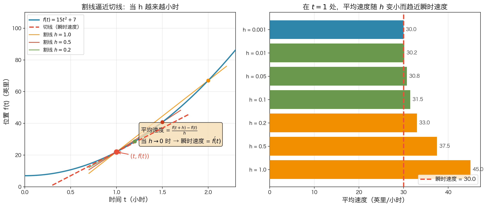

# 5.2.3：瞬时速度

---

## 一、本章核心目标

> **核心问题**：在某一给定的瞬间，汽车的速度是多少？
>
> 单张照片无法告诉你速度——因为速度 = 位移 ÷ 时间，而"一瞬间"几乎没有时间。本章用**极限**解决这个矛盾：让时间间隔越来越短，平均速度就越来越接近瞬时速度。

**作者想解决什么**：
- 从"平均速度"过渡到"瞬时速度"
- 用极限严格定义"某一时刻的速度"
- 建立导数的物理直觉

---

## 二、关键知识地图

- **瞬时速度**
  - 从平均速度出发
    - 位移 $\div$ 时间间隔
  - 极限思想
    - 时间间隔 $\to 0$
  - 两种等价定义
    - 写法一：$\displaystyle\lim_{u \to t} \frac{f(u)-f(t)}{u-t}$
    - 写法二：$\displaystyle\lim_{h \to 0} \frac{f(t+h)-f(t)}{h}$
  - 计算步骤
    - 代入
    - 展开
    - 化简
    - 消去 $h$
    - 令 $h = 0$
  - 物理意义
    - 速度函数 $v(t) = 30t$

---

## 三、重点概念精讲

### 概念：瞬时速度

#### 1. 定义（是什么）

**瞬时速度** = 在某一时刻，物体运动的精确快慢。

数学上，它是**平均速度**在时间间隔趋近于零时的极限：

$$
\text{在时刻 } t \text{ 的瞬时速度} = \lim_{u \to t} \frac{f(u) - f(t)}{u - t}
$$

其中：
- $f(t)$ = 汽车在时刻 $t$ 的位置
- $u$ = $t$ 之后（或之前）的另一个时刻
- $f(u) - f(t)$ = 位移
- $u - t$ = 时间间隔

#### 2. 本质（为什么需要它）

| 问题 | 平均速度 | 瞬时速度 |
|------|---------|---------|
| 能回答什么 | 一段时间内的整体快慢 | 某一瞬间的精确快慢 |
| 适用场景 | 匀速运动 | 变速运动（如加速的汽车） |
| 计算方式 | 位移 ÷ 时间 | 取极限（时间间隔 → 0） |

> 汽车 constantly 在加速或减速，不存在一个"固定速度"。想知道某一秒的确切速度，必须用到瞬时速度。

#### 3. 数学 / 逻辑核心

**两种等价写法**：

| 写法 | 公式 | 特点 |
|------|------|------|
| 写法一（双时刻） | $\displaystyle\lim_{u \to t} \frac{f(u) - f(t)}{u - t}$ | 用两个时刻 $t$ 和 $u$ |
| 写法二（时间间隔） | $\displaystyle\lim_{h \to 0} \frac{f(t + h) - f(t)}{h}$ | 用时间间隔 $h = u - t$ |

**为什么两种写法等价？**

令 $h = u - t$，则 $u = t + h$。当 $u \to t$ 时，$h \to 0$。

代入即可互相转化：

$$
\frac{f(u) - f(t)}{u - t} = \frac{f(t + h) - f(t)}{h}
$$

> **关键**：不能直接代入 $u = t$（或 $h = 0$），因为会得到 $\dfrac{0}{0}$ 的不定式。必须先化简消去分母中的 $h$，再取极限。

#### 4. 直觉理解（生活案例）

**案例：汽车速度表**

- 你开车时，速度表显示 60 km/h。这就是**瞬时速度**
- 但它不是真的"测了一瞬间"——传感器实际上测的是极短时间内的平均速度
- 时间间隔越短，读数越精确
- 极限思想：如果速度表能测"无限短"的时间间隔，读数就是真正的瞬时速度

**图像直觉：割线 → 切线**



- **割线**：连接 $(t, f(t))$ 和 $(t+h, f(t+h))$ 的直线，斜率 = 平均速度
- **切线**：当 $h \to 0$ 时，割线的极限位置，斜率 = 瞬时速度

#### 5. 常见错误

| 错误 | 原因 | 正确做法 |
|------|------|---------|
| 直接代入 $h = 0$ | 得到 $0/0$ 不定式 | 先化简消去分母的 $h$，再代入 |
| 混淆 $f(t+h)$ 和 $f(t) + h$ | $f(t+h)$ 是把整个 $t$ 替换为 $(t+h)$ | $f(t+h) = 15(t+h)^2 + 7$，不是 $15t^2 + 7 + h$ |
| 展开 $(t+h)^2$ 出错 | 忘记交叉项 | $(t+h)^2 = t^2 + 2th + h^2$，不是 $t^2 + h^2$ |
| 认为瞬时速度是一个"特殊公式" | 本质是极限 | 记住通用套路：代入 → 展开 → 化简 → 消 $h$ → 取极限 |

#### 6. 一句话记忆

> **瞬时速度 = 平均速度的时间间隔缩到极限**

---

## 四、章节重点公式 / 定理整理

### 公式 1：平均速度

- **表达式**：$v_{t \leftrightarrow u} = \dfrac{f(u) - f(t)}{u - t}$
- **含义**：从时刻 $t$ 到时刻 $u$ 这段时间内的平均快慢
- **使用条件**：需要两个时刻的位置信息
- **常见题型**：已知位置函数，求某段时间的平均速度
- **易错点**：分子是位移（终点 − 起点），不是距离

### 公式 2：瞬时速度（写法一）

- **表达式**：$\displaystyle\lim_{u \to t} \frac{f(u) - f(t)}{u - t}$
- **含义**：时刻 $t$ 的精确速度
- **使用条件**：需要知道位置函数 $f(t)$ 的表达式
- **常见题型**：从位置函数推导速度函数
- **易错点**：不能直接代入 $u = t$

### 公式 3：瞬时速度（写法二）

- **表达式**：$\displaystyle\lim_{h \to 0} \frac{f(t + h) - f(t)}{h}$
- **含义**：与写法一等价，用时间间隔 $h$ 表示
- **使用条件**：计算时更方便，只需要处理一个变量 $h$
- **常见题型**：多项式函数的求导计算
- **易错点**：$f(t+h)$ 的代入要完整，注意括号

---

## 五、例题模型

### 题型：从位置函数求瞬时速度函数

**题目**：汽车从 7 英里标志处静止出发，位置函数为 $f(t) = 15t^2 + 7$（$t$ 单位：小时），求任意时刻 $t$ 的瞬时速度。

#### 解题步骤：

**第一步：写出极限定义**

$$
\text{瞬时速度} = \lim_{h \to 0} \frac{f(t + h) - f(t)}{h}
$$

**第二步：分别计算 $f(t+h)$ 和 $f(t)$**

- $f(t + h) = 15(t + h)^2 + 7$
- $f(t) = 15t^2 + 7$

**第三步：代入公式**

$$
= \lim_{h \to 0} \frac{[15(t + h)^2 + 7] - [15t^2 + 7]}{h}
$$

**第四步：展开 $(t + h)^2 = t^2 + 2th + h^2$**

$$
= \lim_{h \to 0} \frac{15t^2 + 30th + 15h^2 + 7 - 15t^2 - 7}{h}
$$

**第五步：化简（消去同类项）**

$$
= \lim_{h \to 0} \frac{30th + 15h^2}{h} = \lim_{h \to 0} (30t + 15h)
$$

> 关键：从分母中消去了 $h$！现在分母不再为零，可以安全取极限。

**第六步：令 $h = 0$**

$$
= 30t
$$

#### 结论：

**瞬时速度 $v(t) = 30t$（英里/小时）**

| 时刻 | 速度 | 物理意义 |
|------|------|---------|
| $t = 0$ | $0$ 英里/小时 | 静止出发 |
| $t = 0.5$ | $15$ 英里/小时 | 半小时后 |
| $t = 1$ | $30$ 英里/小时 | 一小时后 |

> 每小时速度增加 30 英里/小时，即加速度为 **30 英里/小时²**。

#### 解题关键：

- **看什么**：题目给的是位置函数，问的是速度
- **用什么**：瞬时速度的极限定义
- **防什么错误**：不要直接代入 $h=0$；展开 $(t+h)^2$ 时别漏了 $2th$

---

## 六、最容易混淆内容

| 概念A | 概念B | 区别 | 常见错误 |
|-------|-------|------|---------|
| 平均速度 | 瞬时速度 | 平均速度是一段时间的"整体"；瞬时速度是某一时刻的"精确" | 以为"很短时间内的平均速度"就是瞬时速度（数学上必须取极限） |
| $f(t+h)$ | $f(t) + h$ | $f(t+h)$ 是把 $t$ 整个替换为 $(t+h)$；$f(t)+h$ 是给函数值加 $h$ | 混淆代入和加法，如写成 $15t^2 + 7 + h$ |
| $u \to t$ | $h \to 0$ | 两种写法等价，$h = u - t$ | 不知道可以互相替换，或替换时忘记调整极限方向 |
| 速率 | 速度 | 速率 ≥ 0（标量）；速度可正可负（矢量，含方向） | 在物理情境中不区分两者 |

---

## 七、章节复习清单

### 你必须记住：

- 瞬时速度的两种极限定义公式
- 平均速度公式：$v = \dfrac{f(u) - f(t)}{u - t}$
- 计算套路：代入 → 展开 → 化简 → 消 $h$ → 取极限
- 不能直接代入 $h = 0$，必须先消去分母的 $h$

### 你必须理解：

- 为什么"一瞬间的速度"要用极限来定义
- 割线斜率 → 切线斜率的图像意义
- 两种写法（$u \to t$ 和 $h \to 0$）为什么等价
- $f(t) = 15t^2 + 7$ 为什么是加速运动（不是匀速）

### 你必须会做：

- 已知位置函数 $f(t)$，用极限定义求瞬时速度函数
- 展开 $(t + h)^2$ 并正确代入
- 化简分式并消去 $h$

---

## 八、苏格拉底自测题

### 基础题

1. 为什么不能直接令 $u = t$ 来计算 $\dfrac{f(u) - f(t)}{u - t}$？
2. 令 $h = u - t$ 后，极限 $\lim_{u \to t}$ 变成了什么？
3. 展开 $(t + h)^2$，写出完整结果。

### 理解题

4. 在位置-时间图像上，**割线**的斜率代表什么？**切线**的斜率代表什么？
5. 为什么说 $f(t) = 15t^2 + 7$ 描述的是加速运动，而不是匀速运动？
6. 从分母中"消去 $h$"为什么是关键一步？如果不消去会怎样？

### 应用题

7. 用极限定义求 $f(t) = 15t^2 + 7$ 在 $t = 2$ 处的瞬时速度。
8. 如果位置函数改为 $f(t) = 10t^2 + 3$，求瞬时速度函数 $v(t)$。

---

## 九、终极总结

> 这一章本质上是在解决 **"变速运动中，如何定义和计算某一时刻的精确速度"** 的问题。

**核心思想链**：

$$
\text{平均速度} \xrightarrow{\text{时间间隔越来越小}} \text{瞬时速度} = \lim_{h \to 0} \frac{f(t+h) - f(t)}{h}
$$

**一句话**：瞬时速度不是"测出来的"，而是"逼出来的"——用极限把平均速度逼到无限精确。

---

## 知识链路

```
前置知识                    当前知识                      后续用途
─────────                   ────────                     ────────
函数概念        →          瞬时速度（极限定义）      →      导数的正式定义
极限的 ε-δ 定义   →          割线逼近切线             →      求导法则
平均速度公式     →          位置函数 → 速度函数        →      微分方程、运动学
```
