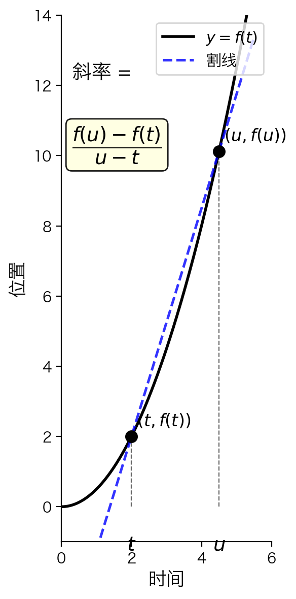
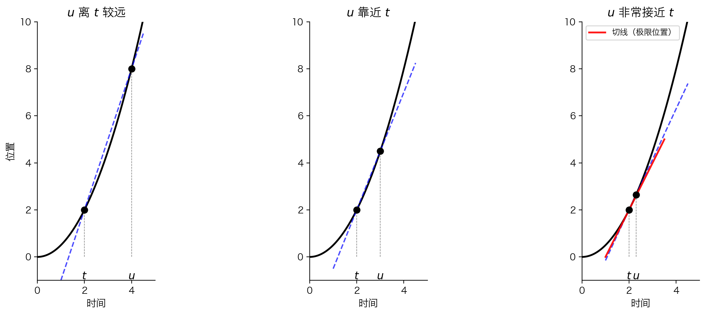

## 本节总览

[上一节](5.2.1%20平均速率、速度和瞬时速度.md)我们从物理直觉推导出了瞬时速度的公式。这一节把公式**画成图**，让你一眼看出"平均速度"和"瞬时速度"在图像上分别是什么。

### 本节知识结构

1. **割线 = 平均速度**：连接两点的直线斜率
2. **切线 = 瞬时速度**：割线的极限位置
3. **核心洞察**：导数就是切线斜率

---

## 核心概念：图像上的速度

### 设定

- 横轴：时间 $t$
- 纵轴：位置 $f(t)$
- 曲线：$y = f(t)$，记录汽车每个时刻在哪

### 两个点，一条线

在曲线上取两个时刻：$t$（当前）和 $u$（稍后）。对应两个点：$(t, f(t))$ 和 $(u, f(u))$。

过这两点画一条直线——这叫**割线**（secant line）。



### 割线的斜率

$$
\text{斜率} = \frac{f(u) - f(t)}{u - t}
$$

等等，这不就是上一节的**平均速度公式**吗？

> **核心发现**：在位置-时间图像上，**割线的斜率 = 平均速度**。

---

## 从割线到切线

### 问题

平均速度是割线斜率，那**瞬时速度**呢？

### 思路：让 $u$ 靠近 $t$

我们知道：时间间隔越短，平均速度越接近瞬时速度。

反映在图像上：**把 $u$ 往 $t$ 的方向挪动**，看看割线怎么变。



### 观察发生了什么

| 步骤 | $u$ 的位置 | 割线特征 |
|:---:|:---|:---|
| 1 | 离 $t$ 较远 | 割线较"平缓"，和曲线差距大 |
| 2 | $u$ 靠近 $t$ | 割线变"陡"了一些 |
| 3 | $u$ 非常接近 $t$ | 割线几乎"贴"在曲线上 |
| 极限 | $u \to t$ | 割线变成一个**唯一的位置**——切线 |

> **关键结论**：当 $u$ 无限趋近于 $t$ 时，割线"转动"到一个极限位置，这个位置就是**切线**（tangent line）。

### 瞬时速度 = 切线斜率

$$
\text{瞬时速度} = \lim_{u \to t} \frac{f(u) - f(t)}{u - t} = \text{切线的斜率}
$$

---

## 本质理解：为什么是这样？

### 为什么割线斜率是平均速度？

斜率的定义是 "纵坐标变化 / 横坐标变化"：

$$
\text{斜率} = \frac{\Delta y}{\Delta x} = \frac{f(u) - f(t)}{u - t} = \frac{\text{位移}}{\text{时间}} = \text{平均速度}
$$

**图像语言**：割线的"倾斜程度"就是在告诉你这段时间里汽车平均跑得多快。

### 为什么切线斜率是瞬时速度？

当 $u \to t$ 时：
- 时间间隔 $\to 0$
- 平均速度 $\to$ 瞬时速度
- 割线 $\to$ 切线

**图像语言**：切线就是"在这一点处，曲线往哪个方向走"的精确描述。

### 一个直觉类比

想象你开车经过一段弯道：
- **割线**：从弯道入口到出口连一条直线，告诉你这段路"平均"指向哪个方向
- **切线**：在你经过某个点的瞬间，车头指向的方向——这是"瞬时"的方向

速度也是一样：切线斜率就是"此时此刻"的快慢和方向。

---

## 典型例子

### 例子：$f(t) = t^2$ 在 $t = 1$ 处

**求割线斜率**（取 $u = 2$）：

$$
v_{1 \leftrightarrow 2} = \frac{f(2) - f(1)}{2 - 1} = \frac{4 - 1}{1} = 3
$$

**求切线斜率**（取极限）：

$$
\lim_{u \to 1} \frac{f(u) - f(1)}{u - 1} = \lim_{u \to 1} \frac{u^2 - 1}{u - 1} = \lim_{u \to 1} (u + 1) = 2
$$

| 类型 | 值 | 含义 |
|:---|:---:|:---|
| 割线斜率（$u=2$） | 3 | 第1小时到第2小时的平均速度 |
| 切线斜率（$u \to 1$） | 2 | $t=1$ 这一瞬间的速度 |

> 注意：平均速度（3）≠ 瞬时速度（2）。只有当 $u$ 无限靠近 $1$ 时，割线斜率才趋近于 2。

---

## 常见错误

### 错误1：切线只和曲线交于一点

**纠正**：切线确实在切点附近"贴着"曲线，但它可以在别的地方再穿过曲线。

比如 $f(t) = t^3$ 在 $t=0$ 处的切线是横轴（$y=0$），它只在原点接触曲线，但其他函数的切线可能再次相交。

> 切线的定义不是"只交于一点"，而是**割线的极限位置**。

### 错误2：割线和切线混淆

| | 割线 | 切线 |
|:---|:---|:---|
| 需要几个点 | **两个点** $(t, f(t))$ 和 $(u, f(u))$ | **一个点** $(t, f(t))$ |
| 代表什么 | 平均速度 | 瞬时速度 |
| 怎么得到 | 直接画出来 | 让割线取极限 |

### 错误3：以为任何曲线都有切线

如果曲线在某点有"尖角"或"断裂"，割线可能没有一个确定的极限位置，这时**切线不存在**，对应的瞬时速度也不存在（函数在该点不可导）。

---

## 知识关联

### 与导数的联系

本节的所有内容，本质上就是在说一件事：

> **导数 = 切线斜率 = 瞬时变化率**

| 语言 | 表达 |
|:---|:---|
| 物理语言 | 瞬时速度 = 位置的变化率 |
| 几何语言 | 导数 = 切线斜率 |
| 代数语言 | $f'(t) = \displaystyle\lim_{u \to t} \frac{f(u) - f(t)}{u - t}$ |

这三者是同一枚硬币的三个面。

### 与上一节的联系

[上一节](5.2.1%20平均速率、速度和瞬时速度.md)的公式：

$$
\text{瞬时速度} = \lim_{h \to 0} \frac{f(t + h) - f(t)}{h}
$$

和本节的：

$$
\text{切线斜率} = \lim_{u \to t} \frac{f(u) - f(t)}{u - t}
$$

**完全一样**——只是换了字母（$u = t + h$）。

---

## 本节总结

### 核心对应关系

```
代数公式              几何图像              物理含义
━━━━━━━━━━━━━━━━━━━━━━━━━━━━━━━━━━━━━━━━━━━━━━
(f(u)-f(t))/(u-t)  →  割线斜率           →  平均速度
lim(u→t) ...       →  切线斜率           →  瞬时速度
```

### 一句话总结

> 在位置-时间图像上，**割线代表过去一段时间的平均，切线代表这一瞬间的精确**。

### 关键理解

- 割线需要**两个点**确定，反映"平均"
- 切线是割线的**极限**，反映"瞬时"
- 导数的几何意义就是**切线斜率**

---

## 下一节

既然瞬时速度就是切线斜率，那如何**把"某一点的导数"推广到"导函数"**？下一节将正式介绍导函数的定义。

→ [5.2.6 导函数](5.2.6%20导函数.md)

---

## 苏格拉底式提问

🤔 **问题1**：为什么割线的斜率公式 $\frac{f(u) - f(t)}{u - t}$ 恰好就是平均速度？试着从"斜率 = 纵坐标变化 / 横坐标变化"这个定义出发解释。

🤔 **问题2**：在图5-10中，当 $u$ 越来越靠近 $t$ 时，割线发生了什么变化？如果 $u$ 和 $t$ 完全重合了，为什么还能确定一条唯一的直线？

🤔 **问题3**：如果曲线在某点有一个"尖角"（像绝对值函数 $|t|$ 在 $t=0$ 处），你觉得割线还能趋近于一个确定的位置吗？这时瞬时速度存在吗？

---

**现在轮到你了**：用你自己的话描述——割线和切线的区别是什么？为什么切线斜率代表"瞬时"速度？
