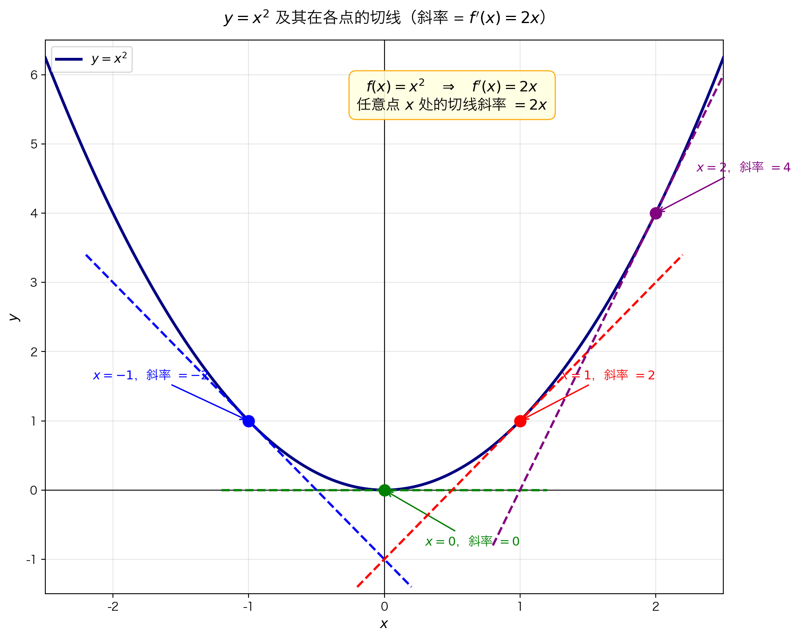

## 本节核心目标

前面我们讨论了"某一时刻"的瞬时速度。但现实中，我们往往想知道的是：**任意时刻**的速度规律。

| 问题 | 答案 |
|------|------|
| **解决什么问题？** | 从"某一点的导数"推广到"每一点的导数"——得到一个**函数** |
| **为什么学？** | 导函数一次性给出所有点的变化率，比逐点计算高效得多 |
| **核心目的？** | 理解 $f'(x)$ 本身就是一个函数，掌握从 $f(x)$ 求 $f'(x)$ 的极限方法 |

---

## 关键知识地图

- **导函数**
  - 从"一点的导数"到"导函数"
    - 某点：$f'(a) = \lim_{h \to 0} \frac{f(a+h) - f(a)}{h}$（一个数）
    - 导函数：$f'(x) = \lim_{h \to 0} \frac{f(x+h) - f(x)}{h}$（一个函数）
  - 本质：把极限定义中的固定点 $a$ 换成变量 $x$
  - 几何意义：$f'(x)$ = 曲线 $y=f(x)$ 在点 $x$ 处切线的斜率
  - 记法：$f'(x)$，$y'$，$\frac{dy}{dx}$，$\frac{d}{dx}f(x)$
  - 计算方法：代入 $\to$ 展开 $\to$ 化简 $\to$ 消 $h$ $\to$ 令 $h=0$

---

## 从瞬时速度到导函数

### 发生了什么变化？

回顾瞬时速度的定义（用 $t$ 表示时间）：

$$v(t) = \lim_{h \to 0} \frac{f(t+h) - f(t)}{h}$$

现在，把**时间** $t$ 换成一般的**自变量** $x$，把**位置函数** $f$ 换成任意函数：

$$f'(x) = \lim_{h \to 0} \frac{f(x+h) - f(x)}{h}$$

**这就是导函数的定义。**

### 关键区别

| | 某一点的导数 | 导函数 |
|:---|:---|:---|
| **符号** | $f'(a)$ 或 $f'(3)$ | $f'(x)$ |
| **结果** | 一个**数** | 一个**函数** |
| **含义** | $x=a$ 处切线的斜率 | 每一点 $x$ 处切线的斜率规律 |
| **例子** | $f(x)=x^2$ 在 $x=3$ 处，$f'(3)=6$ | $f(x)=x^2$ 的导函数是 $f'(x)=2x$ |

> 导函数就是"把所有点的导数打包成一个函数"。

---

## 概念精讲：导函数

### 1. 定义（是什么）

函数 $f$ 的**导函数** $f'$ 定义为：

$$f'(x) = \lim_{h \to 0} \frac{f(x+h) - f(x)}{h}$$

对定义域内每个使该极限存在的 $x$，$f'(x)$ 给出一个对应的数值——即 $f$ 在点 $x$ 处的瞬时变化率。

### 2. 本质（为什么需要它）

| 场景 | 没有导函数 | 有了导函数 |
|:---|:---|:---|
| 想知道 $x=1$ 处的变化率 | 代入计算一次 | $f'(1)$ 直接查 |
| 想知道 $x=2$ 处的变化率 | 再代入计算一次 | $f'(2)$ 直接查 |
| 想知道**所有** $x$ 处的变化率 | 算无数次 | $f'(x)$ 一个公式搞定 |

导函数把"逐点求导"变成了"一次求出全部"。

### 3. 数学 / 逻辑核心

**从具体到一般的一步：**

$$
\begin{aligned}
&\text{固定点 } a: && f'(a) = \lim_{h \to 0} \frac{f(a+h) - f(a)}{h} && \leftarrow a \text{ 是常数} \\
&\quad\quad\quad\downarrow \text{ 把 } a \text{ 换成变量 } x \\[6pt]
&\text{变量 } x: && f'(x) = \lim_{h \to 0} \frac{f(x+h) - f(x)}{h} && \leftarrow x \text{ 是自变量}
\end{aligned}
$$

仅此而已！没有新数学，只是把固定点换成了变量。

### 4. 直觉理解（生活案例）

**案例：汽车速度表 vs 速度公式**

- 某一点的导数 $f'(3) = 90$：就像你低头看速度表，"现在是 90 km/h"
- 导函数 $f'(t) = 30t$：就像车的"速度规律"——起步时慢，越开越快，任意时刻的速度都能算

> 速度表显示的是"此刻"，速度公式告诉你"任意时刻"。

**案例：山坡的坡度**

- 某一点的导数："站在山腰这里，坡度是 30°"
- 导函数："整座山的坡度变化规律——山脚缓，山腰陡，山顶又变缓"

### 5. 常见错误

| ❌ 错误 | ✅ 正确 | 原因 |
|--------|--------|------|
| 混淆 $f'(x)$ 和 $f'(a)$ | $f'(x)$ 是函数，$f'(a)$ 是数值 | 前者输入任意 $x$，后者只在一个点求值 |
| 认为 $f'(x)$ 就是 $[f(x)]'$ 的"括号版" | $f'(x)$ 是先用极限定义求出导函数，再代入 $x$ | 不是对函数值 $f(x)$ 求导，是对函数 $f$ 求导 |
| 计算时把 $x$ 当常数处理 | $x$ 在极限过程中保持不变，$h \to 0$ | 极限是 $h$ 在变，$x$ 是固定的参数 |

### 6. 一句话记忆

> 导函数 = "变化率函数"，输入一个点 $x$，输出该点的瞬时变化率。

---

## 例题：求 $f(x) = x^2$ 的导函数

### 先搞懂：这题在问什么？

不是问"$x=3$ 处的导数是多少"，而是问：**任意 $x$ 处的导数规律是什么？**

答案应该是一个关于 $x$ 的表达式。

### 解题步骤

**第一步：写出导函数定义**

$$f'(x) = \lim_{h \to 0} \frac{f(x+h) - f(x)}{h}$$

**第二步：计算 $f(x+h)$ 和 $f(x)$**

- $f(x+h) = (x+h)^2$
- $f(x) = x^2$

**第三步：代入极限公式**

$$f'(x) = \lim_{h \to 0} \frac{(x+h)^2 - x^2}{h}$$

**第四步：展开 $(x+h)^2$**

$$= \lim_{h \to 0} \frac{x^2 + 2xh + h^2 - x^2}{h}$$

**第五步：化简（消去 $x^2$）**

$$= \lim_{h \to 0} \frac{2xh + h^2}{h}$$

**第六步：提取并消去 $h$**

$$= \lim_{h \to 0} \frac{h(2x + h)}{h} = \lim_{h \to 0} (2x + h)$$

> 关键：$h \neq 0$ 时才能约分，这正是极限的精髓。

**第七步：令 $h = 0$**

$$f'(x) = 2x$$

### 结论

$$\boxed{f(x) = x^2 \quad \Rightarrow \quad f'(x) = 2x}$$

这意味着：抛物线 $y = x^2$ 在任意点 $(x, x^2)$ 处的切线斜率就是 $2x$。

### 验证

| $x$ | $f'(x) = 2x$ | 切线斜率 | 直观感觉 |
|:---:|:---:|:---|:---|
| $-1$ | $-2$ | 负的，向下倾斜 | 抛物线左半支下降 |
| $0$ | $0$ | 水平的 | 抛物线底部平坦 |
| $1$ | $2$ | 正的，向上倾斜 | 抛物线右半支上升 |
| $2$ | $4$ | 更陡 | 越往右越陡 |



> 图像验证：$x=-1$ 处切线斜率看起来确实是 $-2$，与公式 $f'(x)=2x$ 一致。

---

## 最容易混淆内容

| 概念A | 概念B | 核心区别 | 一句话区分 |
|-------|-------|---------|-----------|
| **$f'(a)$** | **$f'(x)$** | 前者是一个数（某点的导数），后者是一个函数（导函数） | $f'(3)=6$ 是数值，$f'(x)=2x$ 是公式 |
| **$f(x+h)$** | **$f(x) + h$** | 前者是把 $x$ 替换成 $(x+h)$；后者是给函数值加 $h$ | $(x+h)^2 \neq x^2 + h$ |
| **变量 $x$** | **增量 $h$** | 在求导函数时，$x$ 是固定参数；$h$ 是趋近于 0 的变量 | $x$ 不动，$h \to 0$ |
| **导函数** | **原函数** | $f'(x)$ 是变化率，$f(x)$ 是原量 | 位置 vs 速度，高度 vs 坡度 |

---

## 本节复习清单

### 你必须记住：
- [ ] 导函数的定义：$f'(x) = \lim_{h \to 0} \frac{f(x+h) - f(x)}{h}$
- [ ] 导函数与某点导数的区别：前者是函数，后者是数值
- [ ] $f(x) = x^2$ 的导函数是 $f'(x) = 2x$
- [ ] 计算套路：代入 $\to$ 展开 $\to$ 化简 $\to$ 消 $h$ $\to$ 令 $h=0$

### 你必须理解：
- [ ] 为什么导函数是"把固定点换成变量 $x$"
- [ ] $f'(x) = 2x$ 的几何意义：$y=x^2$ 在任意点的切线斜率
- [ ] 为什么求导函数时 $x$ 当作常数，$h$ 才是变量
- [ ] 导函数记法：$f'(x)$、$y'$、$\frac{dy}{dx}$ 都是同一个意思

### 你必须会做：
- [ ] 用极限定义从 $f(x)$ 推导 $f'(x)$
- [ ] 计算 $f(x+h)$ 时正确代入（注意括号）
- [ ] 展开 $(x+h)^2$ 并正确化简
- [ ] 已知导函数 $f'(x)$，求某一点的导数值 $f'(a)$

---

## 苏格拉底自测题

### 基础题

**Q1**：导函数 $f'(x)$ 和某点的导数 $f'(3)$ 有什么区别？

> [!faq]- 点击查看答案
> - $f'(x)$ 是一个**函数**，输入任意 $x$，输出该点的导数
> - $f'(3)$ 是一个**数值**，只表示 $x=3$ 处的导数
> 
> 类比：$f'(x)$ 像"速度公式"，$f'(3)$ 像"此刻速度表读数"。

**Q2**：求 $f(x) = x^2$ 的导函数时，$x$ 和 $h$ 哪个是变量？

> [!faq]- 点击查看答案
> 在极限 $\lim_{h \to 0}$ 中，**$h$ 是变量**（趋近于 0），**$x$ 是固定参数**（保持不变）。
> 
> 可以把 $x$ 想象成"某个选定的点"，然后让 $h$ 越来越小，观察该点的变化率。

**Q3**：$f(x+h)$ 和 $f(x) + h$ 一样吗？以 $f(x) = x^2$ 为例说明。

> [!faq]- 点击查看答案
> 不一样！
> 
> - $f(x+h) = (x+h)^2 = x^2 + 2xh + h^2$
> - $f(x) + h = x^2 + h$
> 
> 显然 $(x+h)^2 \neq x^2 + h$（除非 $h=0$ 或 $x=0$）。
> 
> > $f(x+h)$ 是把**自变量**从 $x$ 换成 $x+h$；$f(x)+h$ 是给**函数值**加 $h$。两者完全不同！

### 理解题

**Q4**：从 $f(x) = x^2$ 得到 $f'(x) = 2x$，$x^2$ 的系数 1 和 $2x$ 的系数 2 之间有什么关系？

> [!faq]- 点击查看答案
> $2 = 2 \times 1$，导函数中 $x$ 的系数是原函数中 $x^2$ 系数的 **2 倍**。
> 
> 更一般地，对于 $f(x) = ax^2 + b$，其导函数是 $f'(x) = 2ax$。这是一个普遍规律（幂函数求导法则的特例），后面会系统学习。

**Q5**：为什么 $f'(0) = 0$ 时，切线是水平的？结合 $f(x) = x^2$ 在 $x=0$ 处解释。

> [!faq]- 点击查看答案
> $f'(x) = 2x$，所以 $f'(0) = 0$。
> 
> 导数 = 切线斜率。斜率为 0 意味着直线是**水平**的。在抛物线 $y=x^2$ 的底部（原点），曲线确实"躺平"了——从左下来到原点，再向右上，在最低点处方向是水平的。
> 
> 这正是为什么 $x=0$ 是 $y=x^2$ 的最小值点：变化率为零，函数在此处"转身"。

**Q6**：如果已知 $f'(x) = 2x$，如何快速求出 $f(x)$ 在 $x = -2, -1, 0, 1, 2$ 处的切线斜率？

> [!faq]- 点击查看答案
> 直接代入 $f'(x) = 2x$：
> 
> | $x$ | $-2$ | $-1$ | $0$ | $1$ | $2$ |
> |:---:|:---:|:---:|:---:|:---:|:---:|
> | $f'(x) = 2x$ | $-4$ | $-2$ | $0$ | $2$ | $4$ |
> 
> 这就是导函数的威力：一次求出公式，任意点代入即得。

### 应用题

**Q7**：用极限定义求 $f(x) = 3x^2$ 的导函数。

> [!faq]- 点击查看答案
> $$f'(x) = \lim_{h \to 0} \frac{3(x+h)^2 - 3x^2}{h}$$
> 
> $$= \lim_{h \to 0} \frac{3(x^2 + 2xh + h^2) - 3x^2}{h}$$
> 
> $$= \lim_{h \to 0} \frac{6xh + 3h^2}{h}$$
> 
> $$= \lim_{h \to 0} (6x + 3h) = 6x$$
> 
> 所以 $f'(x) = 6x$。注意 $6 = 2 \times 3$，再次验证了"系数翻倍"的规律。

**Q8**：函数 $f(x) = x^2$ 在哪一点的切线斜率等于 10？

> [!faq]- 点击查看答案
> 已知 $f'(x) = 2x$，令 $2x = 10$，解得 $x = 5$。
> 
> 所以在 $x = 5$ 处，切线斜率为 10。
> 
> 验证：$f(5) = 25$，切线方程为 $y - 25 = 10(x - 5)$，即 $y = 10x - 25$。

---

## 终极总结

> 这一节本质上是在解决 **"如何从'某一点的导数'得到'所有点的导数规律'"** 的问题。

### 核心公式

$$f'(x) = \lim_{h \to 0} \frac{f(x+h) - f(x)}{h}$$

### 核心思想

```
某一点的导数 f'(a)  —— 一个数
        ↓ 把固定点 a 换成变量 x
导函数 f'(x)        —— 一个函数（变化率规律）
```

### 关键理解

- **导函数**就是"导数打包成函数"
- **$f'(x)$** 给出每一点 $x$ 处的瞬时变化率
- **几何意义**：$f'(x)$ = 曲线 $y=f(x)$ 在点 $x$ 处切线的斜率
- **计算套路**：代入 $\to$ 展开 $\to$ 化简 $\to$ 消 $h$ $\to$ 令 $h=0$

### 一句话

> 导函数是"变化率的批量生产"——一次推导，任意点查用。

---

## 知识链路

```
极限 → 瞬时速度（5.2.1/5.2.3） → 导函数（5.2.6）
  ↑                                    ↓
  └──────── 导数是极限的应用 ──────────┘
```

### 前置知识
- **极限**：理解 $\lim_{h \to 0}$ 的含义
- **瞬时速度**：$\lim_{h \to 0} \frac{f(t+h) - f(t)}{h}$ 的物理版本
- **切线斜率**（5.2.4）：导数的几何直觉

### 当前知识
- **导函数定义**：$f'(x) = \lim_{h \to 0} \frac{f(x+h) - f(x)}{h}$
- **例子**：$f(x) = x^2 \Rightarrow f'(x) = 2x$
- **几何意义**：每一点的切线斜率

### 后续用途
- **求导法则**：不用每次都算极限，直接用公式（幂函数、和差积商法则）
- **切线方程**：已知 $f'(a)$，写出 $x=a$ 处的切线方程
- **函数分析**：用导函数判断增减性、极值、凹凸性

---

## 上一节与下一节

← [5.2.4 速度的图像阐释](5.2.4%20速度的图像阐释.md)

→ [5.2.7 作为极限比的导数](5.2.7%20作为极限比的导数.md)
