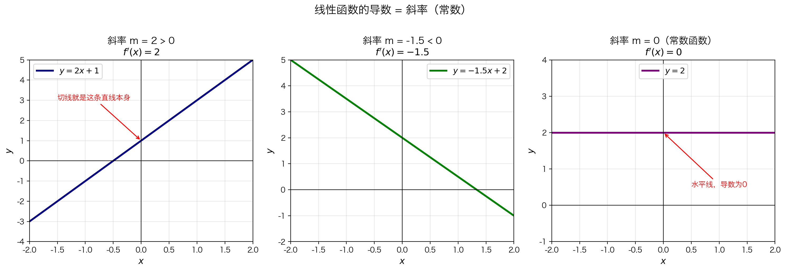

## 本节核心目标

前面我们用极限定义推导了 $f(x) = x^2$ 的导数。这一节来看一个更简单的函数——**直线**——看看它的导数是什么。

| 问题 | 答案 |
|------|------|
| **解决什么问题？** | 用极限定义验证线性函数的导数，建立最基本的求导直觉 |
| **为什么学？** | 线性函数是最简单的函数，理解它的导数为后续求导法则铺路 |
| **核心目的？** | 掌握 $f(x) = mx + b \Rightarrow f'(x) = m$，以及常数函数的导数为 0 |

---

## 关键知识地图

- **线性函数的导数**
  - **几何直觉**
    - 直线的切线就是它自己
    - 斜率处处相同
  - **极限推导**
    - $f(x) = mx + b$
    - $f'(x) = \lim_{h \to 0} \frac{f(x+h) - f(x)}{h} = m$
  - **常数函数**
    - $f(x) = b$ 是 $m = 0$ 的特例
    - $f'(x) = 0$
  - **核心结论**
    - 线性函数的导数是**常数**
    - 只有线性函数有固定的斜率

---

## 线性函数的导数

### 白话解释

假设你以恒定速度开车，速度表永远指向同一个数字。那么你的"瞬时速度"是什么？

**就是速度表上的那个数字。** 因为它从不改变。

直线 $y = mx + b$ 就像这辆匀速行驶的车——斜率 $m$ 永远不变。所以它的导数就是 $m$。

### 几何直觉

$f'(x)$ 是切线的斜率。但对于直线 $y = mx + b$：

> **直线的切线就是它自己。**

无论你在直线上选哪个点，切线都和原直线重合，斜率永远是 $m$。



> 左：正斜率（$m=2$），导数为正；中：负斜率（$m=-1.5$），导数为负；右：常数函数（$m=0$），导数为0。

---

## 概念精讲：线性函数的导数

### 1. 定义（是什么）

对于线性函数 $f(x) = mx + b$：

$$f'(x) = m$$

即：线性函数的导数等于它的斜率，是一个**常数**（与 $x$ 无关）。

### 2. 本质（为什么是这样）

导数度量的是"变化的快慢"。线性函数的变化是**均匀的**：

| $x$ | $f(x) = 2x + 3$ | 变化 |
|:---:|:---:|:---|
| 0 | 3 | — |
| 1 | 5 | +2 |
| 2 | 7 | +2 |
| 3 | 9 | +2 |

每增加 1 个 $x$，$y$ 总是增加 2。变化率是恒定的，所以导数是常数。

### 3. 数学 / 逻辑核心

**用极限定义推导 $f(x) = mx + b$：**

$$f'(x) = \lim_{h \to 0} \frac{f(x+h) - f(x)}{h}$$

**第一步**：计算 $f(x+h)$

$$f(x+h) = m(x+h) + b = mx + mh + b$$

**第二步**：计算分子 $f(x+h) - f(x)$

$$= (mx + mh + b) - (mx + b) = mh$$

**第三步**：代入极限公式

$$f'(x) = \lim_{h \to 0} \frac{mh}{h} = \lim_{h \to 0} m = m$$

### 结论

$$\boxed{f(x) = mx + b \quad \Rightarrow \quad f'(x) = m}$$

> 注意：推导过程中 $b$ 被消掉了！这意味着 **$y$ 轴截距不影响导数**——导数只和斜率 $m$ 有关。

### 4. 直觉理解（生活案例）

**案例：匀速行驶的汽车**

- 位置函数：$f(t) = 60t + 10$（单位：英里）
- 导数：$f'(t) = 60$（英里/小时）

速度永远是 60，不随时间变化。这就是"匀速"。

**案例：电梯匀速上升**

- 高度函数：$h(t) = 2t + 1$（单位：米）
- 导数：$h'(t) = 2$（米/秒）

电梯以每秒 2 米的恒定速度上升，不会加速也不会减速。

### 5. 常见错误

| ❌ 错误 | ✅ 正确 | 原因 |
|--------|--------|------|
| 认为 $f'(x) = mx + b$ | $f'(x) = m$ | 导数是斜率，不是原函数 |
| 认为截距 $b$ 会影响导数 | $b$ 被消掉了 | 上下平移不改变斜率 |
| 认为只有 $y = x$ 的导数是 1 | 任何 $y = mx + b$ 的导数都是 $m$ | 导数只取决于斜率 |

### 6. 一句话记忆

> 直线的导数就是它的斜率——匀速运动的"速度"永远不变。

---

## 常数函数的导数

### 从线性函数推导

常数函数 $f(x) = b$ 可以看成线性函数的特例：$f(x) = 0 \cdot x + b$。

这里 $m = 0$，所以：

$$f'(x) = 0$$

### 直觉

常数函数是一条水平线。水平线的斜率是 0。

> 高度不变，变化率为零。

---

## 最容易混淆内容

| 概念A | 概念B | 区别 | 常见错误 |
|-------|-------|------|---------|
| **$f(x) = mx + b$** | **$f'(x) = m$** | 前者是直线方程，后者是它的导数 | 把原函数和导数混为一谈 |
| **斜率 $m$** | **截距 $b$** | 斜率决定导数；截距不影响导数 | 认为 $b$ 会出现在导数中 |
| **线性函数** | **非线性函数** | 线性函数的导数是常数；非线性函数的导数随 $x$ 变化 | 认为所有函数的导数都是常数 |

---

## 本节复习清单

### 你必须记住：
- [ ] $f(x) = mx + b \Rightarrow f'(x) = m$
- [ ] $f(x) = b$（常数函数）$\Rightarrow f'(x) = 0$
- [ ] 截距 $b$ 不影响导数

### 你必须理解：
- [ ] 为什么直线的切线就是它自己
- [ ] 为什么线性函数的导数是常数
- [ ] 为什么常数函数的导数为 0

### 你必须会做：
- [ ] 用极限定义推导 $f(x) = mx + b$ 的导数
- [ ] 快速说出任意线性函数的导数

---

## 苏格拉底自测题

### 基础题

**Q1**：$f(x) = 3x + 7$ 的导数是什么？

> [!faq]- 点击查看答案
> $f'(x) = 3$。
>
> 线性函数的导数就是斜率，与截距 7 无关。

**Q2**：$f(x) = 5$ 的导数是什么？

> [!faq]- 点击查看答案
> $f'(x) = 0$。
>
> 常数函数是水平线，斜率为 0。

### 理解题

**Q3**：为什么截距 $b$ 不影响导数？

> [!faq]- 点击查看答案
> 因为在求导过程中：
>
> $$f(x+h) - f(x) = [m(x+h) + b] - [mx + b] = mh$$
>
> $b$ 被消掉了。几何上，上下平移直线不改变它的倾斜程度（斜率）。

**Q4**：直线 $y = mx + b$ 上任意一点的切线是什么？

> [!faq]- 点击查看答案
> 切线就是**这条直线本身**。
>
> 因为直线在每一点的方向都相同，切线（割线的极限）不会"转动"到别的位置。

### 应用题

**Q5**：用极限定义完整推导 $f(x) = 4x - 1$ 的导数。

> [!faq]- 点击查看答案
> $$f'(x) = \lim_{h \to 0} \frac{[4(x+h) - 1] - [4x - 1]}{h}$$
>
> $$= \lim_{h \to 0} \frac{4x + 4h - 1 - 4x + 1}{h}$$
>
> $$= \lim_{h \to 0} \frac{4h}{h} = \lim_{h \to 0} 4 = 4$$
>
> 所以 $f'(x) = 4$。

---

## 终极总结

> 这一节本质上是在解决 **"最简单的函数（直线）的导数是什么"** 的问题。

### 核心公式

| 函数 | 导数 | 含义 |
|:---|:---:|:---|
| $f(x) = mx + b$ | $f'(x) = m$ | 斜率 |
| $f(x) = b$ | $f'(x) = 0$ | 水平线 |

### 核心思想

```
线性函数 → 均匀变化 → 变化率恒定 → 导数是常数
```

### 关键理解

- 直线的切线 = 它自己
- 导数 = 斜率，与截距无关
- 常数函数是线性函数的特例（$m = 0$）

---

## 知识链路

```
导函数定义（5.2.6） → 线性函数的导数（5.2.8） → 求导法则
         ↓
    最简单的验证案例
```

### 前置知识
- **导函数定义**：$f'(x) = \lim_{h \to 0} \frac{f(x+h) - f(x)}{h}$
- **导数的几何意义**：切线斜率

### 当前知识
- **线性函数**：$f(x) = mx + b \Rightarrow f'(x) = m$
- **常数函数**：$f(x) = b \Rightarrow f'(x) = 0$

### 后续用途
- **求导法则的基础**：幂函数求导法则的证明思路与此类似
- **线性近似**：用切线（直线）近似复杂函数

---

## 上一节与下一节

← [5.2.7 作为极限比的导数](5.2.7%20作为极限比的导数.md)

→ [5.2.10 何时导数不存在](5.2.10%20何时导数不存在.md)
