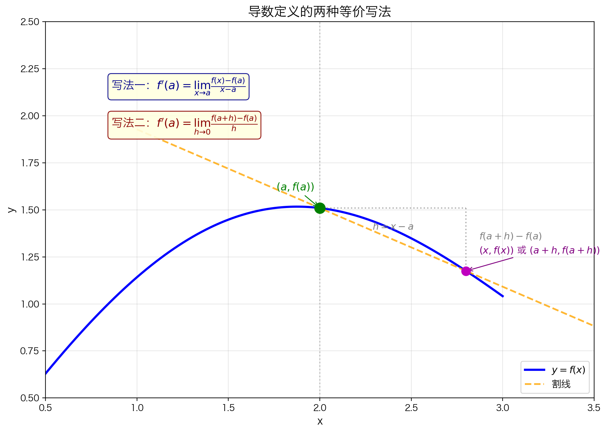
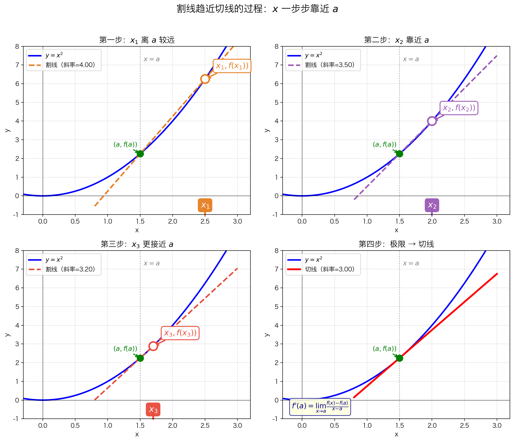
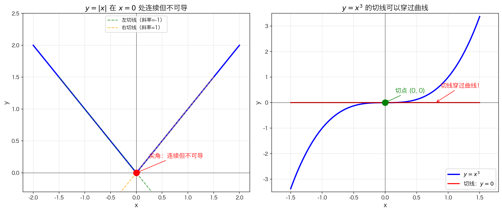

## 本节总览

这一节通过**精选习题**，把前面学到的"可导性"概念从"看懂"练到"会用"。每道题都围绕一个核心问题展开，答案不重要，**思考过程**才重要。

### 解题原则

- 先问"这道题在考什么？"
- 再问自己"如果我不知道答案，能推出来吗？"
- 最后检查"我的理解有没有漏洞？"

---

## 题1（定义题）：函数在 $x = a$ 处可导的定义

> **问题**：函数 $f(x)$ 在 $x = a$ 处可导的定义是什么？
> - 写出极限表达式
> - 用"瞬时变化率"解释
> - 用"切线斜率"解释

---

### 核心概念（What）

**一句话定义**：

函数 $f(x)$ 在 $x = a$ 处可导，意味着函数在这一点有一个**确定的、唯一的瞬时变化率**——不存在"突变"或"尖角"。

> 类比：如果连续性是"一笔画出"，那么可导性就是"画得顺畅，没有急转弯"。

---

### 关键公式 / 定理（Formal）

**可导的极限定义（两种等价写法）**：

**写法一**（用 $x$ 趋近）：

$$f'(a) = \lim_{x \to a} \frac{f(x) - f(a)}{x - a}$$

**写法二**（用 $h$ 趋近 0）：

$$f'(a) = \lim_{h \to 0} \frac{f(a + h) - f(a)}{h}$$

| 符号 | 含义 |
|------|------|
| $f'(a)$ | 函数在 $x = a$ 处的**导数**（读作"f prime of a"） |
| $x \to a$ | $x$ 无限接近 $a$（但不等于 $a$） |
| $h \to 0$ | 时间间隔/距离间隔无限缩短 |
| $\dfrac{f(x) - f(a)}{x - a}$ | 连接 $(a, f(a))$ 和 $(x, f(x))$ 的**割线斜率** |

> **为什么两种写法等价？——详细换元过程**
>
> 我们的目标：把写法一中的 $x$ 全部换成 $h$，得到写法二。
>
> **第一步：建立 $x$ 和 $h$ 的关系**
>
> 令 $h = x - a$（也就是说，$h$ 是 $x$ 到 $a$ 的距离）
>
> 那么反过来：$x = a + h$
>
> **第二步：分析极限的变化**
>
> 当 $x \to a$ 时，$h = x - a \to 0$。所以极限条件从 "$x$ 趋近 $a$" 变成了 "$h$ 趋近 0"。
>
> **第三步：逐一替换公式中的每个部分**

**替换表格：**

| 写法一中的部分 | 用 $x = a + h$ 替换后 | 为什么 |
|:---|:---|:---|
| $f(x)$ | $f(a + h)$ | 因为 $x = a + h$ |
| $f(a)$ | $f(a)$ | 没有 $x$，不变 |
| $x - a$ | $(a + h) - a = h$ | 因为 $x = a + h$ |
| $\lim_{x \to a}$ | $\lim_{h \to 0}$ | 因为 $x \to a$ 等价于 $h \to 0$ |

> **第四步：代入写法一**
>
> $$\lim_{x \to a} \frac{f(x) - f(a)}{x - a} \quad \xrightarrow{x = a + h} \quad \lim_{h \to 0} \frac{f(a + h) - f(a)}{h}$$
>
> 左边就是写法一，右边就是写法二。**完全一样的东西，只是换了字母表达。**
>
> **为什么要换？** 写法一里有两个变量（$a$ 和 $x$），容易混淆哪个是定点、哪个是动点。写法二只用关注"偏离了 $a$ 多少距离"这一个变量 $h$，更简洁、更不容易出错。



---

### 本质理解（Why）

#### 角度一：瞬时变化率

想象你正在看一个仪表盘，上面的数字在变化：

- **平均变化率**："过去 10 分钟，温度上升了 5 度"——这是一个"事后总结"
- **瞬时变化率**："**现在**这一刻，温度上升的精确速度是多少？"

导数回答的就是第二个问题。

**为什么需要极限？**

因为"现在"是一个**点**，点上没有"时间间隔"。你无法用 $\dfrac{\Delta y}{\Delta x}$ 直接计算——分母为 0 了！

所以我们的策略是：
1. 取一个很小的时间间隔
2. 计算这段时间内的平均变化率
3. 让间隔越来越小，看平均变化率**趋近于什么**
4. 那个趋近的值，就是**瞬时变化率**

$$\underbrace{\frac{f(a+h) - f(a)}{h}}_{\text{平均变化率}} \xrightarrow{h \to 0} \underbrace{f'(a)}_{\text{瞬时变化率}}$$

> **苏格拉底式提问**：
> - 如果 $h$ 真的等于 0，分子 $f(a+0) - f(a)$ 也是 0，那不就变成 $0/0$ 了吗？为什么取极限就能"绕过"这个问题？
> - （提示：思考"化简"的作用——$h$ 在趋近 0 的过程中**不等于** 0，所以可以做代数运算消去分母中的 $h$）

---

#### 角度二：切线斜率

从几何上看：

**割线**：连接曲线上两点的直线
- 斜率 = $\dfrac{f(x) - f(a)}{x - a}$
- 描述的是"从 $a$ 到 $x$ 这一段"的整体趋势

**切线**：只"碰"曲线一点的直线
- 想象用放大镜不断放大曲线在 $x = a$ 附近的部分
- 放大到极致，曲线在局部看起来就像一条直线
- 这条直线的斜率，就是**切线斜率**

**从割线到切线的过程**：

$$\underbrace{\frac{f(x) - f(a)}{x - a}}_{\text{割线斜率}} \xrightarrow{x \to a} \underbrace{f'(a)}_{\text{切线斜率}}$$



> **苏格拉底式提问**：
> - 为什么"切线只碰曲线一点"这个直觉在圆上是对的，但在某些曲线上可能有问题？（比如 $y = x^3$ 在 $x=0$ 处，切线 $y=0$ 其实还穿过了曲线）
> - 这说明"切线"的本质定义应该依赖什么？（提示：不是"只碰一点"，而是"最佳局部线性近似"）

---

### 典型例子（Example）

**用定义求 $f(x) = x^2$ 在 $x = 2$ 处的导数**

**第一步**：写出极限表达式

$$f'(2) = \lim_{h \to 0} \frac{f(2 + h) - f(2)}{h}$$

**第二步**：代入 $f(x) = x^2$

$$= \lim_{h \to 0} \frac{(2 + h)^2 - 2^2}{h}$$

**第三步**：展开

$$(2 + h)^2 = 4 + 4h + h^2$$

$$= \lim_{h \to 0} \frac{4 + 4h + h^2 - 4}{h}$$

**第四步**：化简

$$= \lim_{h \to 0} \frac{4h + h^2}{h} = \lim_{h \to 0} (4 + h)$$

> 关键：$h \neq 0$ 时才能约分！但在极限过程中，$h$ 只是**趋近** 0，所以这是合法的。

**第五步**：令 $h = 0$

$$= 4$$

**结论**：$f'(2) = 4$

---

**两种角度的验证**：

| 角度 | 解释 |
|------|------|
| **瞬时变化率** | 在 $x = 2$ 处，$y = x^2$ 的瞬时变化速度是 4。如果 $x$ 增加一点点，$y$ 大约增加 $4$ 倍 |
| **切线斜率** | 曲线 $y = x^2$ 在点 $(2, 4)$ 处的切线斜率是 4。切线方程：$y - 4 = 4(x - 2)$，即 $y = 4x - 4$ |

---

### 常见错误（Pitfalls）

| 错误 | 原因 | 正确理解 |
|------|------|---------|
| 把"可导"和"连续"混为一谈 | 可导确实要求连续，但连续不一定可导 | $|x|$ 在 $x=0$ 处连续但不可导（有尖角） |
| 认为"切线只碰曲线一点" | 这只对圆和一些简单曲线成立 | 切线的本质是"最佳局部近似"，可以穿过曲线 |
| 在 $h = 0$ 时直接代入分式 | 会导致 $0/0$ 未定义 | 必须先化简消去分母中的 $h$，再取极限 |
| 忽略极限必须存在 | 左右极限必须相等 | 如果左极限 $\neq$ 右极限，则不可导 |



---

### 知识关联（Connections）

```
        平均变化率
             |
      lim h→0 （取极限）
             |
             ↓
      瞬时变化率 = 导数 f'(a)
             |
    ┌────────┴────────┐
    ↓                 ↓
  物理意义           几何意义
（速度、加速度）   （切线斜率）
```

- **可导 $\Rightarrow$ 连续**：有切线的前提是曲线"不间断"
- **连续 $\not\Rightarrow$ 可导**：曲线可以连续但有"尖角"（如 $|x|$）
- **导数函数**：把每个点的导数连起来，得到 $f'(x)$——描述函数在每一点的"瞬时变化率"

---

## 轮到你了

请先不看上面的答案，试着自己回答下面这个问题：

> **问题**：函数 $f(x) = 3x + 1$ 在 $x = 1$ 处可导吗？如果可导，导数是多少？
>
> （提示：这是一个一次函数，你觉得它的图像是什么样的？切线斜率是多少？）

---

### 如果你的答案是：

**"可导，导数是 3"** ✓

这是对的！因为：
- $f(x) = 3x + 1$ 是一条直线
- 直线上每一点的切线就是直线本身
- 斜率永远是 3

用定义验证：

$$\lim_{h \to 0} \frac{f(1+h) - f(1)}{h} = \lim_{h \to 0} \frac{[3(1+h)+1] - [3 \times 1 + 1]}{h} = \lim_{h \to 0} \frac{3h}{h} = 3$$

---

### 思考题（留给下一次复习）

1. 如果函数在某点可导，是否一定连续？反过来呢？
2. 你能画出一个"连续但不可导"的函数图像吗？
3. 为什么导数定义中要求"极限存在"？如果左极限和右极限不相等会怎样？

---

## 下一题

→ [题2（计算题）：用定义求导数](题2%20计算题.md)
