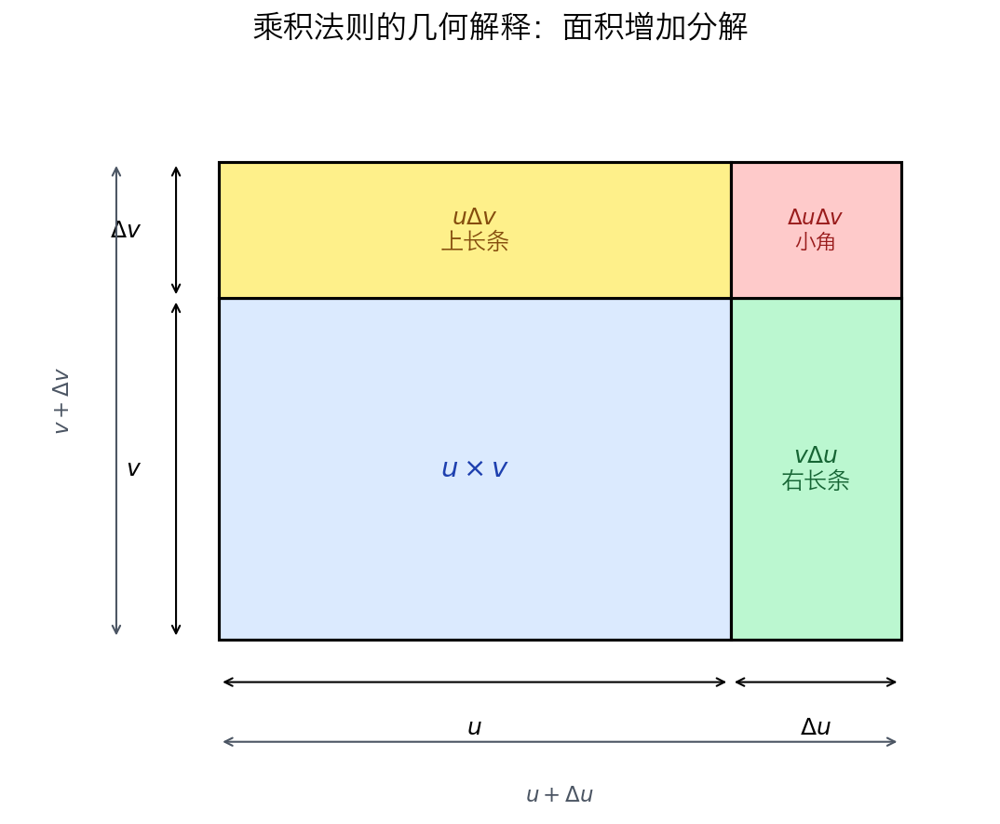

> **核心思想：复杂函数不是新的函数，而是简单函数按照一定的结构组合而成。**

---

# 一、本节解决什么问题

上一节，我们利用导数定义求导：

$$
f'(x)=\lim_{h\to0}\frac{f(x+h)-f(x)}{h}
$$

导数定义适用于任何函数，但计算十分繁琐。

例如：

$$
(x^{10})'
$$

还能通过定义计算。

但对于

$$
\frac{3x^7+x^4\sqrt{2x^5+15x^{4/3}-23x+9}}{6x^2-4}
$$

几乎无法直接利用定义求导。

因此，本节需要解决的问题是：

> **如何利用已经掌握的简单函数导数，快速求出复杂函数的导数。**

---

# 二、本节核心思想

整章只有一个核心思想：

> **复杂函数 = 简单函数 + 运算结构**

因此，求导的过程不是重新计算，而是：

```text
观察函数结构
      │
      ▼
拆解成简单函数
      │
      ▼
识别运算方式
      │
      ▼
应用对应法则
      │
      ▼
组合结果
```

因此：

> **求导的关键不是公式，而是识别结构。**

以后任何函数，都先问：

> **它是怎样组合出来的？**

---

# 三、本章知识框架

复杂函数通常由五种运算组成。

```text
复杂函数
│
├── 常数倍
│      ↓
│   常数倍法则
│
├── 加减
│      ↓
│   和差法则
│
├── 乘法
│      ↓
│   乘积法则
│
├── 除法
│      ↓
│   商法则
│
└── 函数套函数
       ↓
     链式法则
```

> **五条法则不是五个技巧，而是五种函数结构的对应规则。**

---

# 四、求导工具箱（基础积木）

所有复杂函数最终都会拆成这些基本函数。

| 函数 | 导数 |
|---|---|
| $c$ | $0$ |
| $x^n$ | $nx^{n-1}$ |
| $\sqrt{x}$ | $\dfrac{1}{2\sqrt{x}}$ |
| $\dfrac{1}{x}$ | $-\dfrac{1}{x^2}$ |

这些就是后续所有求导法则的基础。

---

# 五、五条求导法则

---

## （一）常数倍法则

### 结构

```text
c·f(x)
```

### 法则

$$
(cf)'=cf'
$$

### 数学意义

常数只会放大函数，不会改变函数的变化规律。

### 解题流程

```text
提出常数
      │
      ▼
求函数导数
      │
      ▼
乘回常数
```

### 例题

$$
(5x^3)'=5(3x^2)=15x^2
$$

---

## （二）和差法则

### 结构

```text
f(x) ± g(x)
```

### 法则

$$
(f\pm g)'=f'\pm g'
$$

### 数学意义

复杂函数可以拆成若干部分分别求导。

### 解题流程

```text
拆项
     │
     ▼
分别求导
     │
     ▼
重新组合
```

### 例题

$$
(3x^5-2x^2+\sqrt{x})'=15x^4-4x+\frac{1}{2\sqrt{x}}
$$

### 易错点

常数项求导为零。

---

## （三）乘积法则

### 结构

```text
f(x)·g(x)
```

### 法则

$$
(fg)'=f'g+fg'
$$

### 数学意义

两个函数同时变化，因此变化率不能分别相乘。

### 解题流程

```text
一个求导
另一个保持不变

↓

交换

↓

相加
```

### 错误直觉

$$
(fg)' \neq f'g'
$$

**这是错误的。**

为什么？

因为两个函数不是独立变化。

例如：

$$
\text{面积} = \text{长} \times \text{宽}
$$

如果：

长增加一点，

宽也增加一点。

面积的变化来源于：

- 长变了
- 宽变了
- 两者共同变化

因此：

真正公式是

$$
(fg)'=f'g+fg'
$$

你会发现：

> **每一次只让一个函数求导，另一个保持原样。**

### 例题

$$
(x^2\sin x)'=2x\sin x+x^2\cos x
$$

### 易错点

错误写法：

$$
(fg)'\neq f'g'
$$

---

## （四）商法则

《普林斯顿微积分读本》在这里的真正顺序其实是：

1. 已经知道乘积法则。
2. 已经知道 $\left(\frac{1}{x}\right)'=-\frac{1}{x^2}$。
3. 作者说：**既然商可以写成乘积，那我们就不用重新发明一个新方法。**

---

### 法则

$$
\boxed{\left(\frac{f}{g}\right)'=\frac{f'g-fg'}{g^2}}
$$

或写成 $u$-$v$ 形式：

$$
\left(\frac{u}{v}\right)'=\frac{u'v-uv'}{v^2}
$$

> **记忆口诀**：上导乘下，减去上乘下导，除以分的平方。

---

### 第一步：把除法写成乘法

例如：

$$
\frac{x^2+1}{x-1}=(x^2+1)\times\frac{1}{x-1}
$$

小学就学过：

$$
a\div b=a\times\frac{1}{b}
$$

所以：

$$
\frac{u}{v}=u\times\frac{1}{v}
$$

---

### 第二步：使用乘积法则

令 $y=u\times w$，乘积法则告诉我们：

$$
\frac{dy}{dx}=u'w+uw'
$$

现在商已经变成：

$$
u\times\frac{1}{v}
$$

乘积法则直接可以使用。

---

### 第三步：唯一不会的是 $\frac{1}{v}$ 怎么求导

上一节已经证明：

$$
\left(\frac{1}{x}\right)'=-\frac{1}{x^2}
$$

把 $x$ 换成 $v$，直接得到：

$$
\left(\frac{1}{v}\right)'=-\frac{v'}{v^2}
$$

> 这里多了一个 $v'$，其实是**链式法则的影子**。《普林斯顿微积分读本》为了让知识循序渐进，没有在这里展开证明。

---

### 第四步：代入并通分

$$
\frac{d}{dx}\left(u\cdot\frac{1}{v}\right)=u'\cdot\frac{1}{v}+u\cdot\left(-\frac{v'}{v^2}\right)
$$

整理：

$$
=\frac{u'}{v}-\frac{uv'}{v^2}=\frac{u'v-uv'}{v^2}
$$

商法则完成。

$$
\boxed{\left(\frac{u}{v}\right)'=\frac{u'v-uv'}{v^2}}
$$

---

### 本法则的重要经验

- **商并不比乘积简单，反而更复杂一点**（多了减号和分母平方）。
- 关键记忆点：**分子是减号，分母是 $v^2$**——最常见的错误就是把减号写成加号，或把顺序写反。
- 若函数本身能先化简成幂函数（如 $\dfrac{x^3}{x}=x^2$），**优先化简再求导**，别硬套商法则做无用功。
- 记不住方向时，回到 $u\cdot v^{-1}$ 用乘积法则现推，永远不会错。

---

## （五）链式法则（本章重点）

### 为什么需要？

前四条法则只能处理

```text
加
减
乘
除
```

但是

$$
(x^2+1)^{99}
$$

不是乘法，而是：

```text
函数里面还有函数
```

这种结构叫：

> **复合函数**

---

### 什么是复合函数？

设

$$
y=f(g(x))
$$

其中：

- 外层函数：最后执行
- 内层函数：最先执行

例如：

| 函数 | 外层 | 内层 |
|---|---|---|
| $(x^2+1)^5$ | 幂函数 | $x^2+1$ |
| $\sin(x^2)$ | $\sin$ | $x^2$ |
| $e^{3x+1}$ | 指数 | $3x+1$ |

口诀：

> **从外往里看，最后执行的是外层。**

---

### 法则

$$
(f(g(x)))'=f'(g(x))\cdot g'(x)
$$

即：

> **先求外层导数，再乘内层导数。**

---

### 解题流程

```text
找到最外层

↓

外层求导

↓

保持内层不变

↓

乘内层导数
```

---

### 例题

$$
((x^2+1)^{99})'
$$

第一步：

设

$$
u=x^2+1
$$

第二步：

$$
(u^{99})'=99u^{98}
$$

第三步：

$$
u'=2x
$$

第四步：

代回

$$
198x(x^2+1)^{98}
$$

---

### 多层复合函数

例如

$$
((x^3-10x)^9+22)^8
$$

按照“剥洋葱”的方法：

```text
最外层

↓

中间层

↓

最里面
```

每剥一层，都乘一个导数。

---

### 易错点

最容易漏掉：

> **内层导数**

例如：

错误：

$$
99(x^2+1)^{98}
$$

正确：

$$
198x(x^2+1)^{98}
$$

---

# 六、统一的求导思维

学习完五条法则后，可以形成统一的解题流程。

```text
观察整体结构
        │
        ▼
拆解函数
        │
        ▼
识别运算
        │
        ▼
选择法则
        │
        ▼
分别求导
        │
        ▼
重新组合
```

以后遇到任何复杂函数，都按照这一流程分析，而不是直接计算。

---

# 七、综合例题（6.2.6）

面对复杂函数：

$$
\frac{3x^7+x^4\sqrt{2x^5+15x^{4/3}-23x+9}}{6x^2-4}
$$

不要急于计算，而是先分析结构。

```text
整体
│
└── 商法则
      │
      ├── 分母
      │      └── 幂函数
      │
      └── 分子
             │
             ├── 加法
             │
             ├── 幂函数
             │
             └── 乘积法则
                     │
                     └── 链式法则
```

然后按照树状结构，自顶向下逐层求导：

1. 使用商法则，将问题拆成分子和分母。
2. 分母直接求导。
3. 分子使用和差法则拆分。
4. 乘积部分使用乘积法则。
5. 根号部分使用链式法则。
6. 最后逐层代回，完成整个求导。

> **整个求导过程中没有使用任何新的技巧，只是不断重复“识别结构 → 选择法则 → 求导 → 回代”这一过程。**

---

# 八、6.2.7 乘积法则和链式求导法则的理由

这一节（**6.2.7 乘积法则和链式求导法则的理由**）是《普林斯顿微积分读本》第 6 章最精彩的一节。

前面的几节告诉你：

> **公式是什么。**

而这一节开始回答：

> **为什么公式是这样的？**

作者没有给出严格证明（严格证明放在附录 A.6.3 和 A.6.5），而是给出了一个**几何和变化率的直观解释**。

这节最好分成两个部分理解：

1. 为什么乘积法则成立
2. 为什么链式法则成立

---

## 第一部分 为什么乘积法则成立？

### 一、问题

假设有两个变量：

$$
u=u(x)
$$

$$
v=v(x)
$$

它们都随着 $x$ 改变。

现在研究

$$
uv
$$

当 $x$ 增加一点时，乘积 $uv$ 究竟增加了多少？

---

### 二、作者把乘积变成面积

作者没有直接写公式，而是让你想象一个矩形。

长：

```text
u
```

宽：

```text
v
```

于是：

矩形面积就是

$$
A=uv
$$

现在：

$x$ 增加一点。

于是：

```text
u

↓

u+Δu
```

同时：

```text
v

↓

v+Δv
```

于是新的矩形变成：

```text
长：u+Δu

宽：v+Δv
```

面积：

$$
(u+\Delta u)(v+\Delta v)
$$

---

### 三、面积到底增加多少？

作者把两个矩形叠在一起。

新的面积比原来的面积多出来一个 L 型区域。

可以分成三块：



第一块：右边细长矩形（浅绿色）

面积：

$$
v\Delta u
$$

第二块：上边细长矩形

面积：

$$
u\Delta v
$$

第三块：右上角小角

面积：

$$
\Delta u\Delta v
$$

于是面积增加：

$$
\Delta(uv)=v\Delta u+u\Delta v+\Delta u\Delta v
$$

这是作者最关键的一步。

---

### 四、为什么最后一项消失？

现在两边同时除以 $\Delta x$：

$$
\frac{\Delta(uv)}{\Delta x}=v\frac{\Delta u}{\Delta x}+u\frac{\Delta v}{\Delta x}+\frac{\Delta u\Delta v}{\Delta x}
$$

关键就在最后一项。

因为：

$$
\Delta u\approx u'\Delta x
$$

同样：

$$
\Delta v\approx v'\Delta x
$$

所以：

$$
\Delta u\Delta v\approx u'v'(\Delta x)^2
$$

于是最后一项：

$$
\frac{\Delta u\Delta v}{\Delta x}\approx u'v'\Delta x
$$

当

$$
\Delta x\rightarrow0
$$

最后变成：

$$
0
$$

因此，只剩：

$$
(uv)'=u'v+uv'
$$

这就是乘积法则。

---

### 五、作者真正想表达什么？

真正增加面积的，主要来自：

```text
右边长条 + 上边长条
```

而右上角那个小方块，太小了。

小到趋近于零。

所以乘积法则成立。

---

## 第二部分 为什么链式法则成立？

接下来作者开始讲链式法则。

假设：

$$
y=f(u)
$$

同时：

$$
u=g(x)
$$

变量关系：

```text
x

↓

u

↓

y
```

作者问：如果 $x$ 变化一点，那么 $y$ 变化多少？

---

### 一、变化是逐层传播的

首先，$x$ 变化：

$$
\Delta x
$$

于是 $u$ 变化：

$$
\Delta u
$$

然后因为 $y=f(u)$，于是又产生：

$$
\Delta y
$$

整个传播过程：

```text
Δx

↓

Δu

↓

Δy
```

---

### 二、先看第一段

对于 $u$ 来说，变化率：

$$
\frac{\Delta u}{\Delta x}
$$

极限就是：

$$
\frac{du}{dx}
$$

意思：

> $x$ 每变化一点，$u$ 增加多少。

---

### 三、再看第二段

同样，对于 $y$ 来说，变化率：

$$
\frac{\Delta y}{\Delta u}
$$

极限就是：

$$
\frac{dy}{du}
$$

意思：

> $u$ 每变化一点，$y$ 增加多少。

---

### 四、整个变化率

现在作者把两段连起来。

观察：

$$
\Delta y=\frac{\Delta y}{\Delta u}\Delta u
$$

而：

$$
\Delta u=\frac{\Delta u}{\Delta x}\Delta x
$$

代入得到：

$$
\Delta y=\frac{\Delta y}{\Delta u}\frac{\Delta u}{\Delta x}\Delta x
$$

两边同时除以 $\Delta x$：

$$
\frac{\Delta y}{\Delta x}=\frac{\Delta y}{\Delta u}\frac{\Delta u}{\Delta x}
$$

最后令：

$$
\Delta x\rightarrow0
$$

于是得到：

$$
\boxed{\frac{dy}{dx}=\frac{dy}{du}\cdot\frac{du}{dx}}
$$

这就是链式法则的来源。

---

## 第三部分 作者真正想表达的数学思想

这一节真正重要的不是两个公式，而是两个思想。

---

### 思想一：忽略高阶小量

乘积法则中：

$$
\Delta u\Delta v
$$

不是不存在，而是相比 $\Delta u$ 和 $\Delta v$ 小得太快。

所以极限里可以忽略。

以后泰勒公式、微分、误差估计，都会不断遇见这个思想。

---

### 思想二：变化是传递的

链式法则里面，变化不会凭空跳过去。

一定是：

```text
x

↓

u

↓

y
```

一层推动一层。

因此变化率自然相乘。

这也是为什么叫 **Chain Rule**，而不是 Composite Rule。

真正重要的是：

> **变化像链条一样传递。**

---

## 本节总结

整节内容可以概括成下面两张思维图。

### ① 乘积法则

```text
矩形面积
    ↓
面积增加
    ↓
L 型区域
    ↓
两块长条 + 一个小角
    ↓
忽略 ΔuΔv
    ↓
(uv)'=u'v+uv'
```

### ② 链式法则

```text
x
↓
u
↓
y
↓
Δx
↓
Δu
↓
Δy
↓
变化率逐层传播
↓
dy/dx=(dy/du)(du/dx)
```

因此，这一节不是在证明公式，而是在帮助你建立直觉：

> **乘积法则来自面积变化的分解，链式法则来自变化率沿变量关系逐层传播。**

这也是作者把正式证明放到附录，而把这一节放在正文的原因——先建立几何和物理上的直观理解，再学习严格证明。

---

# 九、本章总结

本节真正讲授的不是五条彼此独立的求导公式，而是一种处理复杂函数的思维方式。

## 1. 核心思想

复杂函数 = 简单函数 + 运算结构。

## 2. 五种结构

- 常数倍
- 加减
- 乘法
- 除法
- 复合函数

## 3. 解题流程

```text
识别结构
      │
      ▼
拆解函数
      │
      ▼
选择法则
      │
      ▼
分别求导
      │
      ▼
组合结果
```

## 4. 本章最重要的一句话

> **求导不是记公式，而是识别函数结构；复杂函数并不可怕，只要能够不断拆解，最终都会转化为已经掌握的简单函数。**

---

我建议后续《普林斯顿微积分读本》的每一章都采用这种固定模板：

> **① 本章解决什么问题 → ② 核心思想 → ③ 知识框架 → ④ 各知识点（结构、法则、流程、例题、易错点）→ ⑤ 综合案例 → ⑥ 本章总结**

这样所有章节都会形成统一的风格，后面复习时只需要看目录和知识树，就能快速回忆整章内容。
