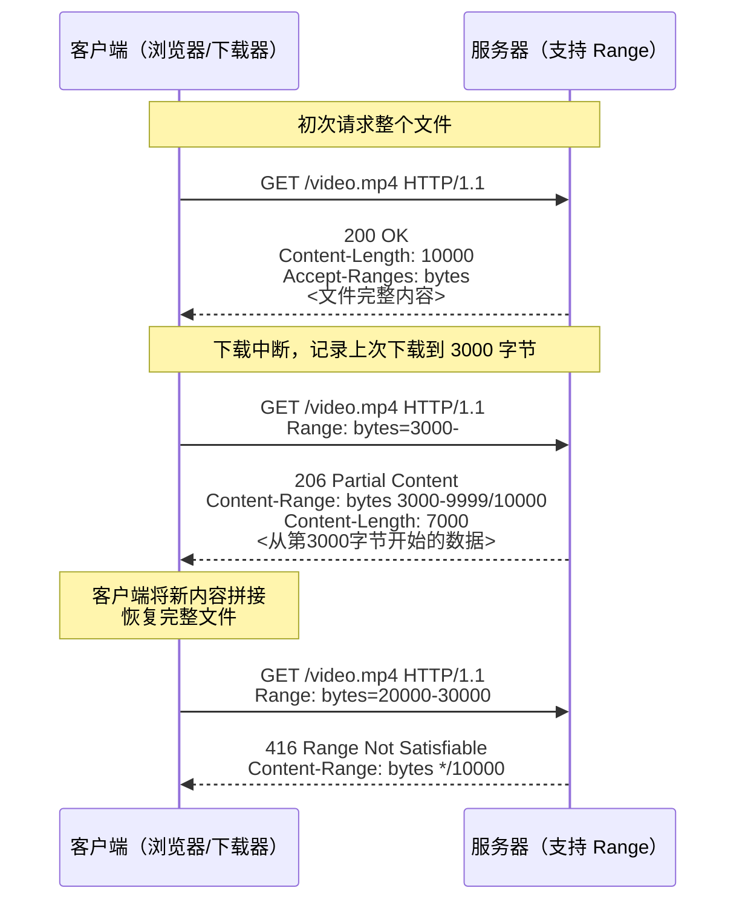

非常好，这是一个非常值得深入理解的 HTTP 协议知识点。我们来系统地讲清楚：**HTTP Range 响应代码的含义、使用场景、工作机制和注意事项。**

---

## 一、Range 响应的基本概念

在 HTTP 协议中，**Range**（范围请求）机制允许客户端请求服务器只返回**资源的一部分**，而不是整个文件。

这一机制在以下场景中非常重要：

- 断点续传（比如下载中断后从中间继续）
    
- 视频、音频的分段加载（如播放进度条跳转）
    
- 大文件的分块传输或分布式下载
    

Range 请求由客户端发起，通过在请求头中添加：

```http
Range: bytes=起始字节-结束字节
```

例如：

```http
Range: bytes=0-499
```

表示请求文件的第 0～499 字节。

---

## 二、Range 响应状态码详解

### 🔹 1. `206 Partial Content`

**这是 Range 请求中最常见、也是最核心的响应代码。**

含义：

> 服务器成功返回了客户端所请求的资源部分（即“部分内容”）。

#### ✅ 示例：

**请求：**

```http
GET /video.mp4 HTTP/1.1
Host: example.com
Range: bytes=1000-1999
```

**响应：**

```http
HTTP/1.1 206 Partial Content
Content-Range: bytes 1000-1999/10000
Content-Length: 1000
Content-Type: video/mp4

[这里是文件的第 1000～1999 字节的数据]
```

#### 响应头解释：

|头字段|含义|
|---|---|
|`Content-Range`|指定服务器返回的实际字节范围及资源总大小。格式：`bytes <start>-<end>/<total>`|
|`Content-Length`|返回内容的长度，即 `<end>-<start>+1`|
|`Accept-Ranges: bytes`|告诉客户端服务器支持按字节范围请求|
|`Content-Type`|内容类型（如 `video/mp4`、`application/octet-stream` 等）|

#### 举例说明：

文件总长为 10000 字节  
请求范围：1000-1999  
则响应头为：

```
Content-Range: bytes 1000-1999/10000
Content-Length: 1000
```

---

### 🔹 2. `200 OK`（而非 206）

当客户端发起了一个带有 Range 的请求，但服务器**不支持 Range 请求**时，会返回整个文件。

即使客户端发了：

```http
Range: bytes=1000-1999
```

服务器仍然可能回应：

```http
HTTP/1.1 200 OK
Content-Length: 10000
Accept-Ranges: none
```

表示：

> “我不支持部分内容返回，只能返回整个文件。”

---

### 🔹 3. `416 Range Not Satisfiable`

含义：

> 客户端请求的范围无效（超出资源的可用范围）。

例如，文件长度为 10000 字节，  
但客户端请求：

```http
Range: bytes=20000-30000
```

服务器无法满足，就返回：

```http
HTTP/1.1 416 Range Not Satisfiable
Content-Range: bytes */10000
```

注意这个响应头：

```
Content-Range: bytes */10000
```

表示文件总长度为 10000，但请求的范围超出。

---

### 🔹 4. `Accept-Ranges` 响应头

虽然它不是一个“响应代码”，但它常常与 Range 机制一起出现。

#### 用法：

```http
Accept-Ranges: bytes
```

表示服务器支持按字节范围请求。

如果服务器不支持，则：

```http
Accept-Ranges: none
```

客户端（如下载器）看到 `none` 时就不会尝试断点续传。

---

### 🔹 5. 多段响应（Multipart/byteranges）

客户端可以一次请求多个范围：

```http
Range: bytes=0-99,200-299
```

服务器返回：

```http
HTTP/1.1 206 Partial Content
Content-Type: multipart/byteranges; boundary=XYZ

--XYZ
Content-Type: application/pdf
Content-Range: bytes 0-99/1000

[前100字节]

--XYZ
Content-Type: application/pdf
Content-Range: bytes 200-299/1000

[第200-299字节]

--XYZ--
```

这种情况通常用于浏览器或下载器多线程下载同一个文件。

---

## 三、Range 请求与响应的典型流程

|步骤|客户端行为|服务器响应|
|---|---|---|
|1|请求整个文件|`200 OK` 返回全部内容|
|2|中断后恢复|`Range: bytes=500-`|
|3|成功部分响应|`206 Partial Content`，返回剩余内容|
|4|请求非法范围|`416 Range Not Satisfiable`|

---

## 四、实际应用示例

### 🧩 1. 断点续传下载（浏览器或下载器）

下载中断 → 客户端记录上次下载到 3000 字节  
重试请求：

```
Range: bytes=3000-
```

服务器返回：

```
206 Partial Content
Content-Range: bytes 3000-9999/10000
```

客户端拼接后恢复完整文件。

---

### 🧩 2. 视频流媒体播放

播放器根据用户拖动进度条，请求：

```
Range: bytes=5000000-
```

服务器只返回从第 5 MB 开始的部分。  
这使得视频能“边下载边播放”。

---

## 五、总结表格

|状态码|名称|说明|
|---|---|---|
|`200 OK`|完整响应|服务器忽略 Range 请求，返回整个文件|
|`206 Partial Content`|部分内容|返回客户端请求的部分内容|
|`416 Range Not Satisfiable`|无效范围|请求超出文件可用范围|
|`Accept-Ranges: bytes`|响应头|表示服务器支持 Range 请求|
|`Content-Range`|响应头|指明返回的字节区间及文件总长度|

---

## 六、总结一句话

> **HTTP Range 响应机制允许客户端按需获取文件的特定片段，从而实现断点续传和流式播放。**
> 
> 最常见的状态码是 `206 Partial Content`，它标志着服务器成功处理了一个部分内容请求。

---

太好了 👍  
下面是一张非常直观的 **HTTP Range 请求与 206 响应流程图（时序图）**，我会用简单的文字版时序图（Mermaid语法）来展示整个过程，并配上详细讲解。

---

### 🧭 HTTP Range 请求与响应时序图



---

### 🔍 图解讲解：

|步骤|动作|说明|
|---|---|---|
|①|客户端发起普通 `GET` 请求|没有带 Range，返回完整文件 (`200 OK`)|
|②|下载中断|客户端记录“已下载到 3000 字节”|
|③|再次请求未完成部分|添加 `Range: bytes=3000-`|
|④|服务器返回部分内容|状态码 `206 Partial Content`|
|⑤|客户端拼接文件|得到完整数据|
|⑥|请求超出范围|返回 `416 Range Not Satisfiable`，并告知总长度|

---

### 🧩 补充说明：`Content-Range` 格式详解

|格式|示例|含义|
|---|---|---|
|`bytes 3000-9999/10000`|请求的范围是 3000 到 9999，总长度 10000||
|`bytes */10000`|请求的范围不合法，总长度 10000||
|`bytes 0-499/10000`|返回前 500 字节||

---

### 🧠 小结

|项目|说明|
|---|---|
|请求头|`Range: bytes=<start>-<end>`|
|成功响应码|`206 Partial Content`|
|错误响应码|`416 Range Not Satisfiable`|
|关键响应头|`Content-Range`, `Accept-Ranges`|
|常见用途|断点续传、流媒体播放、分段下载|

---

是否希望我再补充一张**可视化文件范围图**（展示每次请求取到的文件片段）？  
比如一个 10KB 文件，第一次取 0-4999，第二次取 5000-9999。  
这样你可以更直观地看到 Range 的“拼接”过程。