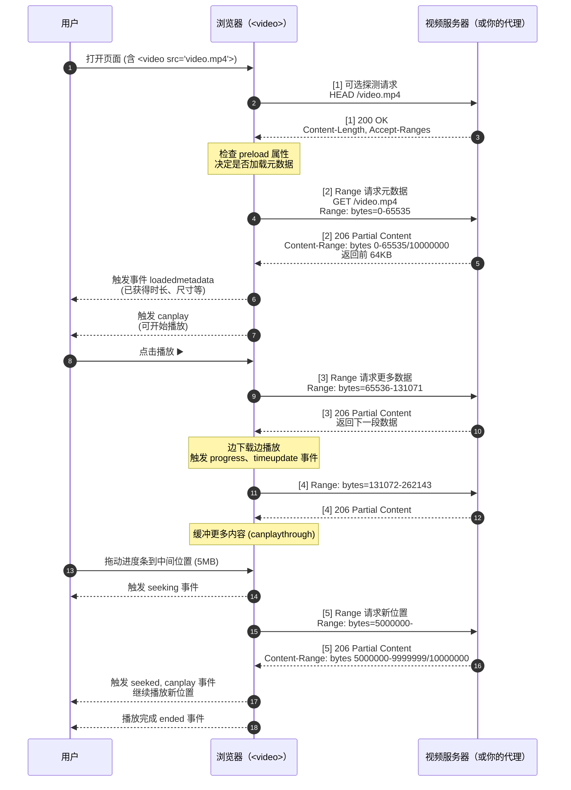

好 —— 我把 `<video>` 标签在浏览器端**如何发请求、为什么发这些请求、以及这些请求对应的响应和影响**讲得尽量系统且实操化，帮你从原理到调试都能上手。内容较多，我把它分块：**行为流程 → 常见请求类型 & 示例 → 与不同流协议/播放器的差异 → 浏览器策略与事件 → 后端/代理要满足的要点 → 调试检查清单**。

---

# 一、总体流程（浏览器播放 MP4 的典型请求顺序）

1. 浏览器解析到 `<video src="...">` 或 `<source>`，创建媒体元素（或 JS 创建）。
    
2. 浏览器根据 `preload` / 自动播放策略/用户交互决定是否发起请求。
    
3. 最常见的做法：
    
    - 可能先发一个 `HEAD`（或小范围 `Range`）探测资源大小与服务器是否支持断点（并非所有浏览器都发 `HEAD`，行为会有差异）。
        
    - 发出一个或多个 `GET`，通常带 `Range`（如 `Range: bytes=0-` 或 `Range: bytes=0-65535`）请求文件前面的一段字节以获取可播放的元数据并开始缓冲与播放。
        
4. 浏览器在播放/缓冲过程中按需发送更多 `Range` 请求（例如当缓冲耗尽或用户拖动进度条时），或直接请求剩下部分。
    
5. 若是 HLS/DASH 等分段协议，浏览器/播放器会先请求 playlist（`.m3u8`/`.mpd`），再按段请求小文件（`.ts`/`.m4s`）逐段下载并播放（通常每个段几秒钟）。
    

---

# 二、浏览器会发出哪些 HTTP 请求（具体示例）

### 1) 初始探测（可选）

- **可能的请求**：
    
    - `HEAD /video.mp4`
        
    - 或 `GET /video.mp4` 带 `Range: bytes=0-0` / `Range: bytes=0-65535`
        
- **目的**：获取 `Content-Length`、`Accept-Ranges`、`Content-Type`、是否支持断点、是否能快速拿到 `moov` 等关键 metadata。
    
- **响应**：`200 OK`（完整）或 `206 Partial Content`（如果带 Range 并支持）。
    

### 2) 读取前端数据（常见）

- 请求：
    
    ```
    GET /video.mp4 HTTP/1.1
    Range: bytes=0-65535
    ```
    
- 服务器返回：
    
    ```
    HTTP/1.1 206 Partial Content
    Content-Range: bytes 0-65535/12345678
    Content-Length: 65536
    Content-Type: video/mp4
    ```
    
- **用途**：浏览器拿到前面若干字节，解析容器（moov atom）和初始化解码器，开始播放前几秒数据。
    

### 3) 连续/按需请求

- 在播放过程中，浏览器会继续请求后续块，例如 `Range: bytes=65536-131071`，或直接 `Range: bytes=0-` 然后分段缓存。
    
- 当用户 seek（拖动时间轴）：
    
    - 浏览器会发 `Range` 请求对应的新偏移（例如 `Range: bytes=5000000-`）来获取新的播放位置数据。
        

### 4) 非 Range 的情况

- 如果服务器不支持 Range，浏览器收到 `200 OK` 和整个文件，就会进行“渐进式下载”——但这通常会影响 seek 和快速播放启动（可能需要等 moov 在前面或整个文件到达）。
    

### 5) HLS / DASH（分段）

- 请求 playlist： `GET /playlist.m3u8`（或 `.mpd`）。
    
- 解析后逐段请求： `GET /seg1.ts`, `GET /seg2.ts` ...
    
- 每个段通常是完整的小文件（无需 Range）。
    

---

# 三、容器格式对请求的影响（关键：moov atom / fragmented MP4）

- **MP4 的 moov atom**（包含索引/元数据）
    
    - 如果 `moov` 在文件头（前端），浏览器只需请求文件开头的少量字节就能开始播放（流式播放友好）。
        
    - 如果 `moov` 在文件尾，浏览器可能无法在拿到尾部之前开始播放 —— 有两种常见处理：
        
        - 服务端把 `moov` 移到前面（称为 faststart 或 use `qt-faststart` / mp4box 等工具处理）。
            
        - 使用 `Range` 去请求尾部以获取 moov，然后再请求前端数据（这会导致多个请求与延迟）。
            
- **fragmented MP4 (fMP4)** 更适合流式/分段（MSE + DASH/HLS fMP4），浏览器可边接边播。
    

---

# 四、MediaSource Extensions (MSE) 与普通 `<video src>` 的差异

- **普通 `<video src="...mp4">`**：浏览器自己管理请求（通常使用 Range），行为受浏览器内建播放策略与容器结构影响。
    
- **MSE（通过 JS 创建 MediaSource，并用 XHR / fetch 获取段数据）**：
    
    - 应用层（你的 JS）控制如何请求段、如何 append 到 `SourceBuffer`，可做到更精细的缓冲管理、ABR (adaptive bitrate) 切换。
        
    - MSE 常用于自定义播放器、DASH/HLS JS 实现、广告插入等场景。
        
- **总结**：MSE 给你最大控制权，但需要自己实现下载/拼接逻辑。普通 `<video>` 使用内置逻辑更简单，但可控性较低。
    

---

# 五、浏览器播放相关策略与事件（可用于调试与优化）

### 重要 HTML 属性会影响请求行为

- `preload`：
    
    - `none`：不预加载。
        
    - `metadata`：仅加载元数据（通常 HEAD 或 Range 0-）。
        
    - `auto`：浏览器尽量预加载（可能下载更多）。
        
- `autoplay`：自动播放受浏览器自动播放策略影响（多数需要 `muted` 才允许自动播放）。
    
- `crossorigin`：跨域请求时控制是否发送凭证（cookies/Authorization），取值 `anonymous` 或 `use-credentials`。
    
- `controls`、`playsinline` 等不直接影响请求，但影响交互体验。
    

### 常见 JS 事件（用于判断何时发出请求或是否开始播放）

- `loadstart`：浏览器开始请求资源。
    
- `loadedmetadata`：浏览器拿到媒体元数据（时长、尺寸），通常说明已拿到必要 header / moov。
    
- `canplay`：可以开始播放，但可能会中途缓冲。
    
- `canplaythrough`：可连续播放至末尾（浏览器预测）。
    
- `progress`：缓冲进度更新（网络请求有数据到达）。
    
- `seeking` / `seeked`：发生跳转。
    
- `stalled` / `waiting`：播放因缓冲停下。
    
- `error`：请求或解码错误。
    

---

# 六、后端 / 代理 必须提供或注意的点（确保浏览器能正确发请求并播放）

1. **必须支持 `Range` 请求和返回 `206 Partial Content`**（如果想支持边下边播与 seek）。
    
    - 返回示例头：
        
        ```
        HTTP/1.1 206 Partial Content
        Content-Range: bytes 1000-1999/12345678
        Content-Length: 1000
        Accept-Ranges: bytes
        Content-Type: video/mp4
        ```
        
2. **正确的 `Content-Type`**（`video/mp4`、`video/webm` 等），否则解码器可能不能处理。
    
3. **支持 `HEAD` 请求**（很多播放器/浏览器可能发 `HEAD` 用于探测）。
    
4. **CORS 策略**（若前端与代理/源不同源）：
    
    - 返回 `Access-Control-Allow-Origin: https://yourdomain.com` 或 `*`（视安全策略）。
        
    - 若跨域且需要 cookie，需要 `Access-Control-Allow-Credentials: true` 且前端使用 `crossorigin="use-credentials"`。
        
5. **允许持续的流式输出**（不要把整个文件读进内存再返回，要边读边写并 `flush`）。
    
6. **支持断连 & 重连、合理的超时**（防止第三方慢连接导致阻塞）。
    
7. **对大文件使用合适的缓冲**（8KB 或 32KB buffer 常见），避免频繁 `flush` 导致性能问题，但也要避免过大导致延迟。
    
8. **处理 `416 Range Not Satisfiable` 情况**（当 client 请求的 range 超出时返回合适的 `Content-Range: bytes */<total>`）。
    

---

# 七、常见场景的网络序列示范（更直观）

### 场景 A：普通 MP4（moov 在前）

1. 浏览器：`GET /video.mp4`（或 `Range: bytes=0-65535`）
    
2. 服务器：`206 Partial Content`（返回前 64KB 包含 moov）
    
3. 浏览器：`loadedmetadata` → `play()` → 继续请求更多 Range 块
    

### 场景 B：用户 seek（跳到中间）

1. 浏览器：`GET /video.mp4` `Range: bytes=5000000-`
    
2. 服务器：`206 Partial Content`（返回从 5MB 开始的数据）
    

### 场景 C：HLS（分段）

1. 浏览器/播放器：`GET /playlist.m3u8`
    
2. 解析后：`GET /seg1.ts`, `GET /seg2.ts`, ...
    
3. 每个 seg 请求通常为 `200 OK`（整个小文件），播放器按顺序播放/缓存。
    

---

# 八、如何在浏览器中调试（实战步骤）

1. 打开 DevTools → Network 面板，过滤 `media` 或按 `Range` 查找请求。
    
2. 观察 `Request Headers` 中是否带有 `Range`，以及 `Response` 代码是否为 `206`。
    
3. 看 `Response Headers`：`Content-Range`, `Content-Length`, `Accept-Ranges`, `Content-Type`, `Access-Control-*`。
    
4. 如果播放慢或不能 seek：
    
    - 检查是否返回 `200 OK`（说明服务器不支持 Range 或忽略）。
        
    - 检查 `Content-Type` 是否正确。
        
    - 检查是否拿到 `moov`（若 moov 在尾端可能导致问题）。
        
5. 用 `curl` 验证：
    
    - 探测 Range 支持：
        
        ```bash
        curl -I -H "Range: bytes=0-1" https://example.com/video.mp4
        ```
        
    - 请求段数据：
        
        ```bash
        curl -v -H "Range: bytes=0-65535" https://example.com/video.mp4 --output part.bin
        ```
        

---

# 九、常见坑与建议（经验贴）

- **moov 在文件尾**：生产环境发布 MP4 前用工具把 moov 放前面（faststart），否则用户首屏延迟高。
    
- **不要把 `Content-Disposition: attachment` 强制加上**，那会让浏览器下载而不是内嵌播放。
    
- **确保代理转发 Range**：很多简单代理忘记把请求头 `Range` 转发给源站，导致源站返回 `200`，浏览器无法流式播放或 seek。
    
- **注意 HTTPS 页面不能加载 HTTP 资源（混合内容）**：必须用后端代理或把源升级到 HTTPS。
    
- **HLS/DASH 在移动端/某些浏览器上有特殊实现**：Safari 原生支持 HLS，其他浏览器常使用 JS 播放器（hls.js、dash.js）与 MSE。
    
- **跨域 Cookie/鉴权**：若源站要求 cookie/authorization，注意跨域凭证配置（CORS + `withCredentials`/`use-credentials`）。
    

---

# 十、快速记忆卡（关键点总结）

- 浏览器通过 `Range` 请求实现“边下载边播放”与 seek。
    
- 服务器要返回 `206 Partial Content` 并带 `Content-Range`、`Content-Length`、`Accept-Ranges: bytes`。
    
- `moov atom`（MP4）的位置决定能否快速开始播放。
    
- HLS/DASH 是基于分段的小文件，不靠单一大文件的 Range（但段文件本身仍可 Range）。
    
- 调试用 Network 面板 + `curl -I -H "Range: bytes=0-1"`。
    

---

如果你愿意，我可以继续提供：

- 一个 **可运行的 demo**：在本地用 Spring Boot 实现一个完整的 Range 转发示例（支持检测 Range、HEAD、超时、CORS），并给出前端 `<video>` 示例页面供你实验；或者
    
- 做一个 **可视化时序图**（把浏览器事件和网络请求按时间线画出来），更直观地看请求与事件的对应关系。
    

非常好 👍  
下面是一张非常清晰的 **可视化时序图**，展示浏览器 `<video>` 标签在加载、播放、拖动进度条（seek）时与服务器交互的全过程。  
格式是标准 **Mermaid 时序图**，可以在支持 Mermaid 的环境（如 Markdown 预览器、ChatGPT canvas 或 mermaid.live）中直接渲染。

---

## 🎬 `<video>` 播放全过程时序图（可视化）



---

## 🧠 图解说明

|阶段|动作|说明|
|---|---|---|
|① 初始化|浏览器可能先请求 `HEAD` 以探测支持|读取大小、是否支持 `Range`|
|② 预加载|请求前 64KB 左右的数据|拿到 `moov` 元数据即可播放|
|③ 播放中|浏览器自动继续请求后续 Range|实现“边下边播”|
|④ 缓冲|浏览器提前请求后续数据|让播放更流畅|
|⑤ 拖动进度条|浏览器重新发送 `Range` 请求|从新位置开始播放|
|⑥ 播放完毕|触发 `ended` 事件|播放结束|

---

## 💡 关键观察点（调试重点）

|观察项|说明|
|---|---|
|**状态码**|应该是 `206 Partial Content` 而不是 `200 OK`|
|**响应头**|必须包含 `Content-Range`, `Accept-Ranges: bytes`, `Content-Type: video/mp4`|
|**事件顺序**|`loadstart → loadedmetadata → canplay → play → progress → timeupdate → ended`|
|**用户 seek 时**|浏览器重新发起新的 Range 请求|
|**混合内容限制**|页面是 HTTPS 时，视频也必须通过 HTTPS 或后端代理转发|

---

## 🎯 如果你想进一步可视化

我可以为你生成另一张 **图像版（带箭头和流向的图形）**，用图形展示：

- 浏览器发送 Range 请求的顺序；
    
- 不同 Range 段的数据如何拼接成视频流；
    
- 拖动时重新定位新 Range 请求。
    

是否希望我为这张时序图生成一张**图形版流程图**（带数据块分布和箭头）？


