> **主题：设计分解、关注点分离、依赖设计与接口设计**

---

# 第一部分 为什么要设计分解（Design Decomposition）

## 一、软件设计的目标

软件设计最终解决三个问题：


几乎后面所有原则都是围绕这三个目标。

---

## 二、高内聚

高内聚意味着：

> 一个模块只负责一件事情。

例如：

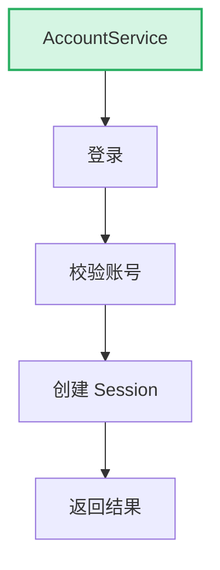

如果：

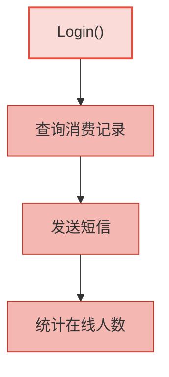

全部写进 `Login()`，那么 `Login` 就承担了多个职责，这是低内聚。

---

## 三、低内聚造成的问题

主要三个影响。

### （1）降低理解性

阅读 `Login()`，结果看到：

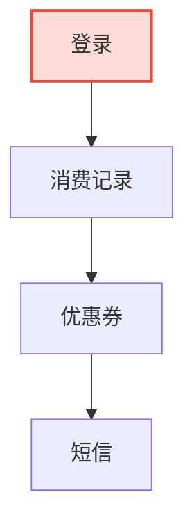

读者不知道：到底是在写登录，还是消费系统。

---

### （2）降低演进能力

登录变化：修改登录。消费变化：修改消费记录。

两个需求都会改 `Login()`，变化来源增加。

---

### （3）降低复用

如果 `Login()` 包含消费系统，那么 OA、CRM、ERP 都不能直接复用登录模块。

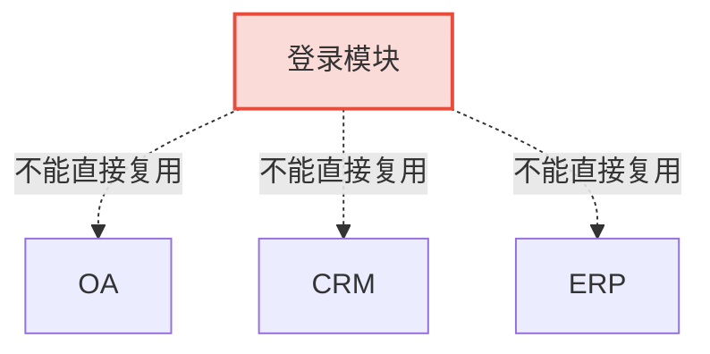

---

# 第二部分 设计分解（职责分离）

作者提出：高内聚不是让一个类完成所有事情，而是让**多个设计单元协作**。

例如：

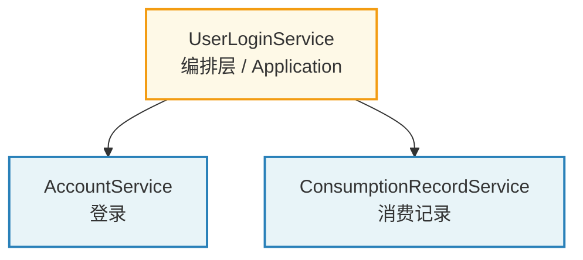

职责划分：

| 设计单元 | 职责 |
| --- | --- |
| `UserLoginService` | 组织业务流程 |
| `AccountService` | 登录 |
| `ConsumptionRecordService` | 消费记录 |

这里实际上体现：

> **编排层（Application）→ 领域能力（Domain Service）**

与你现在研究的 DDD 基本一致。

---

# 第三部分 从重复中发现设计机会

这是整本书我最喜欢的一部分。

作者告诉我们：重复代码不是问题，真正的问题是 **为什么重复？**

例如：

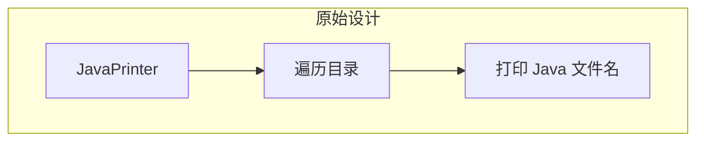

还有：

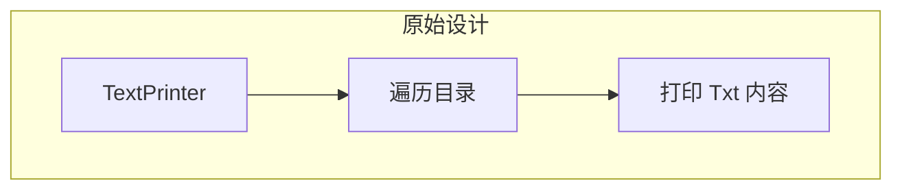

真正重复的是：

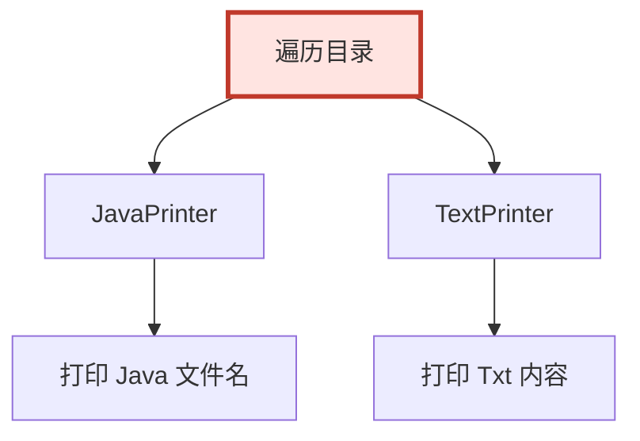

于是作者发现：真正应该抽象的是 `FileTraversal`，而不是 `JavaPrinter`。

---

## 一、分析重复的方法

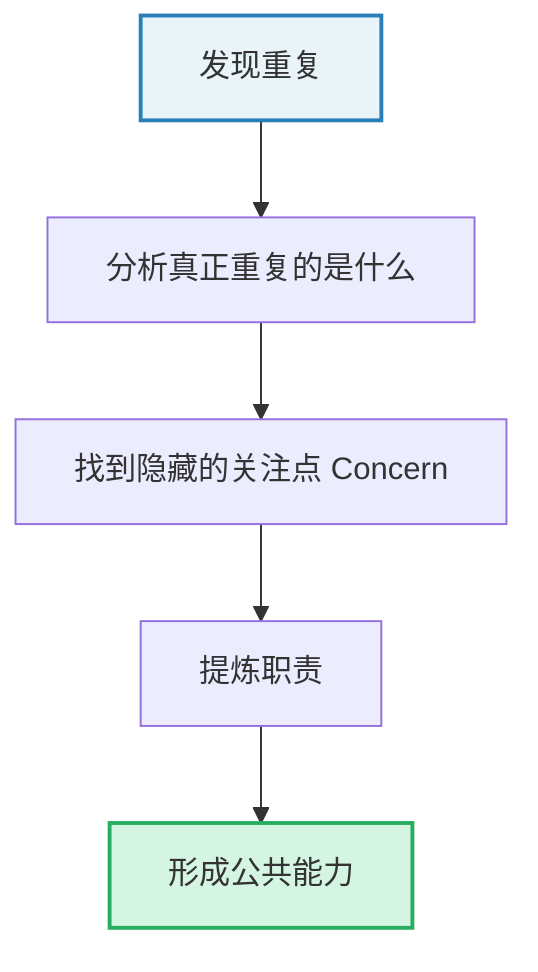

---

## 二、FileTraversal

负责 **How**：怎么遍历。

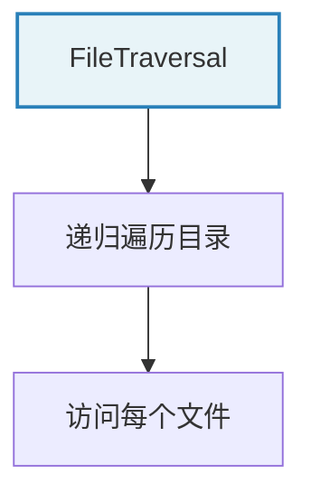

## 三、FileVisitor

负责 **What**：遍历之后干什么。

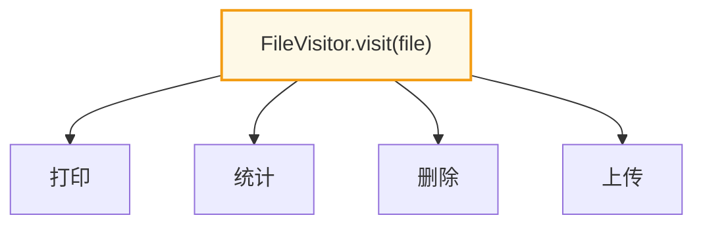

于是 `Traversal` 永远不用修改。

---

这一案例体现：

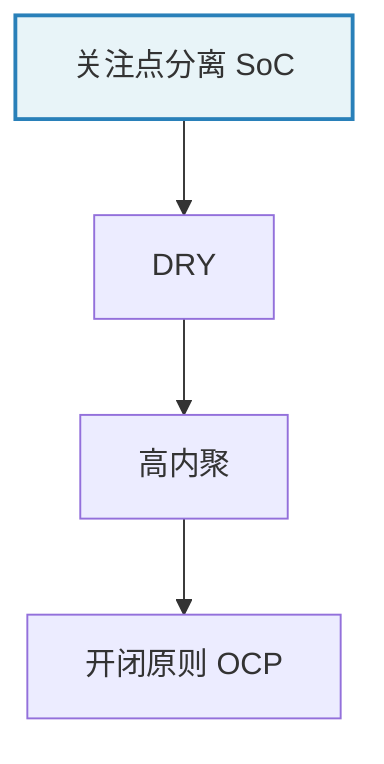

---

# 第四部分 依赖设计

作者开始讨论：模块之间如何协作。

例如：

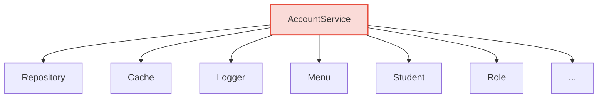

依赖越来越多，产生：

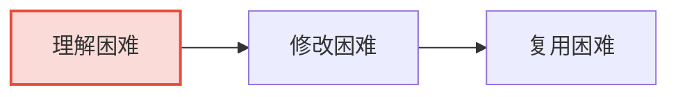

所以作者提出两个原则。

---

## 一、依赖最小化

只依赖真正需要的模块。

不要：

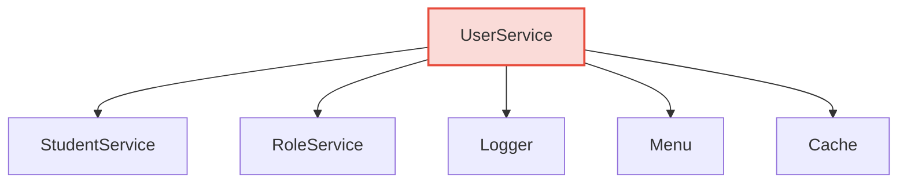

全部引用。

---

## 二、稳定依赖

优先依赖稳定、变化少、长期存在的抽象，而不是具体实现。

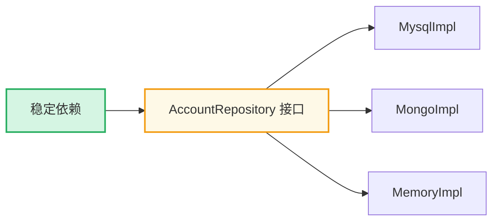

而不是直接依赖：

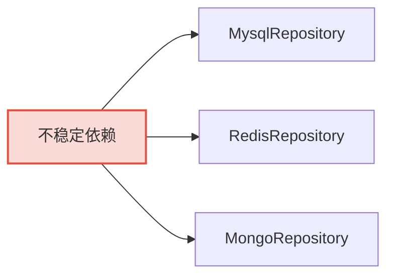

---

# 第五部分 面向接口编程

真正目的不是 `Java Interface`，而是依赖**能力**，而不是**实现**。

例如：

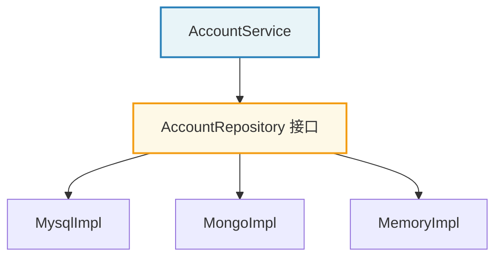

`AccountService` 不知道 Mysql、JPA、MyBatis、Mongo 是什么，它只知道：

```text
findById()
findByName()
```

这就是依赖接口。

---

## 一、为什么依赖接口？

因为接口稳定，实现容易变化。

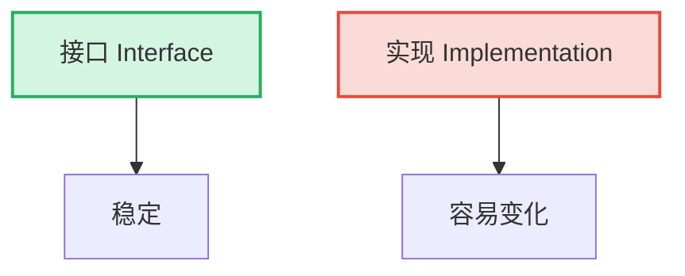

例如：

```mermaid
graph LR
    A["Mysql"] --> B["Mongo"]
    B --> C["Memory"]
    C --> D["H2"]

    style A fill:#f8f9fa,stroke:#7f8c8d
```

全部可以切换，`AccountService` 不用修改。

---

# 第六部分 依赖倒置（DIP）

作者这里讲得很好。

传统：

```mermaid
graph TD
    A["Switch"] --> B["MotorImpl"]

    style A fill:#fadbd8,stroke:#e74c3c,stroke-width:2px
```

`Switch` 依赖具体电机。后来 `Motor` 增加 `setSpeed()`，`Switch` 必须改。

于是改成：

```mermaid
graph TD
    A["Switch"] --> B["Motor Interface"]
    B --> C["MotorImpl"]

    style A fill:#d5f5e3,stroke:#27ae60,stroke-width:2px
    style B fill:#fef9e7,stroke:#f39c12,stroke-width:2px
```

`Switch` 只知道 `start()`、`stop()`。新的 `setSpeed()` 不会影响 `Switch`。

所以依赖倒置的真正目的是：

```mermaid
graph TD
    A["依赖倒置 DIP"] --> B["控制变化传播"]

    style A fill:#e8f4f8,stroke:#2980b9,stroke-width:2px
    style B fill:#d5f5e3,stroke:#27ae60,stroke-width:2px
```

而不是为了 Interface 而 Interface。

---

# 第七部分 接口隔离（ISP）

作者举了打印机。

错误设计（胖接口）：

```mermaid
graph TD
    A["Printer"] --> B["print()"]
    A --> C["scan()"]
    A --> D["fax()"]
    A --> E["staple()"]

    style A fill:#fadbd8,stroke:#e74c3c,stroke-width:2px
```

所有打印机必须实现所有能力。普通打印机的 `fax()` 只能抛 `UnsupportedOperationException`。

正确设计：

```mermaid
graph TD
    A["Printer"] --> B["print()"]
    C["Scanner"] --> D["scan()"]
    E["Fax"] --> F["fax()"]
    G["Stapler"] --> H["staple()"]

    style A fill:#d5f5e3,stroke:#27ae60,stroke-width:2px
    style C fill:#d5f5e3,stroke:#27ae60,stroke-width:2px
    style E fill:#d5f5e3,stroke:#27ae60,stroke-width:2px
    style G fill:#d5f5e3,stroke:#27ae60,stroke-width:2px
```

任何设备按需组合：

```mermaid
graph TD
    A["SimplePrinter"] --> B["Printer"]
    C["MultiPrinter"] --> D["Printer"]
    C --> E["Scanner"]
    C --> F["Fax"]
    C --> G["Stapler"]

    style A fill:#e8f4f8,stroke:#2980b9,stroke-width:2px
    style C fill:#e8f4f8,stroke:#2980b9,stroke-width:2px
```

接口变小，系统更稳定。

---

# 第八部分 需求方接口（这一章很重要）

作者提出：接口其实有两种。

## 一、提供方接口

```mermaid
graph TD
    A["Repository 接口"] --> B["大家一起用"]
    C["Spring"] --> A
    D["JDK"] --> A
    E["SDK"] --> A

    style A fill:#e8f4f8,stroke:#2980b9,stroke-width:2px
```

接口由提供者决定，例如 Spring、JDK、SDK、OpenAPI。

## 二、需求方接口

```mermaid
graph TD
    A["AccountService<br/>需求方"] -->|定义| B["AccountRepository 接口"]
    B -->|实现| C["RepositoryImpl"]

    style A fill:#d5f5e3,stroke:#27ae60,stroke-width:2px
    style B fill:#fef9e7,stroke:#f39c12,stroke-width:2px
```

接口由使用者定义，`RepositoryImpl` 去实现。

真正决定接口的是**需求方**，不是实现方。这是 DDD、Hexagonal、Clean Architecture 里面最重要的思想，也是依赖倒置真正落地方式。

---

# 第九部分 本章所有原则之间关系

整个章节其实讲的是一棵树：

```mermaid
graph TD
    A["软件设计目标"] --> B["易理解"]
    A --> C["易演进"]
    A --> D["易复用"]

    C --> E["高内聚"]
    C --> F["低耦合"]

    E --> G["职责分离"]
    E --> H["关注点分离"]

    F --> I["面向接口"]
    F --> J["依赖最小化"]

    G --> K["Login 案例"]
    H --> L["FileTraversal 案例"]
    I --> M["DIP"]
    J --> N["ISP"]

    style A fill:#ffe4e1,stroke:#c0392b,stroke-width:3px
    style C fill:#e8f4f8,stroke:#2980b9,stroke-width:2px
    style E fill:#d5f5e3,stroke:#27ae60,stroke-width:2px
    style F fill:#d5f5e3,stroke:#27ae60,stroke-width:2px
```

---

# 第十部分 本章最值得记住的设计方法

这本书真正教你的，不是 SRP、DIP、ISP 这些名词，而是一套**分析设计的方法**：

```mermaid
graph TD
    A["业务需求"] --> B["分析职责<br/>一个模块应该负责什么？"]
    B --> C["发现重复<br/>哪些流程在多个地方出现？"]
    C --> D["识别关注点<br/>真正稳定、可复用的能力是什么？"]
    D --> E["抽象公共能力<br/>形成独立模块"]
    E --> F["设计依赖<br/>依赖抽象，而不是实现"]
    F --> G["缩小接口<br/>接口只暴露真正需要的能力"]
    G --> H["控制变化传播<br/>让需求变化尽可能局部化"]

    style A fill:#e8f4f8,stroke:#2980b9,stroke-width:2px
    style H fill:#d5f5e3,stroke:#27ae60,stroke-width:2px
```

---

# 第十一部分 后续学习建议

建议把这些内容整理成一个长期维护的笔记系列，而不是按书本章节整理：

1. **设计分析方法**（职责、关注点、变化分析）
2. **设计原则**（SRP、OCP、ISP、DIP 等）
3. **设计模式**（Visitor、Strategy、Bridge、Factory 等）
4. **架构实践**（DDD、Hexagonal、Clean Architecture、Angular 架构）

这样后面无论学习 Spring、Angular、Greenplum，还是正在设计的同步框架，都可以不断把新的案例归纳到同一套知识体系中。
