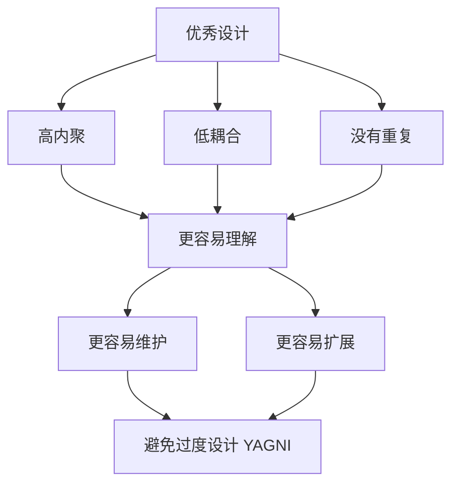

> [!summary] 本章核心
> **优秀代码 = 高内聚 + 低耦合 + 无重复 + 不做多余设计。**

本章所有案例（login、文件遍历、Visitor、依赖倒置等）都围绕这四个原则展开。

---

## 本章核心思想

软件设计最终要解决三个问题：

1. **代码容易理解**
2. **代码容易修改**
3. **代码容易复用**

为了达到这三个目标，需要遵循四个原则：

```text
高内聚
  │
  ▼
低耦合
  │
  ▼
没有重复（DRY）
  │
  ▼
没有多余设计（YAGNI）
```

它们不是独立存在，而是互相促进：

- 高内聚通常意味着低耦合
- 消除重复通常会提高内聚
- 避免过度设计可以减少耦合

---

## 2.4 高内聚和低耦合

### 为什么需要模块化？

项目规模从小到大：

```text
几百行
  ↓
几万行
  ↓
几十万行
  ↓
几百万行
```

如果所有代码混在一起：

```text
登录 / 支付 / 查询 / 导出 / 打印 / 消息通知
```

任何一个需求变化都会影响整块代码。

所以需要模块化：

```text
整个系统
    │
─────────────
│     │     │
用户  订单  支付
│     │     │
 …    …    …
```

模块划分的最高原则就是：

> **高内聚、低耦合。**

---

## 一、高内聚（Cohesion）

### 什么是内聚？

内聚表示：

> **一个模块内部，各个功能之间联系有多紧密。**

也可以理解成：

> **一个模块是否只做一件事情。**

**高内聚示例：**

```text
登录模块
├── 登录
├── 生成 Token
├── 身份认证
└── 登录日志
```

这些事情都属于"登录"。

**低内聚示例：**

```text
登录模块
├── 登录
├── 消费记录查询
├── 库存统计
└── 邮件发送
```

虽然都放在一个方法里，但它们不是一件事情。

### 高内聚的两条原则

> [!tip] 第一条
> **紧密相关的内容放在一起。**

例如：

```text
订单
├── 创建订单
├── 取消订单
└── 支付订单
```

都属于订单，应该放一起。

> [!tip] 第二条
> **放在一起的东西，必须紧密相关。**

否则：

```text
OrderService
├── 创建订单
├── 发送短信
├── 积分统计
└── Excel 导出
```

模块职责开始发散。

### 如何判断是否高内聚？

问自己一句话：

> **这个模块有没有一个统一的名字？**

例如 `OrderService` 里面所有方法都回答"是订单相关"，说明内聚不错。

如果 `OrderService` 里有登录、导出、发短信、统计，已经找不到统一概念，说明内聚不好。

### 为什么低内聚不好？

书中 `login()` 例子：最初只负责登录，后来不断增加"登录成功后显示消费记录"、"查询积分"、"查询优惠券"等需求，最终 `login()` 承担了多个不相关的关注点。

结果：

```text
登录变化 或 消费变化
    ↓
都会修改 login()
    ↓
理解难 → 维护难 → 复用差
```

> [!important]
> 低内聚通常不是一次设计错误，而是需求不断累积造成的。详见下面的完整案例分析。

---

## 案例：登录（Login）方法为什么会变成低内聚？

> [!info]
> 这个案例是整章最重要的案例。作者后面讲的单一职责（SRP）、高内聚、应用服务（Application Service）、DDD、CQRS 等思想，几乎都可以追溯到这里。

### 一、案例背景

系统最开始只有登录功能。`AccountService` 负责：

```text
用户输入账号密码
        │
        ▼
验证账号密码
        │
        ▼
生成 Session(Token)
        │
        ▼
返回 LoginResultDTO
```

此时 `AccountService.login()` 只做登录相关工作：身份认证、登录失败处理、Session 创建、返回登录结果。整个方法围绕一个业务目标：

> **完成用户登录。**

```text
AccountService
      │
      ▼
login()
      │
      ▼
登录业务
```

属于高内聚。

### 二、新需求出现

后来产品提出：

> 登录成功以后，首页需要显示最近消费记录。

很多程序员第一反应是直接修改 `login()`：

```text
login()
  ↓
验证账号密码
  ↓
查询消费记录
  ↓
组装 DTO
  ↓
生成 Token
  ↓
返回
```

实际代码可能长这样：

```java
public class AccountService {
    public LoginResultDTO login(String accountName, String securedPassword) {
        Account account = getAccount(accountName, securedPassword);
        if (account == null) {
            throw new RequestedResourceNotFound("账号或密码不正确!");
        }
        LoginResultDTO r = new LoginResultDTO();
        if (AccountType.STUDENT.equals(account.getDomain())) {
            List<RecordConsumptionDTO> consumptionRecords = consumptionService
                .getByAccount(account.getId());
            if (consumptionRecords != null && consumptionRecords.size() > 0) {
                // 存在消费记录, 代码略
            } else {
                // 不存在消费记录, 代码略
            }
        }
        String token = buildSession(account);
        r.setToken(token);
        r.setAccount(helper.toAccountDTO(account));
        return r;
    }
}
```

> [!warning]
> 注意看这个方法里混杂了多少关注点：
> - 账号认证（`getAccount`）
> - 登录失败处理（抛异常）
> - 消费记录查询（`consumptionService.getByAccount`）
> - 学生身份判断（`AccountType.STUDENT`）
> - Session 创建（`buildSession`）
> - DTO 组装（`helper.toAccountDTO`）
>
> 其中"消费记录查询"和"学生身份判断"已经不属于"登录"这个业务概念。

代码虽然还能运行，但 `login()` 已经不仅仅负责登录了，它开始负责：

```text
登录 + 消费记录
```

这就是作者所说的：

> **一个方法出现了多个关注点（Concern）。**

### 三、为什么很多程序员都会这样写？

不是程序员不会设计，而是需求逐渐增加：

```text
第一版：登录
第二版：登录 + 最近消费记录
第三版：登录 + 最近消费记录 + 积分信息
第四版：登录 + 消费 + 积分 + 优惠券
```

于是 `login()` 越来越长。这是很多系统最终演化出来的结果。

> **低内聚通常不是一次设计错误，而是需求不断累积造成的。**

### 四、为什么这是低内聚？

很多同学会困惑：消费记录不是登录成功以后要展示的吗？为什么说不属于登录？

作者强调：应该看**业务职责**，而不是**业务流程**。

登录以后可能需要：

```text
登录 → 查询消费 → 查询订单 → 查询积分 → 查询消息
```

这些都发生在登录之后，但是它们分别属于：

```text
账户 / 消费 / 订单 / 积分 / 消息
```

它们只是：

> **流程相关（Workflow Related）**

不是：

> **职责相关（Responsibility Related）**

所以它们不能放到同一个 Service 里面。

### 五、作者总结了三个坏处

#### ① 可理解性下降

阅读 `login()` 的人本来只想了解登录流程，结果还要理解消费记录、DTO、查询数据库等内容。思维不断在"登录"和"消费"之间切换，理解成本明显增加。

#### ② 可演进性下降

登录规则可能变化（验证码、二步认证、设备验证），消费记录也可能变化（最近 10 条、最近 30 天、分页、缓存）。两个变化来源都修改 `login()`，违反了：

> **一个模块应该只有一个变化原因。**

这也是**单一职责原则（SRP）**真正想解决的问题。

#### ③ 可复用性下降

原来 `AccountService.login()` 在任何系统（后台、APP、小程序）都能直接使用。后来 `login()` 依赖 `ConsumptionRecordService`，登录功能绑定了消费系统。另一个没有消费记录的项目，也必须引入 `ConsumptionRecordService` 才能登录，登录能力失去了通用性。

### 六、作者真正想表达什么？

很多人第一反应：那以后 `login()` 什么都不能调用？

不是。作者真正想表达的是：

> **不要让业务能力承担流程编排。**

登录应该负责：

```text
账号认证 / 密码校验 / Token 生成 / 登录状态
```

登录完成以后需要消费记录、订单、积分等，这些属于**业务组合（Orchestration）**，应该交给：

```text
UserLoginService
```

负责。

### 七、作者的优化方案

```text
                UserLoginService
                        │
          ┌─────────────┴─────────────┐
          │                           │
          ▼                           ▼
 AccountService         ConsumptionRecordService
     login()               retrieveRecords()
```

#### AccountService

只负责登录相关：

```text
账号认证 / 密码校验 / Token 生成 / 登录
```

关注点只有：登录。

#### ConsumptionRecordService

只负责消费相关：

```text
查询消费记录 / 消费统计 / 消费业务
```

关注点只有：消费。

#### UserLoginService

负责整个登录场景：

```text
登录 → 查询消费 → 组装 DTO → 返回页面
```

注意：这里不是新增了业务，而是新增了**流程编排层**。它本身几乎没有业务规则，只是负责调用 `AccountService` 和 `ConsumptionRecordService`，完成一个完整的应用场景。

这就是：

> **组合职责，而不是堆职责。**

### 八、这个案例体现的设计思想

| 设计思想 | 在案例中的体现 |
| --- | --- |
| 高内聚 | `AccountService` 只负责登录 |
| 单一职责（SRP） | 登录变化不会影响消费业务 |
| 关注点分离（SoC） | 登录与消费属于两个关注点 |
| 低耦合 | 登录不再依赖消费模块 |
| Application Service（DDD） | `UserLoginService` 负责业务流程编排 |
| 可复用 | `AccountService` 可以脱离消费模块独立使用 |
| 可维护 | 登录、消费分别演进，互不影响 |

### 九、这个案例最大的启发

很多人把高内聚理解成：

> **一个类的方法不要太多。**

其实作者想表达的是更深层的观点：

> **高内聚并不是让一个类变小，而是让一个类只表达一个业务概念。**

在这个案例中：

- **AccountService** 表达的是 **"账户登录"**；
- **ConsumptionRecordService** 表达的是 **"消费记录"**；
- **UserLoginService** 表达的是 **"用户登录这个应用场景"**。

三个类都围绕一个清晰的业务概念组织，因此整个系统既保持了高内聚，又能够完成完整的业务流程。

这一点也是 DDD 中 **Application Service（应用服务）** 与 **Domain Service（领域服务）** 划分职责的经典例子，后续学习 DDD 时你会再次遇到几乎相同的设计思想。

## 案例：从重复代码中发现真正的抽象（FileTraversal）

> [!info]
> 这个案例甚至比 Login 案例更经典。
>
> 因为 Login 案例讲的是**职责划分（SRP、高内聚）**。
>
> 而这个案例实际上讲的是软件设计里一个更高级的思想：
>
> **从重复代码中发现真正的关注点（Concern），再把关注点抽出来。**
>
> 这是很多优秀框架（Spring MVC、NIO、Netty、Angular Router、React Fiber）的共同设计思想。

### 一、案例背景

作者先实现了一个功能：

> **打印指定目录下所有 Java 文件。**

例如：

```text
src/
    App.java
    User.java
    README.md
```

输出：

```text
App.java

User.java
```

于是写出了：

```text
printJavaFiles()

↓

遍历目录

↓

判断是不是 Java 文件

↓

打印文件名
```

整个代码没有问题。

甚至：

- 方法很短
- 命名规范
- 注释齐全

很多程序员都会认为：

> **这是不错的代码。**

作者故意告诉我们：

> **这段代码其实还有设计提升空间。**

### 二、新需求来了

后来又来了一个需求：

> **打印指定目录下所有 txt 文件内容。**

很多程序员第一反应：

复制：

```text
JavaPrinter

↓

复制

↓

TextPrinter
```

改：

```text
isJava()

↓

isText()
```

打印：

```text
文件名

↓

文件内容
```

于是：

得到第二份代码。

---

作者指出：

两段代码：

并不是：

```text
100%

一样
```

但是：

大约：

```text
80%
```

都是一样。

例如：

```text
遍历目录

↓

递归

↓

listFiles()

↓

访问每个文件
```

完全重复。

### 三、重复意味着什么？

很多人第一反应：

抽工具方法。

作者没有这样做。

作者先画了一张图。

（图2.8）

```text
JavaPrinter                  TextPrinter

输出Java文件名              输出Txt内容
        \                    /
         \                  /
          \                /
          遍历目录（共同）
```

作者想表达：

真正重复的：

不是：

```text
打印Java

打印Txt
```

真正重复的是：

```text
遍历目录
```

这一步。

于是：

发现了：

真正的关注点：

```text
遍历目录
```

### 四、为什么这是一个关注点？

因为：

遍历目录：

无论以后：

```text
打印Java

打印Txt

打印PDF

统计文件数量

上传文件

删除文件

压缩文件
```

第一步永远都是：

```text
遍历目录
```

说明：

```text
遍历目录
```

属于：

一个独立职责。

应该抽出来。

作者这里实际上提出了一个非常重要的方法：

> **如果某段代码在多个业务里都会出现，它很可能就是一个独立的关注点。**

### 五、作者如何拆分？

于是：

作者重新划分职责。

原来：

```text
JavaPrinter

↓

遍历目录

↓

判断Java

↓

打印
```

变成：

```text
                FileTraversal
                      │
        负责遍历整个目录树
                      │
                      ▼
               FileVisitor
               visit(file)
```

以后：

JavaPrinter：

变成：

```text
visit(file)

↓

判断Java

↓

打印
```

TextPrinter：

变成：

```text
visit(file)

↓

判断Txt

↓

打印内容
```

于是：

遍历：

完全消失。

### 六、拆分之后职责如何变化？

作者实际上把原来的一个类，

拆成了两个设计单元。

#### FileTraversal

职责：

只有一个：

```text
遍历目录
```

负责：

```text
目录

↓

递归

↓

listFiles()

↓

访问每个文件
```

它：

完全不知道：

Java

Txt

PDF

是什么。

#### FileVisitor

职责：

只有一个：

```text
文件到了以后怎么办？
```

例如：

Java：

```text
visit(file)

↓

输出文件名
```

Txt：

```text
visit(file)

↓

输出内容
```

PDF：

```text
visit(file)

↓

生成索引
```

因此：

Traversal

负责：

How to Walk（怎么遍历）

Visitor

负责：

What to Do（遍历后做什么）

### 七、为什么这种设计更好？

作者总结：

第一：

内聚提高。

FileTraversal：

只负责：

```text
遍历
```

JavaPrinter：

只负责：

```text
Java
```

TextPrinter：

只负责：

```text
Txt
```

每个类：

职责非常明确。

---

第二：

重复消失。

以前：

```text
JavaPrinter

↓

遍历

↓

打印
```

```text
TextPrinter

↓

遍历

↓

打印
```

现在：

只有：

```text
Traversal

↓

Visitor
```

遍历：

写一次。

---

第三：

新增需求几乎不用修改。

以后：

新增：

```text
统计文件数量
```

只需：

```java
CountVisitor
```

实现：

```text
visit(file)
```

即可。

Traversal：

不用修改。

符合：

> 开闭原则（Open-Closed Principle）

---

第四：

复用能力提高。

以后：

整个项目：

任何地方：

需要：

```text
遍历目录
```

直接：

```java
new FileTraversal(...)
```

即可。

Traversal：

变成：

公共能力。

### 八、这个案例真正想告诉我们的是什么？

很多人看到这里，

会认为：

作者是在讲：

Visitor。

其实：

不是。

Visitor：

只是：

实现方式。

真正重要的是：

作者发现了：

```text
JavaPrinter

↓

TextPrinter

↓

共同拥有：

遍历目录
```

于是：

抽出了：

```text
FileTraversal
```

所以：

整个案例真正体现的是：

> **从重复中发现关注点，再把关注点抽象出来。**

### 九、为什么很多优秀框架都这样设计？

其实：

Java NIO：

```java
Files.walkFileTree(...)
```

就是：

```text
FileTraversal
```

而：

```java
FileVisitor
```

就是：

```text
visit(file)
```

Spring MVC：

也是一样：

```text
DispatcherServlet

↓

遍历 Handler

↓

找到 Controller
```

Dispatcher：

负责：

流程。

Controller：

负责：

业务。

Angular：

Router：

负责：

路由遍历。

Component：

负责：

页面。

React：

Fiber：

负责：

遍历组件树。

Component：

负责：

渲染。

这些框架本质上都遵循同一种设计思想：

> **把稳定的流程（How）和变化的业务（What）分离。**

### 十、这个案例最值得学习的一句话

这个案例真正教会我们的，并不是 Visitor 模式，而是一种分析设计的方法：

```text
发现重复
        │
        ▼
寻找真正重复的是什么
        │
        ▼
找到隐藏的关注点（Concern）
        │
        ▼
把关注点抽象成独立模块
        │
        ▼
其他业务通过扩展点接入
```

这也是作者为什么在前面一直强调**高内聚**、后面又讲 **DRY（Don't Repeat Yourself）** 的原因。

**重复代码本身不是重点，重点是：重复往往意味着系统中存在一个尚未被识别出来的职责。**

## 两个案例的对比与联系

**Login 案例**和**FileTraversal 案例**放在一起学习，因为它们实际上形成了一套完整的设计思维：

- **Login 案例**：从**职责混乱**中发现一个类承担了多个业务概念，因此通过**职责分解**提升内聚。
- **FileTraversal 案例**：从**代码重复**中发现多个业务共享同一个流程，因此通过**关注点分离**提取公共能力。

这两个案例分别回答了软件设计中两个最核心的问题：

1. **一个类应该负责什么？**（单一职责、高内聚）
2. **多个类共同做的事情应该放在哪里？**（关注点分离、DRY、可复用）

后面学习 SOLID、DDD、设计模式时，这两种分析方法会反复出现。

---

## 二、低耦合（Coupling）

### 什么是耦合？

耦合描述：

> **模块之间依赖程度。**

一句话：

```text
A 改 → B 也必须改 → 存在耦合
```

变化传播越远，耦合越严重。

### 耦合不可避免

> [!warning]
> **零耦合实际上不存在。**

例如：

```text
Controller → Service → Repository
```

天然存在依赖。

关键不是有没有依赖，而是：

> **依赖是否合理。**

### 几种典型耦合

#### ① 循环依赖

```text
A → B → A
```

问题：

```text
A 改 → B 改 → A 继续改
```

两个模块已经不能独立演化，通常说明模块划分太大、职责不合理。

#### ② 链式依赖

```text
A → B → C → D
```

如果 `D` 变化，最终 `A` 也可能受影响。链越长，传播越远。

#### ③ 依赖范围太广

例如：

```text
AccountService
  ↓
StudentService / ConsumptionService / SessionService / MailService / …
```

依赖越来越多，说明职责越来越多，通常意味着内聚下降。

#### ④ 内容耦合（最严重）

例如 `area()` 直接操作 `angle`、`radius`。

调用者知道了对象内部如何计算面积。以后如果角度改成弧度，所有代码都得改。

正确做法：

```text
sector.area()
```

对象自己负责自己的数据，这就是**封装**。

### 如何降低耦合？

#### 方法一：职责拆分

例如：

```text
login()
  ↓
查询消费
  ↓
登录
```

拆成：

```text
LoginService
ConsumptionService
```

减少依赖。

#### 方法二：依赖倒置（DIP）

不要依赖实现，改成依赖接口：

```text
AccountService
    ↓
Repository 接口
    ↓
DBWrapper 实现
```

以后数据库框架换掉，业务层不用改。

一句话：

> **依赖稳定接口，而不是变化实现。**

---

## 三、没有重复（DRY）

### DRY 原则

Don't Repeat Yourself。

真正意思不是不要复制代码，而是：

> **同一份知识，只允许存在一个权威表达。**

例如"判断 Java 文件"出现 5 份，以后扩展 `.java` → `.kt`，需要改 5 个地方，这就是重复知识。

### 重复的危害

1. **理解成本增加** —— 代码越来越长，不知道哪个是真的
2. **维护困难** —— Bug 修一半，另一半忘记，产生新的 Bug
3. **隐藏设计问题** —— 重复暴露真正的公共能力应该被抽取

书中案例：

```text
打印 Java 文件
打印 TXT 文件
```

重复其实暴露：遍历目录才是真正公共能力。于是抽出来 `FileTraversal`，重复消失，设计变好。

### 如何消除重复？

不要先抽代码，先抽：

> **关注点。**

例如 `JavaPrinter`、`TXTPrinter` 共同点是"遍历目录"，于是抽 `FileTraversal`，而不是简单提取工具函数。

---

## 四、没有多余设计（YAGNI）

很多人喜欢：

```text
未来可能要用
  ↓
先写接口 → 先写抽象 → 先写工厂 → 先写策略
```

实际上未来根本没发生，却增加了理解成本、维护成本、学习成本，没有收益。

### 一个典型案例

只有 `PascalTriangle` 一种实现，却写：

```text
IPascalTriangle
    ↓
PascalTriangle
```

接口没有意义，因为不存在第二种实现。属于为了模式而模式。

### 判断标准

问自己：

> **这层抽象今天有没有价值？**

如果只有一个实现、未来没有变化需求，就不要抽象。

### 死代码

代码半年没人调用、一年没人调用，就是技术债。

> [!danger]
> 不要注释，不要保留。Git 已经保存历史，真正不用的代码就删除。

### 不要为未来写代码

很多人喜欢"以后可能支持、以后可能扩展、以后可能换数据库"，于是提前设计。

书里强调：

> **预测未来通常是不准确的。**

真正需要时再重构，这就是 YAGNI。

---

## 本章四个原则之间的关系



---

## 工程实践检查清单

每次设计一个类或模块时，都可以用下面的问题自检。

### 高内聚

- [ ] 这个类是否只有一个明确职责？
- [ ] 是否所有方法都围绕同一个业务概念？
- [ ] 是否存在"顺手加一点"的逻辑？

### 低耦合

- [ ] 是否依赖了过多其他模块？
- [ ] 是否存在循环依赖？
- [ ] 是否依赖具体实现而不是接口？
- [ ] 是否直接操作了其他对象的内部数据？

### DRY

- [ ] 是否有相似代码？
- [ ] 是否有相同业务知识在多个地方维护？
- [ ] 是否可以抽取共同关注点，而不是简单提取工具方法？

### YAGNI

- [ ] 当前抽象是否真正解决了现有问题？
- [ ] 是否只是因为某种设计模式而引入额外层次？
- [ ] 是否存在已经不用的代码、接口或配置？
- [ ] 是否为了一个"不确定的未来"增加了复杂度？

---

> [!info] 后续学习关联
> 这份笔记适合作为长期学习的软件设计原则总纲。后续学习 [[SOLID]]（尤其是 [[SRP|单一职责原则]]）、[[DDD]]（尤其是 [[Application Service|应用服务]] 与 [[Domain Service|领域服务]] 的划分）、[[Clean Architecture]]、[[六大设计原则]]、[[23种设计模式]] 时，都可以不断回到这四个核心原则来判断一个设计是否合理。
